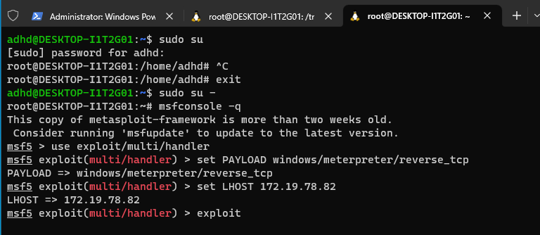
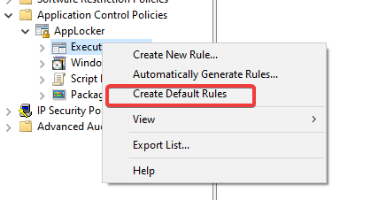
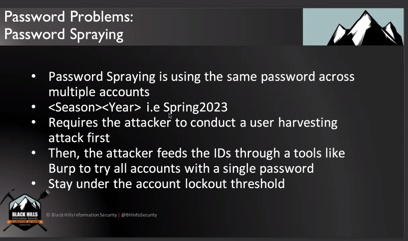
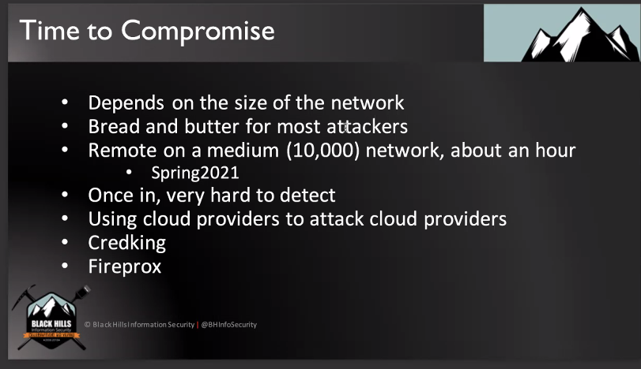
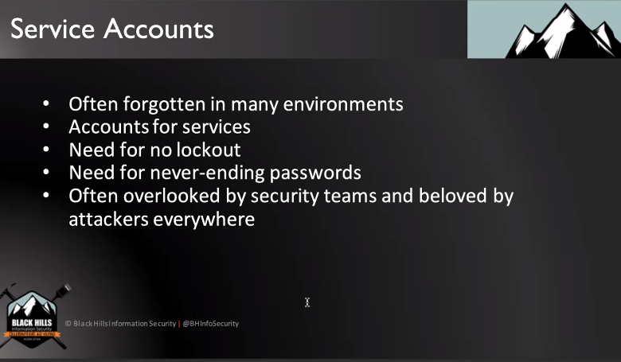
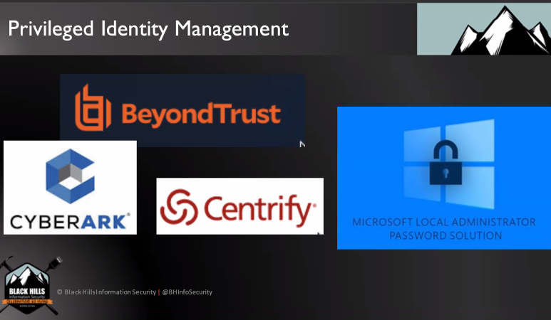

# MEMES
- Change your title to "managing intern" if you want to avoid some marketing crap
# RESOURCES and LINKS
- [Free Resources - AuditScripts.com](https://www.auditscripts.com/) 
- [John Strand Training Lab – Download Instructions – Antisyphon Training](https://www.antisyphontraining.com/john-strand-training-lab-download-instructions/) 
## Misc, Mentioned
- Pingcastle, GPOZaurr, Testimo
- Graphrunner
- Bloodhound + Plumhound
# A Gentle Caring Intro to Security
## Overview of Class - What will be covered
- What works to defend a network
- Cover the things that BHIS loves/hates to see in customer networks
- "Hacker tears make the best wine" - classic quote from John Strand
- **Atomic Controls** - Mapping MITRE to Critical Controls 11 topics:
	- Application Allow listing
	- Password Controls
	- Egress Traffic Analysis
	- UEBA
	- Advanced Endpoint Protection
	- Logging
	- Host Firewalls
	- Internet Allow Listing
	- Vuln mgmt
	- AD Hardening
	- Backup and Recovery
## What WON'T be covered
- Windows
- Linux
- TCP/IP
- Crypto
- Security Models
- The CBK
- NIST 800 series
- DLP
- Exploit of the day!
## Why is this important
- BHIS tracked vulns over the years (650+ per year)
- Mapped these to Mitre

## Compliance Issues
- Far too many frameworks
- Overlapping and conflicting recommendations
- NIST Greenbook
- PCI Min Password length changes a lot
- [Free Resources - AuditScripts.com](https://www.auditscripts.com/) 

## Mitre Defense Coverage Approach
- Don't approach by technique - try to cover large sets of attacks instead
# Application Allow Listing

- How to approach white and blacklisting applications
- We are hardwired to like denylists
	- Don't snuggle with grizzly bears - cavemen evolution
## Six Dumbest Ideas in Security

/## Examples: Ghostwriting, LOLBins
- If we XOR data to itself then it should always be 0
- If we do this in assembly then we can avoid lots of AV
- Living of the land binaries can be used to avoid denylisting AV out there
## Application Allow listing: Directories

- Go by dir
	- Only from Program Files, Program Files x86
	- Avoids from Downloads, Desktop, etc.

## By Hash
- This works too
## By Digital Certs

## AppLocker

- You need pro license to use it
## AppLocker LAB
[IntroLabs/IntroClassFiles/Tools/IntroClass/AppLocker/AppLocker.md at master · strandjs/IntroLabs](https://github.com/strandjs/IntroLabs/blob/master/IntroClassFiles/Tools/IntroClass/AppLocker/AppLocker.md)

## Malicious Executable with Metasploit
- `su` - switch user
- `sudo su` - avoids having to type psw in multiple times

- Made a malicious executable that's hidden
- Ran a C2 in WSL
- Accessed the C2 from another Linux terminal in the VM using `msf5 > use exploit/multi/handler`
- Used my local IP `172.19.78.82`
- Ran TrustMe.exe 

## AppLocker Setup
- Start > Local Security Policy
- Application Control Policies > AppLocker
- Create default rules for each category
	- 
- Enforce the rules
	- 
- Start the Application identity service
	- 
- Run `gpudate /force` to force policy update
## Testing AppLocker
- Signed into allowlist account
- Ran exe from tools folder
	- 
# Password Controls
## Password Sprays

- Using one easy guessable password over tons of different accounts or services instead of focusing on one account with many passwords
- One to many instead of many to one

## Password Spray LAB
[IntroLabs/IntroClassFiles/Tools/IntroClass/PasswordSpray/PasswordSpray.md at master · strandjs/IntroLabs](https://github.com/strandjs/IntroLabs/blob/master/IntroClassFiles/Tools/IntroClass/PasswordSpray/PasswordSpray.md#password-spray)

- Uses `200-user-gen.bat` to generate fake local accounts
- Uses `LocalPasswordSpray.ps1` to spray local accounts

## Password Spray Questions
- Is there a way to give power to decoy accounts if you're a hacker?  What if there's a compromised DA? Seems like they just log, but don't allow actual access.
	- Deny logon to the user on any machine. Please be aware that if another DA gets compromised the DenyLogon setting can be removed.
	- If there is any attempt to use the user credentials (password or hashes) a [4768](https://docs.microsoft.com/en-us/windows/security/threat-protection/auditing/event-4768) is logged. Any enumeration which reads DACL or all properties for the user will result in a [4662](https://docs.microsoft.com/en-us/windows/security/threat-protection/auditing/event-4662) logging.
- How many accounts per number of accounts to cover most password spray type passwords?  I've tried to see if there was a way to allow for an account to accept a password from a list of passwords for the ultimate honey account, but this is impossible to do.  Seems like I would need to create many accounts to cover lots of easy ones depending on what wordlists or guesses I think attackers would use.

# 2FA

- SMS-based 2FA can be bad if your threat profile is against APTs with things like SIM swapping

- Service accounts can't have MFA because they aren't people, so how to secure them?

## Kerberoasting

- user accounts can request these tickets for service accounts, grab hashes, and then crack the hashes offline
# LLMNR, MDNS, NBNS - Name Resolution

- Can still be used to harvest hashes and passwords
- Name resolution:
	- computers have to find servers and IPs when you look up things like blank[.]com
	- "Hey if I can't find the IP address, then how about the computer asks the computers around it for the IP addresses"
		- mDNS and LLMNR
		- No need for security 😆
## Responder LAB
[IntroLabs/IntroClassFiles/Tools/IntroClass/Responder/Responder.md at master · strandjs/IntroLabs](https://github.com/strandjs/IntroLabs/blob/master/IntroClassFiles/Tools/IntroClass/Responder/Responder.md)
- Really simple
- Grabs the hash as someone goes to ask for something that doesn't exist
- Password is cracked
- Then pw could be used with meterpreter

## 2FA Bypassing
- Credking - really good

- Evilginx
	- Really effective at proxying 2FA
	- 

# Identity
## Password Managers
- If these get compromised without 2FA, then you're in trouble
- Just use them
- 

## Privileged Identity Management
- 3rd party identity provision
- Makes post exploitation difficult with reused passwords
- 

# Hashcat LAB
- TODO

# 