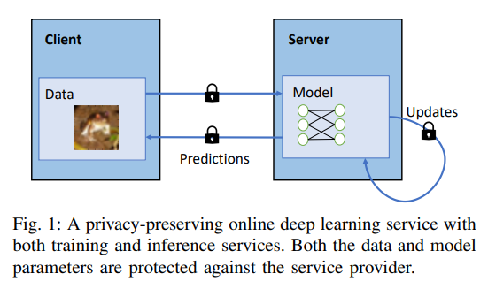

# outline

## Abstract

- Deep learning training and inference in the cloud:
    - most people deploy online learning services (3rd party) that do training and inference to the public cloud
- Issues with 3rd party AI services in cloud:
    - Using user data and models with 3rd parties creates risk (privacy or security)
- Lots of solutions have been proposed before:
    - privacy-preserving deep learning algos
    - obfuscation mechanisms
    - cryptographic tools and workflows
    - NONE ARE APPLICABLE TO ONLINE LEARNING SERVICES (training and inference)
- Sphinx:
    - What:
        - efficient privacy-preserving online deep learning system which doesn’t require any third parties to manage trust
        - Balances: model performance, computational efficiency, and privacy preservation - with “systematical” optimizations on both private inference and public training
    - How:
        - uses homomorphic encryption and differential privacy “reciprocally” to maintain the AI model by keeping params as plaintext (fast training and inference is possible).
        - Refined homomorphic operations - reduces training time while retaining real-time inference (without exposing user features or identities)
    - Stats:
        - 35x faster for training
        - 4 orders faster for inference
    - Control over privacy “budget” (privacy ↔ returns : ratio)
        - good model accuracy under tight privacy budget
        - doesn’t require “trusted” data aggregator
        - robust against practical reconstruction attacks

## Introduction

- The problem:
    - AI and ML training and inference is the backbone of a lot of growing applications, but the infrastructure can’t keep up with the growth. MLaaS - arrives to save the day…except there’s privacy concerns with bringing user data to the public cloud.
- Previous wisdom/solutions:
    - MLaaS systems that protect user privacy with various privacy-preserving techniques
    - Why they don’t work:
        - training and inference are extremely inefficient
            - inference service over encrypted data (assumes a plain public model on the server)
            - concentrate on training on encrypted models (inefficient inference)
        - Not secure:
            - assumes non-colluding servers
            - OR assumes a trusted aggregator
        
        
        
- Why Sphinx is different:
    - As far as we know, Sphinx is the first of its kind in the regime of privacy preserving deep learning to adopt different privacy-preserving protocols for both phases.
- The challenges of Sphinx:
    - design efficient and compatible training and inference protocols with different primitives respectively to fulfill their specific requirements
    - exploit the possible merits from the hybrid protocols, in terms of both
    privacy and accuracy, by deliberately designing the privacy preserving operation behaviors
- Sphinx architecture:
    - chef analogy
        - Imagine a group of chefs working together to create a delicious meal, where each chef represents a layer in a deep neural network. The ingredients they use are the linear components (W), and their personal cooking techniques are the bias components (b).
        - Sphinx comes in to protect the recipe of the meal (the privacy of the data). It uses homomorphic encryption (HE) to turn the unique cooking techniques (bias components) into secret instructions, so no one can understand the techniques without the decryption key. At the same time, differential privacy (DP) adds some random seasoning (noise) to the ingredients (linear components) to make it difficult for others to figure out the exact original recipe.
        - By doing this, Sphinx ensures the recipe of the meal remains private, while still allowing the chefs to collaborate effectively and quickly prepare the meal (train the AI model) and serve it to the guests (make predictions) with minimal delay.
    - choir analogy
        - Imagine a choir of singers working together to create a harmonious song. Each singer represents a layer in a deep neural network, and their individual contributions are the linear components (W) and bias components (b).
        - The linear components (W) are like the main melody of the song, while the bias components (b) are like the unique harmonies that make the song special.
        - Sphinx comes in to protect the composition of the song (the privacy of the data). It uses homomorphic encryption (HE) to encode the unique harmonies (bias components) in a secret musical language, so no one can understand the harmonies without the decryption key. Meanwhile, differential privacy (DP) adds some random notes (noise) to the main melody (linear components) to make it difficult for others to figure out the exact original composition.
        - This way, Sphinx ensures the composition of the song remains private, while still allowing the singers to collaborate effectively and quickly perform the song (train the AI model) and present it to an audience (make predictions) with low delay.
- criticisms of DP
    - Explain this part 
    One line of criticism of DP-based algorithms is the hugegap between the upper bound of privacy loss and the realisticprivacy leakage in adversarial scenarios [20]. To verify the pri-vacy guarantee provided by Sphinx, we evaluate the privacy-accuracy trade-off against current reconstruction attacks fromgradients [21] (Section IX-E). The result shows that even withsimilar privacy cost compared to DP solutions, Sphinx canachieve a significantly stronger defense against attacks in apractical scenario.
        - This part discusses the criticism of Differential Privacy (DP) and how Sphinx addresses this concern by providing a better privacy guarantee in practice compared to other DP solutions.
        - DP algorithms often have a large gap between the theoretical upper bound of privacy loss and the actual privacy leakage that occurs in real-world adversarial scenarios. This means that although the privacy guarantee provided by DP is strong in theory, it might not be as effective in practice.
        - To test the privacy guarantee provided by Sphinx, the researchers evaluated its privacy-accuracy trade-off against existing gradient-based reconstruction attacks. Gradient-based attacks are methods that adversaries use to exploit the gradients (model parameter updates) in an attempt to reconstruct the original data or gain sensitive information.
        - The results of the evaluation show that, compared to other DP solutions, Sphinx can achieve a significantly stronger defense against these attacks in practical scenarios, even with a similar privacy cost. In other words, Sphinx is more effective in preventing adversaries from reconstructing or gaining sensitive information from the model while still maintaining a good balance between privacy and accuracy.
- Privacy and accuracy of what though? and what does upper bound mean in this case?
    - In the context of this research, privacy refers to the protection of sensitive user data from being leaked or accessed by adversaries during the machine learning process. Accuracy refers to the effectiveness of the model in making correct predictions or classifications based on the input data.
    - The privacy-accuracy trade-off is a key concern in privacy-preserving machine learning, as increasing privacy often comes at the cost of reduced model accuracy. This is because privacy-preserving techniques, such as differential privacy, often introduce noise or perturbations to the data or model parameters to protect sensitive information. While this helps maintain privacy, it can also affect the model's ability to learn from the data and make accurate predictions.
    - The "upper bound of privacy loss" refers to the theoretical limit of the amount of sensitive information that can be leaked during the machine learning process when using differential privacy. In practice, however, the actual privacy leakage might be lower than this theoretical limit. The concern is that the gap between the theoretical privacy guarantee and the actual privacy leakage in real-world scenarios can be significant, potentially making differential privacy less effective in practice than it appears in theory.
    - By evaluating Sphinx against gradient-based reconstruction attacks, the researchers aimed to demonstrate that Sphinx can provide stronger privacy protection in real-world scenarios compared to other DP solutions, while still maintaining a good balance between privacy and accuracy.

## Related Works

The related works in the paper can be categorized into three main groups: privacy-preserving inference on neural networks, privacy-preserving training on neural networks, and privacy-preserving federated learning. I will briefly explain the important components of each group and how they differ from Sphinx.

1. Privacy-preserving inference on neural networks:
These solutions focus on the inference procedure, where a server holds a well-trained model to provide predictions for clients. Examples include Gazelle and Delphi. The server's model is either public or proprietary, so it is stored and evaluated as plaintext. These solutions can't be directly applied to the online learning setting since they don't address the privacy concerns during the training process. Sphinx, on the other hand, offers both training and inference services simultaneously in a privacy-preserving way.
2. Privacy-preserving training on neural networks:
These solutions can be classified into centralized and distributed, depending on the number of servers required. Centralized training methods, such as those based on homomorphic encryption (HE), encrypt both model weights and user data for outsourced training. However, these methods are slower and don't consider the inference process. Solutions based on differential privacy (DP) introduce randomization to protect privacy but may face a trade-off between model performance and privacy level. Unlike these methods, Sphinx provides an efficient inference protocol based on lightweight secret sharing techniques and offers better protection against privacy leakage from gradients.
3. Privacy-preserving federated learning:
These solutions involve multiple data owners collaboratively learning their local models without exposing user privacy. Examples include selective stochastic gradient algorithm (selective SGD) and employing HE for federated neural network learning. In this setting, clients are both data owners and main executors for heavy computations of model training. However, Sphinx focuses on machine learning as a service (MLaaS) setting, where clients outsource heavy computations to a service provider with large computation power. As a result, federated learning solutions are beyond the scope of Sphinx.

Sphinx's main difference from the related works is its ability to offer both privacy-preserving training and inference services simultaneously. It combines homomorphic encryption and differential privacy to provide better privacy protection while maintaining a good balance between privacy and accuracy, compared to the other solutions.

## Preliminaries

### **Homomorphic Encryption Explained**

1. History and Traditional Issues:
    - Homomorphic encryption used to be slow, limiting its practical applications.
2. Public-Key Cryptography (PKC) Analogy:
    - Slamming a door shut that locks (anyone can shut the door); only the secret key can unlock it and open it.
3. Homomorphic Encryption:
    - Allows mathematical operations on encrypted data without decryption.
    - Glove box analogy: Anyone can manipulate what's inside the glove box without taking it out.
    - Only the secret key can open it up.
    - Types: Additive, Multiplicative, Full
4. Outsource Computation to Limit the Utility of User Data:
    - Users can be aware of how their data is used and provably ensure it is used only in that way.
5. Applications and Benefits of Homomorphic Encryption:
    - Secure data storage: Encrypted data can be stored securely while still allowing computations on the data without the need for decryption.
    - Privacy-preserving data processing: Enables privacy-preserving computations on sensitive data, such as medical records, financial information, or personal information.
    - Secure multi-party computation: Multiple parties can collaboratively compute a function over their inputs while keeping their data private from one another.

### **Neural Networks Explained**

1. Origin:
    - Deep neural networks are a family of machine learning models that adopt stacked artificial neural network layers to extract features from raw data at different abstract levels hierarchically.
2. Linear and Non-linear Components:
    - Linear layers: Convolutional (Conv) layers and fully-connected (FC) layers.
    - Non-linear layers: Max-pooling functions and activation functions (e.g., ReLU and Sigmoid).

### **Preliminaries**

1. Threat Model:
    - Considers a client-server model with two parties: client A (data owner) and server B (provides training and inference services).
    - Semi-honest server: Adheres to the protocol but is curious to infer privacy information from client A based on all the available information provided during the interaction.
2. DNN Training and Inference:
    - Linear layers: Convolutional (Conv) layers and fully-connected (FC) layers.
    - Non-linear layers: Max-pooling functions and activation functions (e.g., ReLU and Sigmoid).
3. Homomorphic Encryption (HE):
    - Focuses on the CKKS HE scheme.
    - Allows limited number of additions and multiplications on ciphertexts based on the ring learning with error (RLWE) problem.
    - Involves operations like lazy rescaling and lazy relinearization.
4. Differential Privacy (DP):
    - Provides a theoretic privacy guarantee for randomized algorithms.
    - Involves a trade-off between model performance and privacy level, depending on the noise injected.
5. Implementations of Homomorphic Encryption:
    - SEAL (Simple Encrypted Arithmetic Library) is a popular implementation of the CKKS homomorphic encryption scheme.
    - Provides tools for working with encrypted data while maintaining desired precision levels.
6. Differential Privacy Mechanisms:
    - Mechanisms for achieving differential privacy typically involve adding random noise to the original data or the output of a statistical analysis.
    - The amount of noise added determines the trade-off between model performance and privacy level.