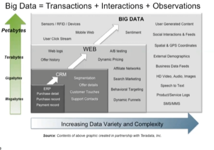

# Intro

# Class Overview

## Tools and Things we will learn

- Cloudera Hadoop
- NLP
- 

# Big Data Stuff

## What’s Big Data?

- Challenges
    - Capture
    - Curation
    - Storage
    - Search
    - Sharing
    - Transfer
    - Analysis
    - Visualization
- Big data
    - collection of data sets so large and complex that traditional means of managing and utilizing the data becomes difficult
- Applicable to tons of domains

## Big Data - 3V’s (sometimes 4)

- Volume
    - 44x increase from 09 to 2020
    - From 0.8 zettabytes to 35zb
- Velocity
    - How fast and often is data generated
- Variety
    - Relational Data (tables, transactional, legacy data)
    - Text Data (web)
    - Sem-structured (XML)
    - Graph Data
        - Networks, semantic web
- Veracity
    - Data in Doubt
        - Uncertainty
        - incompleteness
        - ambiguities
        - latency
        

## Harnessing Big Data

## Big Data Landscape

- We will be using Cloudera Hadoop
- Using machine learning to create a simple application

## Data Privacy

- GDPR, USA w/ FTC and ADPPA and CCPA

## Earthscope

- designed to track North America’s geological evolution