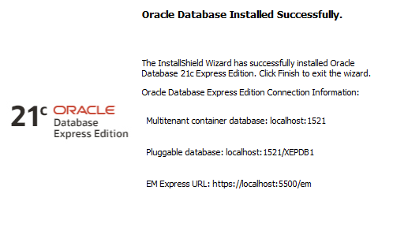

# Labs

- Oracle Database Express
- pw: Chevron_Outline2
    
    
    


- Server=localhost\SQLEXPRESS;Database=master;Trusted_Connection=True;
- C:\Program Files\Microsoft SQL Server\160\Setup Bootstrap\Log\20230830_212014
- C:\SQL2022\Express_ENU
- C:\Program Files\Microsoft SQL Server\160\SSEI\Resources


- Server=localhost\SQLEXPRESS;Database=master;Trusted_Connection=True;
- 


# Using SYS in Oracle Express

- Setup SYS username with SYSDBA role


# Password Stuff

- [ORACLE-BASE - Basic Security Measures for Oracle](https://oracle-base.com/articles/misc/basic-security-measures-for-oracle)

# Connecting to Pluggable Database

- 

# Password Verify Function

# Looking at Users

List all users that are visible to the current user:

```sql
SELECT * FROM all_users;
```

List all users in the Oracle Database:

```sql
SELECT * FROM dba_users;
```

Show the information of the current user:

```sql
SELECT * FROM user_users;
```

# Looking at Profiles

SELECT profile
FROM dba_profiles
WHERE profile LIKE 'DBSEC%';

SELECT profile
FROM user_profiles
WHERE profile LIKE 'DBSEC%';

# Lab 5

```jsx
alter session set container  = XEPDB1;
--
-- Create DBSEC_ADMIN user 
--CREATE USER DBSEC_ADMIN 
--  IDENTIFIED BY tec5363admin 
--  DEFAULT TABLESPACE USERS 
--  TEMPORARY TABLESPACE TEMP; 
--

CREATE USER DBSEC_CLERK 
  IDENTIFIED BY tec5363clerk 
  DEFAULT TABLESPACE USERS 
  TEMPORARY TABLESPACE TEMP;
  
--
---- Create DBSEC_DEV user 
--CREATE USER DBSEC_DEV 
--  IDENTIFIED BY tec5363$dev 
--  DEFAULT TABLESPACE USERS 
--  TEMPORARY TABLESPACE TEMP;
-- 
--SELECT * FROM dba_users;
--
---- Create DBSEC_ADMIN_PROF profile
--CREATE PROFILE DBSEC_ADMIN_PROF LIMIT
--  SESSIONS_PER_USER 5
--  CONNECT_TIME 480
--  IDLE_TIME 60
--  PASSWORD_LIFE_TIME 30
--  PASSWORD_GRACE_TIME 7;
--
---- Create DBSEC_DEV_PROF profile
--CREATE PROFILE DBSEC_DEV_PROF LIMIT
--  CONNECT_TIME 120
--  IDLE_TIME 120
--  CPU_PER_CALL 60
--  PASSWORD_LIFE_TIME 30
--  PASSWORD_GRACE_TIME 14;
--
-- Create DBSEC_CLERK_PROF profile
CREATE PROFILE DBSEC_CLERK_PROF LIMIT
  SESSIONS_PER_USER 1
  CPU_PER_CALL 5
  CONNECT_TIME 480
  IDLE_TIME 30
  LOGICAL_READS_PER_CALL 100
  FAILED_LOGIN_ATTEMPTS 3
  PASSWORD_LIFE_TIME 30
  PASSWORD_LOCK_TIME 3
  PASSWORD_GRACE_TIME 14;
--
---- List DBA profiles with DBSEC in the name
--SELECT profile
--FROM dba_profiles
--WHERE profile LIKE 'DBSEC%';
--
---- Create DBSEC_ADMIN_ROLE role with SELECT and ALTER privileges on all DBSEC tables
--CREATE ROLE DBSEC_ADMIN_ROLE;
--GRANT SELECT, ALTER ON DBSEC TO DBSEC_ADMIN_ROLE;
--
-- Create DBSEC_CLERK_ROLE role with SELECT, INSERT, and UPDATE privileges on all DBSEC tables
CREATE ROLE DBSEC_CLERK_ROLE;
GRANT SELECT, INSERT, UPDATE ON DBSEC TO DBSEC_CLERK_ROLE;
--
---- Create DBSEC_SUPERVISOR_ROLE role with SELECT, INSERT, UPDATE, and DELETE privileges on all DBSEC tables
--CREATE ROLE DBSEC_SUPERVISOR_ROLE;
--GRANT SELECT, INSERT, UPDATE, DELETE ON DBSEC TO DBSEC_SUPERVISOR_ROLE;
--
---- Create DBSEC_QUERY_ROLE role with SELECT privilege on CUSTOMER table owned by DBSEC
--CREATE ROLE DBSEC_QUERY_ROLE;
--GRANT SELECT ON DBSEC TO DBSEC_QUERY_ROLE;
--
---- Assign roles and profiles to DBSEC_ADMIN user
--GRANT DBSEC_ADMIN_ROLE TO DBSEC_ADMIN;
--ALTER USER DBSEC_ADMIN PROFILE DBSEC_ADMIN_PROF;
--
-- Assign roles and profiles to DBSEC_CLERK user
GRANT DBSEC_CLERK_ROLE TO DBSEC_CLERK;
ALTER USER DBSEC_CLERK PROFILE DBSEC_CLERK_PROF;
--
---- Assign roles and profiles to DBSEC_DEV user
--GRANT DBSEC_ADMIN_ROLE, DBSEC_SUPERVISOR_ROLE TO DBSEC_DEV;
--ALTER USER DBSEC_DEV PROFILE DBSEC_DEV_PROF;

--CONNECT DBSEC_CLERK/tec5363clerk@localhost:1521/XEPDB1;

SELECT * FROM dba_users;

show user;
```

```sql
--alter session set container  = XEPDB1;

-- Create WLISA user
--CREATE USER WLISA IDENTIFIED BY password;

-- Create DBSEC_CLERK user
--CREATE USER DBSEC_CLERK IDENTIFIED BY password;

--GRANT CONNECT, RESOURCE TO WLISA;
--GRANT CONNECT, RESOURCE TO DBSEC_CLERK;

-- Create an audit table
--CREATE TABLE APP_AUDIT_CUSTOMER
--(
--  AUDIT_ID NUMBER,
--  OS_USER VARCHAR2(30),
--  DB_USER VARCHAR2(30),
--  ACTION_DATE DATE,
--  ACTION_NAME VARCHAR2(30)
--);

--SELECT owner, table_name
--  FROM dba_tables;

CONNECT WLISA/password@XEPDB1;

-- Create a CUSTOMERS table
CREATE TABLE CUSTOMERS
(
  CUSTOMER_ID NUMBER PRIMARY KEY,
  CUSTOMER_NAME VARCHAR2(50),
  ADDRESS VARCHAR2(100),
  PHONE_NUMBER VARCHAR2(20)
);

-- Insert some sample data
INSERT INTO CUSTOMERS VALUES (1, 'Customer1', '123 Main St', '555-1111');
INSERT INTO CUSTOMERS VALUES (2, 'Customer2', '456 Oak St', '555-2222');
INSERT INTO CUSTOMERS VALUES (3, 'Customer3', '789 Pine St', '555-3333');
INSERT INTO CUSTOMERS VALUES (4, 'Customer4', '101 Elm St', '555-4444');
COMMIT;

-- Create a CUSTOMERS table
--CREATE TABLE CUSTOMERS
--(
--  CUSTOMER_ID NUMBER PRIMARY KEY,
--  CUSTOMER_NAME VARCHAR2(50),
--  ADDRESS VARCHAR2(100),
--  PHONE_NUMBER VARCHAR2(20)
--);
--
--alter session set container  = XEPDB1;

-- Drop the CUSTOMERS table with cascade
--DROP TABLE CUSTOMERS CASCADE CONSTRAINTS;
-- Create a trigger to restrict updates and deletes
CREATE OR REPLACE TRIGGER TRG_RESTRICT_CUSTOMER
BEFORE UPDATE OR DELETE ON CUSTOMERS
FOR EACH ROW
DECLARE
BEGIN
  IF (USER = 'WLISA' OR USER = 'DBSEC_CLERK') THEN
    RAISE_APPLICATION_ERROR(-20001, 'You do not have the privilege to update or delete the customers table. Please contact your manager if you need the privilege.');
  END IF;
END;
/

```

```sql
--alter session set container  = XEPDB1;

-- Create WLISA user
--CREATE USER WLISA IDENTIFIED BY password;

-- Create DBSEC_CLERK user
--CREATE USER DBSEC_CLERK IDENTIFIED BY password;

--GRANT CONNECT, RESOURCE TO WLISA;
--GRANT CONNECT, RESOURCE TO DBSEC_CLERK;

-- Create an audit table
--CREATE TABLE APP_AUDIT_CUSTOMER
--(
--  AUDIT_ID NUMBER,
--  OS_USER VARCHAR2(30),
--  DB_USER VARCHAR2(30),
--  ACTION_DATE DATE,
--  ACTION_NAME VARCHAR2(30)
--);

-- Insert artificial data into APP_AUDIT_CUSTOMER table
INSERT INTO APP_AUDIT_CUSTOMER (AUDIT_ID, OS_USER, DB_USER, ACTION_DATE, ACTION_NAME)
VALUES
  (1, 'WLISA', 'WLISA', TO_DATE('2023-11-16 10:30:00', 'YYYY-MM-DD HH24:MI:SS'), 'CUSTOMERS Modification');

INSERT INTO APP_AUDIT_CUSTOMER (AUDIT_ID, OS_USER, DB_USER, ACTION_DATE, ACTION_NAME)
VALUES
  (2, 'DBSEC_CLERK', 'DBSEC_CLERK', TO_DATE('2023-11-16 11:45:00', 'YYYY-MM-DD HH24:MI:SS'), 'CUSTOMERS Modification');

-- Commit the changes
COMMIT;

--SELECT owner, table_name
--  FROM dba_tables;

CONNECT WLISA/password@XEPDB1;

-- Create a CUSTOMERS table
CREATE TABLE CUSTOMERS
(
  CUSTOMER_ID NUMBER PRIMARY KEY,
  CUSTOMER_NAME VARCHAR2(50),
  ADDRESS VARCHAR2(100),
  PHONE_NUMBER VARCHAR2(20)
);

-- Insert some sample data
INSERT INTO CUSTOMERS VALUES (1, 'Customer1', '123 Main St', '555-1111');
INSERT INTO CUSTOMERS VALUES (2, 'Customer2', '456 Oak St', '555-2222');
INSERT INTO CUSTOMERS VALUES (3, 'Customer3', '789 Pine St', '555-3333');
INSERT INTO CUSTOMERS VALUES (4, 'Customer4', '101 Elm St', '555-4444');
COMMIT;

-- Create a trigger to restrict updates and deletes
CREATE OR REPLACE TRIGGER TRG_RESTRICT_CUSTOMER
BEFORE UPDATE OR DELETE ON CUSTOMERS
FOR EACH ROW
DECLARE
BEGIN
  IF (USER = 'WLISA' OR USER = 'DBSEC_CLERK') THEN
    RAISE_APPLICATION_ERROR(-20001, 'You do not have the privilege to update or delete the customers table. Please contact your manager if you need the privilege.');
  END IF;
END;
/

SELECT * FROM APP_AUDIT_CUSTOMER;

-- Create a CUSTOMERS table

--
--alter session set container  = XEPDB1;

-- Drop the CUSTOMERS table with cascade
--DROP TABLE CUSTOMERS CASCADE CONSTRAINTS;

--CREATE TABLE CUSTOMERS
--(
--  CUSTOMER_ID NUMBER PRIMARY KEY,
--  CUSTOMER_NAME VARCHAR2(50),
--  ADDRESS VARCHAR2(100),
--  PHONE_NUMBER VARCHAR2(20)
--);

---- Insert some sample data
--INSERT INTO CUSTOMERS VALUES (1, 'Customer1', '123 Main St', '555-1111');
--INSERT INTO CUSTOMERS VALUES (2, 'Customer2', '456 Oak St', '555-2222');
--INSERT INTO CUSTOMERS VALUES (3, 'Customer3', '789 Pine St', '555-3333');
--INSERT INTO CUSTOMERS VALUES (4, 'Customer4', '101 Elm St', '555-4444');
--COMMIT;

-- Create a trigger to restrict updates and deletes
--CREATE OR REPLACE TRIGGER TRG_RESTRICT_CUSTOMER
--BEFORE UPDATE OR DELETE ON CUSTOMERS
--FOR EACH ROW
--DECLARE
--BEGIN
--  IF (USER = 'WLISA' OR USER = 'DBSEC_CLERK') THEN
--    RAISE_APPLICATION_ERROR(-20001, 'You do not have the privilege to update or delete the customers table. Please contact your manager if you need the privilege.');
--  END IF;
--END;
--/

--SELECT owner, table_name FROM dba_tables;

-- Grant access to the CUSTOMERS table for WLISA
GRANT SELECT, INSERT, UPDATE, DELETE ON SYSTEM.CUSTOMERS TO WLISA;

-- Create a synonym for the CUSTOMERS table in the WLISA schema
SELECT * FROM SYSTEM.CUSTOMERS;

alter session set current_schema = WLISA;

SELECT * FROM SYSTEM.CUSTOMERS;

---- Test delete statement
DELETE FROM SYSTEM.CUSTOMERS WHERE CUSTOMER_ID = 2;
COMMIT;
--
---- View audit records
SELECT * FROM APP_AUDIT_CUSTOMER;
--
--SELECT * FROM dba_users;
--
--alter session set container  = XEPDB1;
```

```sql
alter session set container  = XEPDB1;

-- Set up database to use DB to save the auditing trail
alter system set AUDIT_TRAIL=db scope=spfile;

-- Show the auditing parameters
show parameters audit;

SHUTDOWN IMMEDIATE;
STARTUP;

SELECT table_name
FROM dba_tables
WHERE UPPER(table_name) LIKE '%AUDIT%';

**SELECT username
FROM dba_users;**

SELECT USER FROM DUAL;

-- Enable statement auditing for SELECT, INSERT, UPDATE, DELETE on all tables for all users
AUDIT SELECT TABLE, INSERT TABLE, UPDATE TABLE, DELETE TABLE
BY ACCESS
WHENEVER NOT SUCCESSFUL;

-- Enable statement auditing for EXECUTE PROCEDURE system privilege for all users
AUDIT EXECUTE PROCEDURE
BY ACCESS
WHENEVER NOT SUCCESSFUL;

-- Create audit record with bad query
select * FROM table_doesnt_exist;

-- show audit trail table
select * from DBA_AUDIT_TRAIL;

-- Create fake table
CREATE TABLE DBA_AUDIT_TRAIL_ (
  OS_USERNAME                 VARCHAR2(255),               
  USERNAME                    VARCHAR2(128),               
  USERHOST                    VARCHAR2(128),               
  TERMINAL                    VARCHAR2(255),               
  TIMESTAMP                   DATE,                        
  OWNER                       VARCHAR2(128),               
  OBJ_NAME                    VARCHAR2(128),               
  ACTION             NUMBER NOT NULL,                      
  ACTION_NAME                 VARCHAR2(28),                
  NEW_OWNER                   VARCHAR2(128),               
  NEW_NAME                    VARCHAR2(128),               
  OBJ_PRIVILEGE               VARCHAR2(32),                
  SYS_PRIVILEGE               VARCHAR2(40),                
  ADMIN_OPTION                VARCHAR2(1),                 
  GRANTEE                     VARCHAR2(128),               
  AUDIT_OPTION                VARCHAR2(40),                
  SES_ACTIONS                 VARCHAR2(19),                
  LOGOFF_TIME                 DATE,                        
  LOGOFF_LREAD                NUMBER,                      
  LOGOFF_PREAD                NUMBER,                      
  LOGOFF_LWRITE               NUMBER,                      
  LOGOFF_DLOCK                VARCHAR2(40),                
  COMMENT_TEXT                VARCHAR2(4000),              
  SESSIONID          NUMBER NOT NULL,                      
  ENTRYID            NUMBER NOT NULL,                      
  STATEMENTID        NUMBER NOT NULL,                      
  RETURNCODE         NUMBER NOT NULL,                      
  PRIV_USED                   VARCHAR2(40),                
  CLIENT_ID                   VARCHAR2(128),               
  ECONTEXT_ID                 VARCHAR2(64),                
  SESSION_CPU                 NUMBER,                      
  EXTENDED_TIMESTAMP          TIMESTAMP(6) WITH TIME ZONE,  -- Fixed this line
  PROXY_SESSIONID             NUMBER,                      
  GLOBAL_UID                  VARCHAR2(32),                
  INSTANCE_NUMBER             NUMBER,                      
  OS_PROCESS                  VARCHAR2(16),                
  TRANSACTIONID               RAW(8),                 
  SCN                         NUMBER,                      
  SQL_BIND                    NVARCHAR2(2000),             
  SQL_TEXT                    NVARCHAR2(2000),             
  OBJ_EDITION_NAME            VARCHAR2(128),               
  DBID                        NUMBER,                      
  RLS_INFO                    CLOB,                        
  CURRENT_USER                VARCHAR2(128)
);

-- Insert artificial record for a failed query by SYSTEM user
INSERT INTO DBA_AUDIT_TRAIL_
  (OS_USERNAME, USERNAME, USERHOST, TERMINAL, TIMESTAMP, OWNER, OBJ_NAME, ACTION, ACTION_NAME,
   NEW_OWNER, NEW_NAME, OBJ_PRIVILEGE, SYS_PRIVILEGE, ADMIN_OPTION, GRANTEE, AUDIT_OPTION,
   SES_ACTIONS, LOGOFF_TIME, LOGOFF_LREAD, LOGOFF_PREAD, LOGOFF_LWRITE, LOGOFF_DLOCK,
   COMMENT_TEXT, SESSIONID, ENTRYID, STATEMENTID, RETURNCODE, PRIV_USED, CLIENT_ID, ECONTEXT_ID,
   SESSION_CPU, EXTENDED_TIMESTAMP, PROXY_SESSIONID, GLOBAL_UID, INSTANCE_NUMBER, OS_PROCESS,
   TRANSACTIONID, SCN, SQL_BIND, SQL_TEXT, OBJ_EDITION_NAME, DBID, RLS_INFO, CURRENT_USER)
VALUES
  ('SYS', 'SYSTEM', 'localhost', 'terminal', SYSDATE, 'OWNER', 'DBA_AUDIT_TRAIL_', 
   100, 'CUSTOM_ACTION_NAME', 'NEW_OWNER_VALUE', 'NEW_NAME_VALUE', 'OBJ_PRIVILEGE_VALUE',
   'SYS_PRIVILEGE_VALUE', 'A', 'GRANTEE_VALUE', 'AUDIT_OPTION_VALUE',
   'SES_ACTIONS_VALUE', SYSDATE, 1, 2, 3, 'LOGOFF_DLOCK_VALUE',
   'COMMENT_TEXT_VALUE', 123, 456, 789, 101, 'PRIV_USED_VALUE', 'CLIENT_ID_VALUE', 'ECONTEXT_ID_VALUE',
   1.5, SYSTIMESTAMP, 789, 'GLOBAL_UID_VALUE', 1, 'os_process_value', '12345678', 123456, 'SQL_BIND_VALUES', 'SELECT * FROM DBA_AUDIT_TRAIL_',
   'EDITION_NAME_VALUE', 987, 'RLS_INFO_VALUE', 'SYS');

-- Delete existing records (optional if you want to start fresh)
-- DELETE FROM DBA_AUDIT_TRAIL_;

-- Insert artificial record for a failed query by DBSEC user
INSERT INTO DBA_AUDIT_TRAIL_
  (OS_USERNAME, USERNAME, USERHOST, TERMINAL, TIMESTAMP, OWNER, OBJ_NAME, ACTION, ACTION_NAME,
   NEW_OWNER, NEW_NAME, OBJ_PRIVILEGE, SYS_PRIVILEGE, ADMIN_OPTION, GRANTEE, AUDIT_OPTION,
   SES_ACTIONS, LOGOFF_TIME, LOGOFF_LREAD, LOGOFF_PREAD, LOGOFF_LWRITE, LOGOFF_DLOCK,
   COMMENT_TEXT, SESSIONID, ENTRYID, STATEMENTID, RETURNCODE, PRIV_USED, CLIENT_ID, ECONTEXT_ID,
   SESSION_CPU, EXTENDED_TIMESTAMP, PROXY_SESSIONID, GLOBAL_UID, INSTANCE_NUMBER, OS_PROCESS,
   TRANSACTIONID, SCN, SQL_BIND, SQL_TEXT, OBJ_EDITION_NAME, DBID, RLS_INFO, CURRENT_USER)
VALUES
  ('Cybersader', 'DBSEC', 'DESKTOP-VKAB06C.attlocal.net\Cybersader', 'DESKTOP-VKAB06C.attlocal.net', SYSDATE, 'DBSEC', 'CUSTOMERS', 3, 'SELECT TABLE',
   NULL, NULL, NULL, DEFAULT, NULL, NULL, NULL,
   NULL, SYSDATE, 1, 2, 3, 'LOGOFF_DLOCK_VALUE',
   'COMMENT_TEXT_VALUE', 123, 456, 789, 101, 'PRIV_USED_VALUE', 'CLIENT_ID_VALUE', 'ECONTEXT_ID_VALUE',
   1.5, SYSTIMESTAMP, 789, 'GLOBAL_UID_VALUE', 1, 'os_process_value', '12345678', 123456, 'SQL_BIND_VALUES', 'SELECT * FROM CUSTOMERS',
   'EDITION_NAME_VALUE', 987, 'RLS_INFO_VALUE', 'Cybersader');

DELETE FROM DBA_AUDIT_TRAIL_;

SELECT * FROM DBA_AUDIT_TRAIL_;

-- Audit logon and logoff activities for DBSEC_CLERK -- CYBERSADER
AUDIT SESSION BY DBSEC_CLERK WHENEVER SUCCESSFUL;

```

# Printing Artificial Output to SQL

```sql
SET SERVEROUTPUT ON;
-- Declare a variable
DECLARE
  message VARCHAR2(100);
BEGIN
  -- Assign a message
  message := 'This is a message to the script output';

  -- Use DBMS_OUTPUT.PUT_LINE to print the message
  DBMS_OUTPUT.PUT_LINE(message);
END;
/

-- Disable DBMS_OUTPUT
SET SERVEROUTPUT OFF;
```