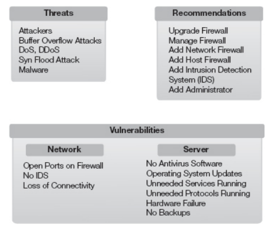

# CH4-7

# Ch 4 - Developing a Risk Management Plan

- Risk Management Plan is just a specialized type of project management
- If you fail to plan, then you plan to fail
- **GOAL: Create a plan that mitigates risks with various solutions.  Planning helps so to be within budget and on schedule.**
- **POAM - Plan of action and milestones**

Chapter 4 Topics:
• What the objectives of a risk management plan are
• What the scope of a risk management plan is
• How to assign responsibilities in a risk management plan
• How procedures and schedules are described in the risk management plan
• What the reporting requirements are
• What a plan of action and milestones is
• How to chart the progress of a risk management plan

## Objectives of Risk Management

Objectives should be established as early as possible.

Common Objectives:

- A list of threats
- A list of vulns
- Costs associated with risks
- Risk mitigations
- Mitigation/solution costs
- Cost-benefit analysis
- One or more reports

Implementation of objective completion:

- Document management decisions
- Document and track implementation of accepted recommendations
- Include a POAM

### Objectives Example

- Identify threats
    - IT infrastructure related attacks
    - IT infrastructure failure
    - Loss of internet
- Identify vulns
    - no firewall
    - no IDS
    - no AV
    - No system for updating assets
    - No AV updates
- Assign responsibilities
    - This is important in real organization
- Identify Cost of outage
    - direct and indirect costs
- Recommendations
    - mitigate risks
- Cost of mitigations
- CBA - cost benefit analysis
- Document accepted recommendations
    - choices must be documented
- Create POAM
    - uses responsiblities and objectives to track implementation

## Scope of Risk MGMT

**Scope creep is bad**

- Make boundaries for the plan
- Scope creep comes from uncontrolled changes.
- Uncontrolled changes lead to **cost overruns**  and **missed deadlines**
- Even with good will, this can subvert the objectives established
- Additional efforts can always become liabilities if they aren’t low risk and easy to implement

**Stakeholders** (Ex: CEO, CIO, CFO, CCO) - are important in defining project scope.  They should help draft scope statements.

- Not involving stakeholders can lead to the project’s death later down the line

## Assigning Roles and Responsibilities

Assigning responsibilities provides accountability.

### Common Responsibilities

- Risk Managemenet PM (project manager)
- Stakeholders
- Departments or department heads
- Executive officers such as CIO or CFO

### Assignment Considerations

- Do they have the authority to complete the task?
- Who do they report to?

### Risk MGMT PM - Common Tasks

- Ensure controlled costs
- Ensure quality
- Ensure the project in on schedule
- Ensure scope of the project
- Track and manage project issues
- Ensure information is available to all stakeholders
- Raise issues and problems as they become known
- Ensure people are aware of their tasks and deadlines

### Common Tasks for other individuals

- Risk identification
- Risk assessment
- Risk mitigation steps
- Reporting

### Create an “Affinity Diagram” to find realistic threats, vulns, and recommendations

Mitre tool - [http://www.mitre.org/work/sepo/toolkits/risk/index.html](http://www.mitre.org/work/sepo/toolkits/risk/index.html)

Steps for creating diagram:

- Identify problem
- Brainstorm
- Classify ideas into groups (usually threats, vulns, mitigations)

## Procedures and Schedules for Accomplishment

Define the procedure for implementing a mitigation or recommendation.

Necessary Communication with Management before Implementing Controls:

These are things that must be defined for management to approve.

- Recommendation
- Justification
- Procedure

## Report Requirements

Technical stuff for show. Reports for dough.

Risk MGMT Reporting Categories:

- Recommendations
- Document Management Response to Recommendations
- Document and Track Implementation of Accepted Recommendations
- Create a Plan of Action and Milestones (POAM)
    - tracks risk response actions

Basic Info in Risk Report:

- Findings
- Recommendation cost and time frame
- Cost-benefit analysis

Findings:

- Threats → Cause
    - identify ROOT causes too
- Vulnerabilities → Criteria
- Losses → Effect

### Considerations for Findings

- Methods—What methods could contribute to an outage?
- Machinery—What machinery issues could contribute to an outage?
- Manpower—What manpower issues could contribute to an outage?
- Materials—What material issues could contribute to an outage?
- Environment—What environmental issues could contribute to an outage?

### CBA (Cost Estimate) Accuracy

- Always be skeptical with these
- Confirmation Bias, positivity bias
- Success can be overestimated or underestimated
- People forget about basic projections

### If-then Risk Statements

- easy way to communicate risks and the impacts

### Documenting MGMT Response to Recommendations

MGMT Response Options: (accept, defer, modify)

It’s important to have responses on an official succinct record.  “Cover-your-ass”

Timelines are important and if you know that something can deferred (extended to be implemented later) and it is exploited before then, then you have it on record.  This prevents any awkward finger pointing from happening.

## Plan of Action & Milestones

Assign responsibilites and allow for management follow-up.

- Easy to hold certain people accountable
- Easy to find the source of a problem in implementing a procedure

### Basic POAM:

*Tasks can also have sub-tasks*

### **Useful Properties to include in tasks:**

• Associated threat or vulnerability
• Risk level (low, medium, or high)
• Step or milestone name
• Assignment of responsibility
• Point of contact
• Estimated cost
• Actual cost
• Estimated person hours to complete task
• Actual person hours to complete task
• Scheduled start date
• Actual start date
• Milestone due date
• Current status
• Scheduled completion date
• Actual date of completion
• Comments

### Useful Tools for PM:

- Milestone plan chart
- Gantt chart
- Critical path chart

## Charting the Progress of Risk MGMT Plan

There are a lot of Project Management Tools out there.  Make sure they are worth using for the project.  #1 is to always have a central place and easy workflow for managing the project.

# Ch 5 - Defining Risk Assessment Approaches

*Risk MGMT Techniques* - avoid, share, transfer, mitigate, accept.

*Risk Assessments* allow you to prioritize certain risks.  Cover the most risk surface. 

*Assessment Methods -* quantitative and qualitative

Chapter 5 Topics:

- What risk assessment is
- What the critical components of a risk assessment are
- What types of risk assessments are available
- Which risk assessment challenges you should address
- What best practices for risk assessments are

## Understanding Risk Assessment

Risk Assessment helps identify controls/safeguards.

Risk Management must also consider - profitability & survivability

## Importance of Risk Assessments

Hard to prioritize risks without them. Hard to cover risk surface properly.

When to do an RA:

- When evaluating risk
- When evaluating a control
- After a control has been implemented
    - make sure controls are still useful

## Purpose of a Risk Assessment

Assisting MGMT

- Where to put resources
- Control effectiveness

### General RA Steps

- Identify threats and vulns
- identify likelihood of risks
- identify asset values
    - hardware, systems, etc
- Impacts of risks
- control usefulness

## Critical Components of a Risk Assessment

### Identify Scope

- make sure this is easily defined
- participants must understand the scope
- puts resources where they need to be

### Identify Critical Areas

- focus on business profit and survival
- critical or sensitive data

### Identify Team Members

- Input from the people correcting the risks should not be the deciding factor

## Types of Risk Assessments

Designing the RA process to be by numbers or by testimonial can drastically affect the timeline of the assessment.

### Quantitative Risk Assessments

- Can require a lot of inputs
- Straightforward for decision-making if done well

Terms associated w/quantitative RA:

- Single Loss Expectancy (SLE) - total loss from one incident
- Annual Rate of Occurrence (ARO)
- Annual Loss Expectancy (ALE) - SLE x ARO
- Safeguard Value - Cost of control

Benefits & Limitations:

- Benefits
    - easier for MGMT
    - good for reporting and records
- Limitations
    - lack of data
    - estimation accuracy of control implementation benefits

### Qualitative Risk Assessments

- Relies on tesimonial of relevant experts and sources
- Usually based around Probability x Impact or Criticality x Likelihood
- **Use some sort of pseudo-objective formula to define risks here**
    - likelihood of exploit x impact
    - probability x criticaliity

Benefits:

- expert testimony
- easy to complete
- easier to communicate terms and aspects of the risks

Limitations:

- Subjective
- Who is an expert really?
- No CBA
- No real standards

### Prioritizing the Risk

- Use some analysis and metrics that take into account:
    - criticality
        - assets involved
        - impact
    - probability
        - how easy it is to exploit
        - system likelihood of failure
        - outside knowledge of the weakness
    - entropy
        - unknowns

## Sample Risk Assessment

## Risk Assessment Challenges

- Static process to look at a moving target
- Low resources and data
- Getting leadership support
- Data consistency
- Esimating impact effects
- Department communication
- Dependent on institutional knowledge sharing
- Results that support resource allocation and risk acceptance
- Businesses change rapidly

## Best Practices for Risk Assessment

- **Clear goals and defined scope -** prevent scope screep.  Scope statement.
- **Senior management support -** MGMT needs to be committed to the RA.
- **Strong RA Team -** team members need expertise or good research and communication.
- **Repeat the RA periodically -** Threats, risks, and vulns evolve.
- **Define workflows and methodologies for the RAs -** this will make it easier to implement and communicate within the organization.

# Ch 6 - Performing a Risk Assessment

Chapter 6 Topics:

- Methodology considerations
- Management structure
- Assets and activities
- Relevant Threats
- Relevant vulns
- Evaluate countermeasures
- Methodology based on assessment needs
- Developing mitigating recommendations
- What presenting risk assessment results entails
- Best practices for performing risk assessments

## Selecting a Risk Assessment Methodology

General RA Steps:

- Assets and Activities
- Threats
- Vulns
- Evaluate Countermeasures
- Assess threats, vulns, exploits
- Evaluate risks
- Develop recommendations to mitigate risks
- Present recommendations to management

Preliminary actions for RA:

- Define the assessment
- Review previous findings

### Defining the Assessment

- Define the system or process being assessed
- This is important because systems and processes change
    - very important for covering your ass, legal reports, etc.

Operational Characteristics

- Don’t just name the system
- Define how it operates in your environment
- How is the system configured and operating?
- Examples:
    - network diagrams and descriptions
    - architectures and tech stacks
    - database schemas
    - management structure
    - roles

Mission of the System

- Can be a paragraph
- What does it do?

## Configuration & Change Managment

These have a direct impact on risk assessments.

**Configuration Management -** baselines, scripting, and automation used make sure that similar system share configuration.  Easier to evaluate risks

**Change Management -** prevents unapproved changes to systems. This helps track any system changes and makes sure they are approved.

HOLY CRAP…data and asset mapping and documentation for assets, configurations, architectures, and IT infrastructure can make everyone’s job easier.

## Reviewing Previous Findings

Old reports can have a lot a useful information when you don’t have great configuration or change management.

Useful information from past assessments:

- **Recommendations** - can address relevant threats and vulnerabilities. These may show what used to be valuable.
- **Status of Approved Recommendations** - previous report can help you understand why it hasn’t been implemented yet
- **Unapproved Recommendations** - They may indicate the org is willing to accept higher residual risk. If losses were suffered which could have been mitigated, this can give you some black mail to get newer recommendations in place.

## Identifying the Management Structure

- Keep the scope of an assessment within the onwership of a single entity
    - Ex: single IT team

### Common Teams over Systems

- Network Infrastructure
- User and Computer MGMT
- E-mail servers
- Web Servers
- Database Servers
- Configuration and Change Management

## Identifying Assets and Activities Within Risk Assessment Boundaries

### Asset Valuation

Methods to determine value:

- Replacement cost
- What value asset provides
- Recovery Value
- Combination of previous methods

Elements to consider

- System access and availability
- System functions
- Hawrdware and software assets
- Personnel Assets
- Data and Information Assets
- Facilities and Supplies

## Identifying and Evaluating Relevant Threats

<aside>
💡 Threat - any potential danger

</aside>

## Reviewing Historical Data

Use historical data to identify realistic threats.

Events to look for:

- Attacks
- Natural events
- Accidents
- Equipment Failures

## Performing Threat Modeling

Threat Model provides info on:

- System
- Threat profile - lists of threats, what attackers may do, possible goals of attack.
- Threat Analysis - is asset vulnerable to any of these threats?

## Identifying and Evaluating Relevant Vulnerabilities

<aside>
💡 Vuln = Weakness

</aside>

- All systems have vulnerabilities
- Not all vulns → loss

## Vulnerability Assessments

Discover weaknesses in a system.

Example Process:

- OSINT - systems to scan
- Recon - scan the systems for vulns

## Exploit Assessments

Discover exploitable weaknesses

Example Process:

- POC - proof of concept
- Pentesting - have an expert do the attack

## Identifying and Evaluating Countermeasures

<aside>
💡 Countermeasure = Control = Safeguard

</aside>

### In-Place and Planned Countermeasures

- **In-Place** - currently installed in the operational system
    - risk assessments can include evaluation of these
- **Planned** - have a specified implementation date
    - review docs or people that recommended them
    - maybe enhance them?

### Types of Controls

<aside>
💡 NIST SP 800-53 - great framework for security controls ^^^^^

</aside>

Procedural (used to be called “administrative”):

- Policies and Procedures
- Security Plans
- Insurance
- Personnel Checks
- Awareness and Training
- Rules of Behavior

Technical:

- Login ID
- Session Timeout
- System Logs
- Audit Trails
- Firewalls
- Encryption

Physical:

- Locked Doors
- Guards and Access Logs
- Video Cameras
- Fire Detection and Suppression
- Water Detection
- Temp and Hummidity Detection
- Electrical Grounding and Circuit Breakers

## Selecting a Methodology Based on Assessment Needs

- Quantitative
    - SLE - single loss expectancy
    - ARO - annual rate of occurrence
    - ALE - annual loss expectancy
        - before and after control
    - Safeguard or control value - cost of control
- Qualitative
    - Probability
    - Impact

## Developing Mitigating Recommendations

Supporting Data for Recommendations:

- Threat/vuln pairs
- Estimate and cost and time to implement
- Estimate of operational impact
- Cost-benefit Analysis (CBA)

## Threat/Vulnerability Pairs

<aside>
💡 You must have both threat and vuln to have risk.

</aside>

## Estimate of Cost and Time to Implement

<aside>
⛔ **underestimating cost of control → BAD**

</aside>

- Include a schedule if possible
- direct and indirect costs

## Estimate of Operational Impact

**Operational impacts**

4 computer areas:

1. Processor - AV systems taking up CPU
2. Memory - RAM
3. Disk - Controls should never require a lot of storage
4. Network Interfact Card (NIC) - consider bandwidth of NIC if control transfers a lot of data

## Cost-Benefit Analysis

<aside>
📈 Just Save Money - do your research & go to the right people to get estimates

</aside>

## Best Practices for Performing Risk Assessments

- Describe Systems Fully
- Review Past Audits
- Review Past Risk Assessments
- Match the RA to the management structure
- Identify assets within the RA boundaries
- Identify and evaluate relevant threats
- Identify and evaluate relevant vulnerabilities
- Identify and evaluate countermeasures
- Track the results

# Ch 7 - Identifying Assets and Activities to Be Protected

## System Access and Availability

## System Functions: Manual and Automated

## Hardware Assets

## Software Assets

## Personnel Assets

## Data and Information Assets

### Data Classification (Categories)

## Asset and Inventory Management Within the Seven Domains of a Typical IT Infrastructure

## Identifying Facilities and Supplies Needed to Maintain Business Operations