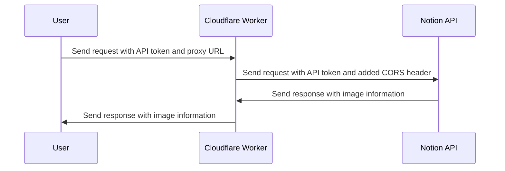

# Convert Notion to Ghost Blog Post in 30 Seconds // Paste Markdown with Local Images to Ghost (Free)

# MISC




# Free Workflow (doesn’t require Ghost pro)

- Export from Notion as Markdown and Images
- Upload the images to Ghost in a markdown card
- Custom Subtitution tool for local images in Markdown
    - Paste the markdown card images lines into the custom tool
    - The custom tool will use the description lines to find the local image files in the Markdown file
    - It substitutes the local URL with the ones pasted in from Ghost line by line
    - The resulting subtituted Markdown is generated in the output
    - Copy the output and paste into a Ghost blog post
- Give the blog a title

# CORS Header Proxy

This error is caused by a restriction called "Cross-Origin Resource Sharing (CORS)" which blocks the JavaScript code from making a request to an API hosted on a different domain. To fix this issue, you will need to make the request to the Notion API from a backend server that you control, instead of making it directly from the client-side JavaScript code in the browser.

One way to achieve this is by creating a proxy server that sits between the client and the Notion API. The client will make a request to the proxy server, which will then forward the request to the Notion API and return the response back to the client. This way, the client will not be blocked by the CORS restriction, as the proxy server will be making the request to the Notion API on behalf of the client.

> Is there a header I can put in the request to get around this?
> 

No, there is no header that you can add to the request to bypass the CORS policy. The CORS policy is a security feature implemented by the browser to prevent unauthorized access to resources from different domains. In order to bypass the CORS policy, the server hosting the resource (in this case, the Notion API) would need to add the 'Access-Control-Allow-Origin' header to its response, allowing requests from your domain.

If you need to make requests to the Notion API from a client-side application, you can consider using a server-side proxy to make the API requests. This way, the proxy would make the request to the Notion API and return the response to your client-side application, bypassing the CORS policy.

> What about the part that says "If an opaque response serves your needs, set the request's mode to 'no-cors' to fetch the resource with CORS disabled" ??
> 

Setting the request's mode to 'no-cors' would mean that the browser would not enforce the same-origin policy, which would normally prevent the request from being made if the origin of the request and the origin of the response are different. However, this would also mean that the response from the server would not be accessible by your JavaScript code, which would likely make it impossible to use the data returned by the API.

In this case, it's likely better to look for a solution that allows the request to be made with CORS enabled, such as hosting your code on a server or using a proxy to make the API request.

> Can you use a browser proxy to add the CORS header like Burp Suite?
> 

Yes, you can use a browser proxy like Burp Suite to add the CORS header. To do this, you would need to configure your browser to use Burp Suite as a proxy, and then configure Burp Suite to add the necessary CORS header to the requests made by your browser. This can be done by creating a custom rule in Burp Suite that modifies the requests made by your browser to include the desired CORS header.

1. Start Burp Suite and configure your browser to use Burp Suite as a proxy.
2. In Burp Suite, go to the Proxy tab and then to the Options sub-tab.
3. Under the Proxy Listeners section, ensure that the default listener is enabled and configured to listen on all network interfaces.
4. In your browser, go to the Notion page that you want to modify and initiate the API request to update the image file names.
5. In the Burp Suite Proxy tab, you should see the API request being captured.
6. Right-click on the captured request and select "Send to Repeater".
7. In the Repeater tab, right-click on the request and select "Add to / Remove from Sites". This will add the Notion API endpoint to the scope.
8. In the Options tab, go to the Request Handling section and enable the "Add CORS header to requests" option.
9. Click the "Go" button in the Repeater tab to send the request with the CORS header added.
10. Check the response to see if the image file names have been updated successfully.

Note: You should always exercise caution when using Burp Suite or any other proxy tool and only use it on systems that you own or have permission to access.

# Resources

- Free Method Resources
    - [Getting Images into Markdown Documents and Weblog Posts with Markdown Monster | by Rick Strahl | Markdown Monster Blog | Medium](https://medium.com/markdown-monster-blog/getting-images-into-markdown-documents-and-weblog-posts-with-markdown-monster-9ec6f353d8ec)
- Methods that Require Ghost Pro
    - [Notion to HTML API](https://myblock.webflow.io/post/notion-to-html-api)
    - https://github.com/asnunes/notion-page-to-html
    - [(56) notion to ghost - YouTube](https://www.youtube.com/results?search_query=notion+to+ghost)
    - [Docker Hub Container Image Library | App Containerization](https://hub.docker.com/)
    - [Heroku Elements](https://elements.heroku.com/)
- Misc
    - [Importing content from other platforms to Ghost](https://ghost.org/docs/migration/content/)
    - [@tryghost/html-to-mobiledoc - npm](https://www.npmjs.com/package/@tryghost/html-to-mobiledoc)
- CORS header proxy Cloudflare workers
    - [CORS header proxy · Cloudflare Workers docs](https://developers.cloudflare.com/workers/examples/cors-header-proxy/)
    - [Set up CORS header for Cloudflare proxied websites – Bart Solutions Technical Blog](https://bartsolutions.github.io/2021/10/21/cloud-flare-cors-worker-setup/)
- CORS header proxy stuff
    - [Hacking HTTP CORS from inside out: a theory to practice approach | by Lucas Vinícius da Rosa | InfoSec Write-ups](https://infosecwriteups.com/hacking-http-cors-from-inside-out-512cb125c528)
    - [Allow CORS: Access-Control-Allow-Origin - Chrome Web Store](https://chrome.google.com/webstore/detail/allow-cors-access-control/lhobafahddgcelffkeicbaginigeejlf?hl=en)
    - [blocked by CORS policy? CORS Proxy is Solution 😎 - DEV Community 👩‍💻👨‍💻](https://dev.to/rajeshj3/blocked-by-cors-policy-cors-proxy-is-solution-5ck8)
- Converting Notion to MD
    - https://github.com/souvikinator/notion-to-md
- CDNs, packages, JS CDNs, Bundling (Webpack, Rollup), Etc.
    - It is essential to be able to use libraries randomly with Webflow
    - [Browserify](https://browserify.org/)
    - [UNPKG](https://unpkg.com/)
    - [jsDelivr - A free, fast, and reliable CDN for JS and open source](https://www.jsdelivr.com/)
        - [Migrate from GitHub to jsDelivr](https://www.jsdelivr.com/github)
    - [Rollup | Rollup](https://rollupjs.org/)
    - [Parcel](https://parceljs.org/)
    - [terser · JavaScript mangler and compressor toolkit for ES6+](https://terser.org/)
    - [UglifyJS — JavaScript parser, compressor, minifier written in JS](https://lisperator.net/uglifyjs/)
        - [UglifyJS 3: Online JavaScript minifier](https://skalman.github.io/UglifyJS-online/)
    - [Babel · The compiler for next generation JavaScript](https://babeljs.io/repl#?browsers=&build=&builtIns=false&corejs=3.21&spec=false&loose=false&code_lz=Q&debug=false&forceAllTransforms=false&shippedProposals=false&circleciRepo=&evaluate=false&fileSize=false&timeTravel=false&sourceType=module&lineWrap=true&presets=env%2Creact%2Cstage-2&prettier=false&targets=&version=7.20.15&externalPlugins=&assumptions=%7B%7D)
- Notion Blog
    - 

# Misc Code & Errors

```bash
Uncaught (in promise) SyntaxError: Unexpected token '<', "<!DOCTYPE "... is not valid JSON
```

```bash
Access to fetch at 'https://notion-cors-header-proxy.cybersader.workers.dev/' from origin 'https://cybersader-tools.webflow.io' has been blocked by CORS policy: No 'Access-Control-Allow-Origin' header is present on the requested resource. If an opaque response serves your needs, set the request's mode to 'no-cors' to fetch the resource with CORS disabled.
```

```bash
/*
async function updateNotionImageFileNames(pageId, apiToken) {
  const notionUrl = `https://api.notion.com/v1/blocks/${pageId}`;
  console.log("Notion URL: ", notionUrl);
  const notionHeaders = {
    'Authorization': `Bearer ${apiToken}`,
    'Notion-Version': '2022-06-28',
    'Content-Type': 'application/json',
  };
  // Get the block that represents the page
  const pageResponse = await fetch(notionUrl, { headers: notionHeaders });
  const pageData = await pageResponse.json();
  let prefix = 1;
  // Iterate through the block children to find image blocks
  for (const child of pageData.block.children) {
    if (child.type === 'embed' && child.embed.type === 'image') {
      const oldUrl = child.embed.url;
      const fileName = oldUrl.split('/').pop();
      const fileExtension = fileName.split('.').pop();
      const newFileName = `${prefix.toString().padStart(4, '0')} ${fileName}`;
      const newUrl = oldUrl.replace(fileName, newFileName);
      // Update the file name property of the image block
      const patchPayload = {
        file: {
          name: newFileName,
        },
        embed: {
          url: newUrl,
        },
      };
      const blockUrl = `${notionUrl}/${child.id}`;
      await fetch(blockUrl, { method: 'PATCH', headers: notionHeaders, body: JSON.stringify(patchPayload) });
      prefix++;
    }
  }
}
*/
```

```bash
/*
async function updateNotionImageFileNames(pageId, apiToken, workerUrl) {
  const notionUrl = `https://api.notion.com/v1/blocks/${pageId}`;
  console.log("Notion URL: ", notionUrl);
  const notionHeaders = {
    'Authorization': `Bearer ${apiToken}`,
    'Notion-Version': '2022-06-28',
    'Content-Type': 'application/json',
  };
  const body1 = JSON.stringify({
      url: notionUrl,
      headers: notionHeaders
    })
  console.log("Request Body to Proxy:", body1);
  // Get the block that represents the page
  const pageResponse = await fetch(workerUrl, {
    method: 'POST',
    headers: {
      'Content-Type': 'application/json'
    },
    body: body1
  });
  const pageData = await pageResponse.json();
  
  console.log("PAGE DATA: ",pageData);
  
  let prefix = 1;
  // Iterate through the block children to find image blocks
  for (const child of pageData.block.children) {
    if (child.type === 'embed' && child.embed.type === 'image') {
      const oldUrl = child.embed.url;
      const fileName = oldUrl.split('/').pop();
      const fileExtension = fileName.split('.').pop();
      const newFileName = `${prefix.toString().padStart(4, '0')} ${fileName}`;
      const newUrl = oldUrl.replace(fileName, newFileName);
      // Update the file name property of the image block
      const patchPayload = {
        file: {
          name: newFileName,
        },
        embed: {
          url: newUrl,
        },
      };
      const blockUrl = `${notionUrl}/${child.id}`;
      
      const body2 = JSON.stringify({
          url: blockUrl,
          method: 'PATCH',
          headers: notionHeaders,
          body: JSON.stringify(patchPayload)
        })
        
      console.log("Request BODY: ", body2);
      const patchResponse = await fetch(workerUrl, {
        method: 'POST',
        headers: {
          'Content-Type': 'application/json'
        },
        body: body2
      });
      prefix++;
    }
  }
}*/
```

```bash
async function updateNotionImageFileNames(pageId, apiToken, workerUrl) {
  const notionUrl = `https://api.notion.com/v1/blocks/${pageId}`;
  console.log("Notion URL: ", notionUrl);
  const notionHeaders = {
    'Authorization': `Bearer ${apiToken}`,
    'Notion-Version': '2022-06-28',
    'Content-Type': 'application/json',
  };
  const getPageRequest = {
      url: notionUrl,
      method: 'GET',
      headers: notionHeaders
    };
  const patchBlockRequest = (blockId, patchPayload) => ({
      url: `${notionUrl}/${blockId}`,
      method: 'PATCH',
      headers: notionHeaders,
      body: JSON.stringify(patchPayload)
    });
  console.log("Request Body to Proxy:", getPageRequest);
  // Get the block that represents the page
  const pageResponse = await fetch(workerUrl, {
    method: 'POST',
    headers: {
      'Content-Type': 'application/json'
    },
    body: JSON.stringify(getPageRequest)
  });
  const pageData = await pageResponse.json();
  
  console.log("PAGE DATA: ",pageData);
  
  let prefix = 1;
  // Iterate through the block children to find image blocks
  for (const child of pageData.block.children) {
    if (child.type === 'embed' && child.embed.type === 'image') {
      const oldUrl = child.embed.url;
      const fileName = oldUrl.split('/').pop();
      const fileExtension = fileName.split('.').pop();
      const newFileName = `${prefix.toString().padStart(4, '0')} ${fileName}`;
      const newUrl = oldUrl.replace(fileName, newFileName);
      // Update the file name property of the image block
      const patchPayload = {
        file: {
          name: newFileName,
        },
        embed: {
          url: newUrl,
        },
      };

      const patchBlockBody = patchBlockRequest(child.id, patchPayload);
      console.log("Request BODY: ", patchBlockBody);
      const patchResponse = await fetch(workerUrl, {
        method: 'POST',
        headers: {
          'Content-Type': 'application/json'
        },
        body: JSON.stringify(patchBlockBody)
      });
      prefix++;
    }
  }
}
```


```bash
// Connects to Notion API and changes image file names
async function updateNotionImageFileNames(pageId, apiToken, workerUrl) {
  const notionUrl = `https://api.notion.com/v1/blocks/${pageId}`;
  console.log("Notion URL: ", notionUrl);
  const notionHeaders = {
    'Authorization': `Bearer ${apiToken}`,
    'Notion-Version': '2022-06-28',
    'Content-Type': 'application/json',
  };
  const getPageRequest = {
      url: notionUrl,
      method: 'GET',
      headers: notionHeaders
    };
  const patchBlockRequest = (blockId, patchPayload) => ({
      url: `${notionUrl}/${blockId}`,
      method: 'PATCH',
      headers: notionHeaders,
      body: JSON.stringify(patchPayload)
    });
  console.log("Request Body to Proxy:", getPageRequest);

  // Get the block that represents the page
	//ERRORS HERE
  const pageResponse = await fetch(workerUrl, {
    method: 'POST',
    headers: {
      'Content-Type': 'application/json'
    },
    body: JSON.stringify(getPageRequest)
  });
  const pageData = await pageResponse.json();
  
  console.log("PAGE DATA: ",pageData);
  
  let prefix = 1;

  // Iterate through the block children to find image blocks
  for (const child of pageData.block.children) {
    if (child.type === 'embed' && child.embed.type === 'image') {
      const oldUrl = child.embed.url;
      const fileName = oldUrl.split('/').pop();
      const fileExtension = fileName.split('.').pop();
      const newFileName = `${prefix.toString().padStart(4, '0')} ${fileName}`;
      const newUrl = oldUrl.replace(fileName, newFileName);
      // Update the file name property of the image block
      const patchPayload = {
        file: {
          name: newFileName,
        },
        embed: {
          url: newUrl,
        },
      };

      const patchBlockBody = patchBlockRequest(child.id, patchPayload);
      console.log("Request BODY: ", patchBlockBody);
      const patchResponse = await fetch(workerUrl, {
        method: 'POST',
        headers: {
          'Content-Type': 'application/json'
        },
        body: JSON.stringify(patchBlockBody)
      });
      prefix++;
    }
  }
}
```


```bash
// Iterate through the block children to find image blocks
    if (pageData.block && pageData.block.children) {
        for (const child of pageData.block.children) {
            if (child.type === 'embed' && child.embed.type === 'image') {
                const oldUrl = child.embed.url;
                const fileName = oldUrl.split('/').pop();
                const fileExtension = fileName.split('.').pop();
                const newFileName = `${prefix.toString().padStart(4, '0')} ${fileName}`;
                const newUrl = oldUrl.replace(fileName, newFileName);
                // Update the file name property of the image block
                const patchPayload = {
                    file: {
                        name: newFileName,
                    },
                    embed: {
                        url: newUrl,
                    },
                };
                const patchBlockBody = patchBlockRequest(child.id, patchPayload);
                console.log("Request BODY: ", patchBlockBody);
                const patchResponse = await fetch(patchBlockRequest(child.id, patchPayload), {
                    method: "POST",
                    headers: {
                        "Content-Type": "application/json",
                    },
                });

                prefix++;
            }
        }
    }
```

[https://stackedit.io/app#](https://stackedit.io/app#)

```bash
// Connects to Notion API and changes image file names
async function parseNotionPage(pageId, apiToken, workerUrl, pageName) {
    //const notionUrl = `https://api.notion.com/v1/pages/${pageId}`;
    const notionUrl = `https://api.notion.com/v1/blocks/${pageId}/children`;
    console.log("Notion URL: ", notionUrl);
    const notionHeaders = {
        'Authorization': `Bearer ${apiToken}`,
        'Notion-Version': '2022-06-28',
        'Content-Type': 'application/json',
    };
    const getPageUrl = new URL(workerUrl);
    getPageUrl.searchParams.set("url", notionUrl);
    getPageUrl.searchParams.set("method", "GET");
    getPageUrl.searchParams.set("headers", JSON.stringify(notionHeaders));

    // Get the block that represents the page
    const pageResponse = await fetch(getPageUrl, {
        method: "GET",
    });
    const pageData = await pageResponse.json();
    console.log("PAGE DATA: ", pageData);
    let prefix = 1;
    let s3BucketUrls = [];
    // Get the blocks from the page content
    const blocks = pageData.results;
    if (blocks) {
    		let i = 0;
        for (const block of blocks) {
        		console.log("BLOCK [", i, "]:", block);
            if (block.type == "image") {
              	//TODO CONFIG
                if(block.image.file.url) {
                	s3BucketUrls.push(block.image.file.url);
                }
            }
            i++;
        }
        //let NotionPageMarkdown = processPageIntoMarkdown(pageData);
        //console.log("NOTION PAGE MARKDOWN: ", NotionPageMarkdown);
        console.log("IMAGE URLs from S3: ", s3BucketUrls);
        for (let i = 0; i < s3BucketUrls.length; i++) {
            const s3BucketUrl = s3BucketUrls[i];
          	console.log("S3 BUCKET URL: ", s3BucketUrl);
          	const fixed_s3_url = s3BucketUrl.replace("https://s3.", "https://s3-");
            //const imageFilenameRegex = /[\]]{0,1}[\(]{0,1}(([^\[\]]*)[\/](([a-zA-Z0-9.\%\_\-\(\)]+)\.(gif|jpe?g|tiff?|png|webp|bmp|svg)))[\?]{0,1}/;
          	//const imageFilenameRegex = /\!\[(.*)[\]][\(]{0,1}(([^\[\]]*[\/](.*))[\/](([a-zA-Z0-9.\%\_\-\(\)]+)\.(gif|jpe?g|tiff?|png|webp|bmp|svg)))\)[\?]{0,1}/;
          	const imageFilenameRegex =/(([^\[\]]*[\/](.*))[\/](([a-zA-Z0-9.\%\_\-\(\)]+)\.(gif|jpe?g|tiff?|png|webp|bmp|svg)))[\?]{0,1}/  
          	const fileName_match_groups = fixed_s3_url.match(imageFilenameRegex);
            const _fileName = fileName_match_groups[4];
            const fileName = replacePercentWithUnderscore(_fileName);
            //const s3BucketUrl_cleaned = fileName_match_groups[1];
          	const S3_URL_UUID = fileName_match_groups[3];
          	console.log("S3_URL_UUID: ",S3_URL_UUID);
            console.log("[", i, "] ", "OLD IMAGE FILE NAME: ", fileName);
            const newFileName = `${prefix.toString().padStart(4, '0')}-${fileName}`;
            console.log("[", i, "] ", "NEW IMAGE FILE NAME: ", newFileName);
            const fileExtension = fileName.split('.').pop();
            UUIDToFileMap[S3_URL_UUID] = newFileName;
            zip.file(newFileName, fetchImage(s3BucketUrl), {
                binary: true
            });
            prefix++;
        }
        console.log("FILENAME CHANGE MAPPING: ", UUIDToFileMap);
        downloadReady = true;
        showDownload.click();
        document.querySelector(".text-block-13").textContent = "Download Renamed Notion Images";
        apiStatusCodeMirror.setValue("Notion Images Parsed from Notion Page. Download the renamed image files!");
    } else {
        console.error("Error: Block or children property not found in page data.");
        const blockIDEr = `Make sure that you are using the correct ID and that
        		your API token has the correct permissions.Additionally,
            make sure that you 've actually shared the Notion 
            page with the integration - Notion page >> 3dots >> Connections;`
        apiStatusCodeMirror.setValue(blockIDEr);
    }
}
```

```bash
var zip = new JSZip();
const convertButton2 = document.querySelector('#convertButton2');
let downloadReady = false;
const showDownload = document.getElementById("showDownload");
let pageId = ""
let pageName = ""
let UUIDToFileMap = {};

function replacePercentWithUnderscore(str) {
    return str.replace(/%/g, "_");
}

convertButton2.addEventListener('click', async () => {
    if (downloadReady) {
        zip.generateAsync({
            type: "blob"
        }).then(function(blob) {
            // Trigger the download
            let imageFileZipName = `renamed-notion-images-${pageName}.zip`
            saveAs(blob, imageFileZipName);
        });
    } else {
        if (inputNotionUrl) {
            const pageUrl = inputNotionUrl.value;
            const corsProxyUrl = inputCorsProxyUrl.value;
            console.log(pageUrl);
            const pageIdRegex = /((https?:\/\/www.notion\.(so|com)\/([a-zA-Z0-9-]+-){1}([a-zA-Z0-9]+)\?pvs\=([0-9]+))|([0-9a-fA-F]{8}\-[0-9a-fA-F]{4}\-[0-9a-fA-F]{4}\-[0-9a-fA-F]{4}\-[0-9a-fA-F]{12})){1}/;
            const match = pageUrl.match(pageIdRegex);
            console.log("Match: ", match);
            if (match) {
                pageName = match[4];
                if (match[5]) {
                    pageId = match[5];
                } else if (match[7]) {
                    pageId = match[7];
                } else {
                    apiStatusCodeMirror.setValue("No match found in page URL.");
                }
                const apiToken = inputNotionAPI.value;
                console.log("PageId: ", pageId);
                console.log("API Token: ", apiToken);
                /*try {*/
                await parseNotionPage(pageId, apiToken, corsProxyUrl, pageName);
                /*} catch (error) {
                    apiStatusCodeMirror.setValue(`Error updating image file names: ${error}`);
                }*/
            } else {
                apiStatusCodeMirror.setValue("No match found in page URL.");
                return;
            }
        } else {
            console.error("Input element with ID 'notionPageUrl' not found.");
        }
    }
});

function fetchImage(url) {
    return fetch(url).then(function(response) {
        return response.arrayBuffer();
    });
}

async function parseNotionPage(pageId, apiToken, workerUrl, pageName) {
    const notionUrl = `https://api.notion.com/v1/blocks/${pageId}/children`;
    console.log("Notion URL: ", notionUrl);
    const notionHeaders = {
        'Authorization': `Bearer ${apiToken}`,
        'Notion-Version': '2022-06-28',
        'Content-Type': 'application/json',
    };
    const getPageUrl = new URL(workerUrl);
    getPageUrl.searchParams.set("url", notionUrl);
    getPageUrl.searchParams.set("method", "GET");
    getPageUrl.searchParams.set("headers", JSON.stringify(notionHeaders));

    let prefix = 1;
    let s3BucketUrls = [];
    let imageCount = 0;
    let hasMorePages = true;
    let startCursor = undefined;
    let prevCursor = undefined;
    let blockCount = 0;
    let pageCount = 1;
    let allBlockData = [];
    do {
        if (startCursor) {
            startCursor = encodeURIComponent(startCursor);
            console.log("ENCODING CURSOR - to -> ", startCursor);
            getPageUrl.searchParams.set("start_cursor", startCursor);
            const nextPageUrl = `https://api.notion.com/v1/blocks/${pageId}/children?start_cursor=${startCursor}`;
            getPageUrl.searchParams.set("url", nextPageUrl);
        }
        console.log("API REQUEST TO NOTION: ", new Request(getPageUrl.toString()));
        const pageResponse = await fetch(getPageUrl, {
            method: "GET",
        });
        const pageData = await pageResponse.json();
        console.log("PAGE DATA [", pageCount, "]: ", pageData);

        console.log("PAGE [", pageCount, "] -- has_more? --", pageData.has_more);
        if (pageData.has_more == true) {
            if (pageCount > 1) {
                prevCursor = startCursor;
            }
            startCursor = pageData.next_cursor;
            if (startCursor == prevCursor) {
                throw ("The Notion API pagination broke - code needs fixin - https://developers.notion.com/reference/pagination");
                break;
            }
            console.log("next_cursor :: ", pageData.next_cursor);
        } else {
            startCursor = undefined;
            hasMorePages = false;
        }
        // append the pageData results to allBlockData array
        allBlockData = [...allBlockData, ...pageData.results];
        pageCount++;
    } while (startCursor);

    if (blocks) {
        for (const block of allBlockData) {
            if (block.type == "image") {

                console.log("BLOCK [", blockCount, "]", ":", block);
                try {
                    s3BucketUrls.push(block.image.file.url);
                    imageCount++;
                } catch {
                    blockCount++;
                    continue;
                }
            }
            blockCount++;
        }
    }

    console.log("NUMBER OF IMAGES FOUND: ", imageCount);
    console.log("IMAGE URLs from S3: ", s3BucketUrls);
    for (let i = 0; i < s3BucketUrls.length; i++) {
        const s3BucketUrl = s3BucketUrls[i];
        console.log("S3 BUCKET URL: ", s3BucketUrl);
        const fixed_s3_url = s3BucketUrl.replace("https://s3.", "https://s3-");
        const imageFilenameRegex = /(([^\[\]]*[\/](.*))[\/](([a-zA-Z0-9.\%\_\-\(\)]+)\.(gif|jpe?g|tiff?|png|webp|bmp|svg)))[\?]{0,1}/
        const fileName_match_groups = fixed_s3_url.match(imageFilenameRegex);
        const _fileName = fileName_match_groups[4];
        const fileName = replacePercentWithUnderscore(_fileName);
        const fileExtension = fileName.split('.').pop();
        const S3_URL_UUID = fileName_match_groups[3];
        console.log("S3_URL_UUID: ", S3_URL_UUID);
        console.log("[", i, "] ", "OLD IMAGE FILE NAME: ", fileName);
        const newFileName = `${prefix.toString().padStart(4, '0')}-${fileName}`;
        console.log("[", i, "] ", "NEW IMAGE FILE NAME: ", newFileName);
        UUIDToFileMap[S3_URL_UUID] = newFileName;
        zip.file(newFileName, fetchImage(s3BucketUrl), {
            binary: true
        });
        prefix++;
    }

    console.log("FILENAME CHANGE MAPPING: ", UUIDToFileMap);
    downloadReady = true;
    showDownload.click();
    document.querySelector(".text-block-13").textContent = "Download Renamed Notion Images";
    apiStatusCodeMirror.setValue("Notion Images Parsed from Notion Page. Download the renamed image files!");
}

/*
function processPageIntoMarkdown(pageData) {
    let markdown = '';
    const blocks = pageData.results;
    for (const block of blocks) {
        switch (block.type) {
            case 'text':
                if (block.rich_text) {
                    for (const richTextBlock of block.rich_text) {
                        markdown += richTextBlock.text + '\n';
                    }
                }
                break;
            case 'header':
                markdown += '#'.repeat(block.level) + ' ' + block.title[0].text + '\n';
                break;
            case 'bulleted_list':
                markdown += block.rich_text.map(richTextBlock => '- ' + richTextBlock.text).join('\n') + '\n';
                break;
            case 'numbered_list':
                markdown += block.rich_text.map((richTextBlock, index) => `${index + 1}. ${richTextBlock.text}`).join('\n') + '\n';
                break;
            case 'quote':
                markdown += '> ' + block.rich_text[0].text + '\n';
                break;
            case 'embed':
                markdown += block.embed.url + '\n';
                break;
            case 'image':
                markdown += '\n';
                break;
            case 'code':
                markdown += '```' + block.language + '\n' + block.rich_text[0].text + '\n```\n';
                break;
            case 'bookmark':
                markdown += '[Link](' + block.url + ')\n';
                break;
            default:
                console.log('Block type not supported: ', block.type);
                break;
        }
    }
    return markdown;
}
*/
```

```jsx

var zip = new JSZip();
const convertButton2 = document.querySelector('#convertButton2');
let downloadReady = false;
const showDownload = document.getElementById("showDownload");
let pageId = ""
let pageName = ""
let UUIDToFileMap = {};

function replacePercentWithUnderscore(str) {
    return str.replace(/%/g, "_");
}

convertButton2.addEventListener('click', async () => {
    if (downloadReady) {
        zip.generateAsync({
            type: "blob"
        }).then(function(blob) {
            // Trigger the download
            let imageFileZipName = `renamed-notion-images-${pageName}.zip`
            saveAs(blob, imageFileZipName);
        });
    } else {
        if (inputNotionUrl) {
            const pageUrl = inputNotionUrl.value;
            const corsProxyUrl = inputCorsProxyUrl.value;
            console.log(pageUrl);
            const pageIdRegex = /((https?:\/\/www.notion\.(so|com)\/([a-zA-Z0-9-]+-){1}([a-zA-Z0-9]+)\?pvs\=([0-9]+))|([0-9a-fA-F]{8}\-[0-9a-fA-F]{4}\-[0-9a-fA-F]{4}\-[0-9a-fA-F]{4}\-[0-9a-fA-F]{12})){1}/;
            const match = pageUrl.match(pageIdRegex);
            console.log("Match: ", match);
            if (match) {
                pageName = match[4];
                if (match[5]) {
                    pageId = match[5];
                } else if (match[7]) {
                    pageId = match[7];
                } else {
                    apiStatusCodeMirror.setValue("No match found in page URL.");
                }
                const apiToken = inputNotionAPI.value;
                console.log("PageId: ", pageId);
                console.log("API Token: ", apiToken);
                /*try {*/
                await parseNotionPage(pageId, apiToken, corsProxyUrl, pageName);
                /*} catch (error) {
                    apiStatusCodeMirror.setValue(`Error updating image file names: ${error}`);
                }*/
            } else {
                apiStatusCodeMirror.setValue("No match found in page URL.");
                return;
            }
        } else {
            console.error("Input element with ID 'notionPageUrl' not found.");
        }
    }
});

function fetchImage(url) {
    return fetch(url).then(function(response) {
        return response.arrayBuffer();
    });
}

async function parseNotionPage(pageId, apiToken, workerUrl, pageName) {
    const notionUrl = `https://api.notion.com/v1/blocks/${pageId}/children`;
    console.log("Notion URL: ", notionUrl);
    const notionHeaders = {
        'Authorization': `Bearer ${apiToken}`,
        'Notion-Version': '2022-06-28',
        'Content-Type': 'application/json',
    };
    const getPageUrl = new URL(workerUrl);
    getPageUrl.searchParams.set("url", notionUrl);
    getPageUrl.searchParams.set("method", "GET");
    getPageUrl.searchParams.set("headers", JSON.stringify(notionHeaders));

    let prefix = 1;
    let s3BucketUrls = [];
    let imageCount = 0;
    let hasMorePages = true;
    let startCursor = undefined;
    let prevCursor = undefined;
    let blockCount = 0;
    let pageCount = 1;
    let allBlockData = [];
    do {
        if (startCursor) {
            startCursor = encodeURIComponent(startCursor);
            console.log("ENCODING CURSOR - to -> ", startCursor);
            getPageUrl.searchParams.set("start_cursor", startCursor);
            const nextPageUrl = `https://api.notion.com/v1/blocks/${pageId}/children?start_cursor=${startCursor}`;
            getPageUrl.searchParams.set("url", nextPageUrl);
        }
        console.log("API REQUEST TO NOTION: ", new Request(getPageUrl.toString()));
        const pageResponse = await fetch(getPageUrl, {
            method: "GET",
        });
        const pageData = await pageResponse.json();
        console.log("PAGE DATA [", pageCount, "]: ", pageData);

        console.log("PAGE [", pageCount, "] -- has_more? --", pageData.has_more);
        if (pageData.has_more == true) {
            if (pageCount > 1) {
                prevCursor = startCursor;
            }
            startCursor = pageData.next_cursor;
            if (startCursor == prevCursor) {
                throw ("The Notion API pagination broke - code needs fixin - https://developers.notion.com/reference/pagination");
                break;
            }
            console.log("next_cursor :: ", pageData.next_cursor);
        } else {
            startCursor = undefined;
            hasMorePages = false;
        }
        // append the pageData results to allBlockData array
        allBlockData = [...allBlockData, ...pageData.results];
        pageCount++;
    } while (startCursor);

    if (blocks) {
        for (const block of allBlockData) {
            if (block.type == "image") {

                console.log("BLOCK [", blockCount, "]", ":", block);
                try {
                    s3BucketUrls.push(block.image.file.url);
                    imageCount++;
                } catch {
                    blockCount++;
                    continue;
                }
            }
            blockCount++;
        }
    }

    console.log("NUMBER OF IMAGES FOUND: ", imageCount);
    console.log("IMAGE URLs from S3: ", s3BucketUrls);
    for (let i = 0; i < s3BucketUrls.length; i++) {
        const s3BucketUrl = s3BucketUrls[i];
        console.log("S3 BUCKET URL: ", s3BucketUrl);
        const fixed_s3_url = s3BucketUrl.replace("https://s3.", "https://s3-");
        const imageFilenameRegex = /(([^\[\]]*[\/](.*))[\/](([a-zA-Z0-9.\%\_\-\(\)]+)\.(gif|jpe?g|tiff?|png|webp|bmp|svg)))[\?]{0,1}/
        const fileName_match_groups = fixed_s3_url.match(imageFilenameRegex);
        const _fileName = fileName_match_groups[4];
        const fileName = replacePercentWithUnderscore(_fileName);
        const fileExtension = fileName.split('.').pop();
        const S3_URL_UUID = fileName_match_groups[3];
        console.log("S3_URL_UUID: ", S3_URL_UUID);
        console.log("[", i, "] ", "OLD IMAGE FILE NAME: ", fileName);
        const newFileName = `${prefix.toString().padStart(4, '0')}-${fileName}`;
        console.log("[", i, "] ", "NEW IMAGE FILE NAME: ", newFileName);
        UUIDToFileMap[S3_URL_UUID] = newFileName;
        zip.file(newFileName, fetchImage(s3BucketUrl), {
            binary: true
        });
        prefix++;
    }

    console.log("FILENAME CHANGE MAPPING: ", UUIDToFileMap);
    downloadReady = true;
    showDownload.click();
    document.querySelector(".text-block-13").textContent = "Download Renamed Notion Images";
    apiStatusCodeMirror.setValue("Notion Images Parsed from Notion Page. Download the renamed image files!");
}

/*
function processPageIntoMarkdown(pageData) {
    let markdown = '';
    const blocks = pageData.results;
    for (const block of blocks) {
        switch (block.type) {
            case 'text':
                if (block.rich_text) {
                    for (const richTextBlock of block.rich_text) {
                        markdown += richTextBlock.text + '\n';
                    }
                }
                break;
            case 'header':
                markdown += '#'.repeat(block.level) + ' ' + block.title[0].text + '\n';
                break;
            case 'bulleted_list':
                markdown += block.rich_text.map(richTextBlock => '- ' + richTextBlock.text).join('\n') + '\n';
                break;
            case 'numbered_list':
                markdown += block.rich_text.map((richTextBlock, index) => `${index + 1}. ${richTextBlock.text}`).join('\n') + '\n';
                break;
            case 'quote':
                markdown += '> ' + block.rich_text[0].text + '\n';
                break;
            case 'embed':
                markdown += block.embed.url + '\n';
                break;
            case 'image':
                markdown += '\n';
                break;
            case 'code':
                markdown += '```' + block.language + '\n' + block.rich_text[0].text + '\n```\n';
                break;
            case 'bookmark':
                markdown += '[Link](' + block.url + ')\n';
                break;
            default:
                console.log('Block type not supported: ', block.type);
                break;
        }
    }
    return markdown;
}
*/
```

```jsx
/*
function processPageIntoMarkdown(pageData) {
    let markdown = '';
    const blocks = pageData.results;
    for (const block of blocks) {
        switch (block.type) {
            case 'text':
                if (block.rich_text) {
                    for (const richTextBlock of block.rich_text) {
                        markdown += richTextBlock.text + '\n';
                    }
                }
                break;
            case 'header':
                markdown += '#'.repeat(block.level) + ' ' + block.title[0].text + '\n';
                break;
            case 'bulleted_list':
                markdown += block.rich_text.map(richTextBlock => '- ' + richTextBlock.text).join('\n') + '\n';
                break;
            case 'numbered_list':
                markdown += block.rich_text.map((richTextBlock, index) => `${index + 1}. ${richTextBlock.text}`).join('\n') + '\n';
                break;
            case 'quote':
                markdown += '> ' + block.rich_text[0].text + '\n';
                break;
            case 'embed':
                markdown += block.embed.url + '\n';
                break;
            case 'image':
                markdown += '\n';
                break;
            case 'code':
                markdown += '```' + block.language + '\n' + block.rich_text[0].text + '\n```\n';
                break;
            case 'bookmark':
                markdown += '[Link](' + block.url + ')\n';
                break;
            default:
                console.log('Block type not supported: ', block.type);
                break;
        }
    }
    return markdown;
}
*/
```

```jsx
<script>
function fetchImage(url) {
    return fetch(url).then(function(response) {
        return response.arrayBuffer();
    });
}

async function getBlockChildren(blockId, apiToken, workerUrl) {
    const notionUrl = `https://api.notion.com/v1/blocks/${blockId}/children`;
    const notionHeaders = {
        'Authorization': `Bearer ${apiToken}`,
        'Notion-Version': '2022-06-28',
        'Content-Type': 'application/json',
    };
    const getPageUrl = new URL(workerUrl);
    getPageUrl.searchParams.set("url", notionUrl);
    getPageUrl.searchParams.set("method", "GET");
    getPageUrl.searchParams.set("headers", JSON.stringify(notionHeaders));

    let hasMorePages = true;
    let startCursor = undefined;
    let prevCursor = undefined;
    let pageCount = 1;
    let allBlockData = [];

    do {
        if (startCursor) {
            startCursor = encodeURIComponent(startCursor);
            console.log("ENCODING CURSOR - to -> ", startCursor);
            getPageUrl.searchParams.set("start_cursor", startCursor);
            const nextPageUrl = `https://api.notion.com/v1/blocks/${blockId}/children?start_cursor=${startCursor}`;
            getPageUrl.searchParams.set("url", nextPageUrl);
        }
      
        console.log("API REQUEST TO NOTION: ", new Request(getPageUrl.toString()));
        const pageResponse = await fetch(getPageUrl, {
            method: "GET",
        });
      
        const pageData = await pageResponse.json();
        console.log("CHILDREN PAGE DATA [", pageCount, "]: ", pageData);
      
        console.log("CHILDREN PAGE [", pageCount, "] -- has_more? --", pageData.has_more);
        if (pageData.has_more == true) {
            if (pageCount > 1) {
                prevCursor = startCursor;
            }
            startCursor = pageData.next_cursor;
            if (startCursor == prevCursor) {
                throw ("The Notion API pagination broke - code needs fixin - https://developers.notion.com/reference/pagination");
                break;
            }
            console.log("next_cursor :: ", pageData.next_cursor);
        } else {
            startCursor = undefined;
            hasMorePages = false;
        }
        allBlockData = [...allBlockData, ...pageData.results];
        console.log("ALL CHILD BLOCK DATA: ", allBlockData);
        pageCount++;
    } while (startCursor);
  
    return allBlockData;
}

async function getAllBlocks(block, apiToken, workerUrl, allBlockData) {
    console.log("BLOCK CHILD RECURSE CHECK");
    if (block.has_children) {
        console.log("RECURSING INTO CHILDREN BLOCKS");
        const children = await getBlockChildren(block.id, apiToken, workerUrl);
      	console.log("RETURNED CHILDREN: ", children);
        if (Array.isArray(children) && children.length > 0) {
            for (const child of children) {
              	console.log("CHILD DATA: ", child);
              	console.log("CURRENT ALL BLOCK DATA: ", allBlockData);
                allBlockData.push(child);
                await getAllBlocks(child, apiToken, workerUrl, allBlockData);
            }
        }
    }
}

async function parseNotionPage(pageId, apiToken, workerUrl, pageName) {
    const notionUrl = `https://api.notion.com/v1/blocks/${pageId}/children`;
    console.log("Notion URL: ", notionUrl);
    const notionHeaders = {
        "Authorization": `Bearer ${apiToken}`,
        "Notion-Version": "2022-06-28",
        "Content-Type": "application/json",
    };
    const getPageUrl = new URL(workerUrl);
    getPageUrl.searchParams.set("url", notionUrl);
    getPageUrl.searchParams.set("method", "GET");
    getPageUrl.searchParams.set("headers", JSON.stringify(notionHeaders));

    let prefix = 1;
    let s3BucketUrls = [];
    let imageCount = 0;
    let hasMorePages = true;
    let startCursor = undefined;
    let prevCursor = undefined;
    let blockCount = 0;
    let pageCount = 1;
    let allBlockData = [];

    do {
        if (startCursor) {
            startCursor = encodeURIComponent(startCursor);
            console.log("ENCODING CURSOR - to -> ", startCursor);
            getPageUrl.searchParams.set("start_cursor", startCursor);
            const nextPageUrl = `https://api.notion.com/v1/blocks/${pageId}/children?start_cursor=${startCursor}`;
            getPageUrl.searchParams.set("url", nextPageUrl);
        }

        console.log("API REQUEST TO NOTION: ", new Request(getPageUrl.toString()));
        const pageResponse = await fetch(getPageUrl, {
            method: "GET",
        });
        const pageData = await pageResponse.json();
        console.log("PAGE DATA [", pageCount, "]: ", pageData);

        console.log("PAGE [", pageCount, "] -- has_more? --", pageData.has_more);
        if (pageData.has_more == true) {
            if (pageCount > 1) {
                prevCursor = startCursor;
            }
            startCursor = pageData.next_cursor;
            if (startCursor == prevCursor) {
                throw (
                    "The Notion API pagination broke - code needs fixin - https://developers.notion.com/reference/pagination"
                );
                break;
            }
            console.log("next_cursor :: ", pageData.next_cursor);
        } else {
            startCursor = undefined;
            hasMorePages = false;
        }
      
      	console.log("ALL BLOCK DATA BEFORE RECURSION: ", allBlockData);

        // Recursively fetch all the children blocks of each block on the page
        const blockResults = pageData.results;
        for (const block of blockResults) {
            console.log("CHILDREN CHECK");
            allBlockData.push(block);
          	console.log("ALL BLOCK DATA AFTER PUSH: ", allBlockData);
            if (block.has_children) {
                console.log("HAS CHILDREN");
                const childBlocks = await getAllBlocks(block, apiToken, workerUrl, allBlockData);
                allBlockData = allBlockData.concat(childBlocks);
            }
        }

        pageCount++;
    } while (hasMorePages);

    console.log("ALL BLOCK DATA: ", allBlockData);

    //Process all of the blocks into a list of Image URLs
    if (allBlockData) {
        for (const block of allBlockData) {
          	console.log("BLOCK: ", block);
            if (block.type == "image") {
                console.log("BLOCK [", blockCount, "]", ":", block);
                try {
                    s3BucketUrls.push(block.image.file.url);
                    imageCount++;
                } catch {
                    blockCount++;
                    continue;
                }
            }
            blockCount++;
        }
    }

    console.log("NUMBER OF IMAGES FOUND: ", imageCount);
    console.log("IMAGE URLs from S3: ", s3BucketUrls);
    for (let i = 0; i < s3BucketUrls.length; i++) {
        const s3BucketUrl = s3BucketUrls[i];
        console.log("S3 BUCKET URL: ", s3BucketUrl);
        const fixed_s3_url = s3BucketUrl.replace("https://s3.", "https://s3-");
        const imageFilenameRegex = /(([^\[\]]*[\/](.*))[\/](([a-zA-Z0-9.\%\_\-\(\)]+)\.(gif|jpe?g|tiff?|png|webp|bmp|svg)))[\?]{0,1}/
        const fileName_match_groups = fixed_s3_url.match(imageFilenameRegex);
        const _fileName = fileName_match_groups[4];
        const fileName = replacePercentWithUnderscore(_fileName);
        const fileExtension = fileName.split('.').pop();
        const S3_URL_UUID = fileName_match_groups[3];
        console.log("S3_URL_UUID: ", S3_URL_UUID);
        console.log("[", i, "] ", "OLD IMAGE FILE NAME: ", fileName);
        const newFileName = `${prefix.toString().padStart(4, '0')}-${fileName}`;
        console.log("[", i, "] ", "NEW IMAGE FILE NAME: ", newFileName);
        UUIDToFileMap[S3_URL_UUID] = newFileName;
        zip.file(newFileName, fetchImage(s3BucketUrl), {
            binary: true
        });
        prefix++;
    }

    console.log("FILENAME CHANGE MAPPING: ", UUIDToFileMap);
    downloadReady = true;
    showDownload.click();
    document.querySelector(".text-block-13").textContent = "Download Renamed Notion Images";
    apiStatusCodeMirror.setValue("Notion Images Parsed from Notion Page. Download the renamed image files!");
}
</script>
```