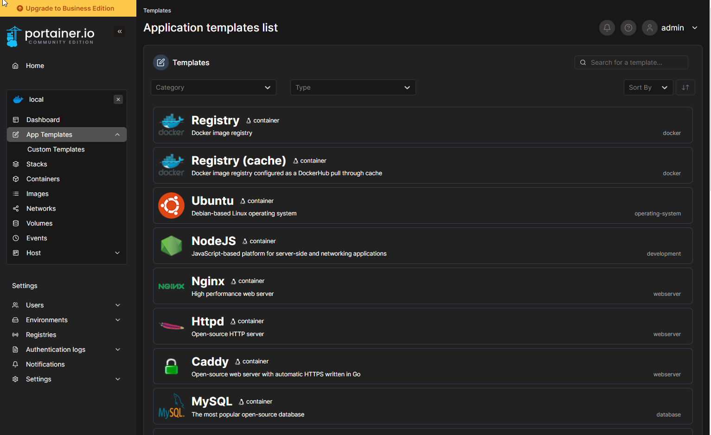

# JOURNAL

# 4/13/2023

- Work
- School
    - Power Consumption Attacks on Data Centers
        - Data centers tend to oversubscribe with their power. In other words, they assume that only a percentage of power is used by each device at one time.
        - Users on VMs in these data centers can run simple Python scripts to cause high power usage on multiple machines (using only VMs) which can cause widespread data center power outages
        - Google is hyper-aggressive when it comes to oversubscription of power
    - Warmonger Attack
        - Serverless Services like with Cloudflare Workers and other FaaS (functions as a service) have a specific attack inherent to egress IP and ports utilized by the server running the serverless function
        - Another tenant of a serverless function can make malicious requests to a target server, which in turn will block the IP of the machine that ran the serverless function. Any other tenants on the machine that runs those serverless functions now gets blocked by that target server
        - These attacks rely on how the SSP (serverless service providers) handle their infrastructure and configuration
    - Cloud Gaming Service Attacks
        - Players can utilize game features and mods to execute malicious code on cloud devices
        - Adversaries can use cloud gaming for non-gaming purposes
        - Steam workshop can be used to inject malicious mods
        - Programs and URLs can be injected into game mods and injected into cloud gaming services
        - Web browsers in the gaming services can be used to execute malicious scripts and visit censored content
        - Defenses:
            - process monitoring, URL request redirection, and adaptive network policies (per game) by using a sandbox for each game to determine what is allowed to be used per game.
    - My own project over Sphinx: a way to implement Homomorphic Encryption and Differential privacy to deep neural networks. AI can be made to be efficient, private, secure, and provably so.
        - Homomorphic encryption could change everything…honestly.
        - Differential privacy is essential to changing how persuasive technology and analytical technology creates conflicts of interest via. user data utilization for its own interests or the interests of the creators of that technology.
- Cybersader
- Exploration

# 3/23/2023

- Work
- School
- Cybersader
- Exploration

# 3/22/2023

- Work
- School
- Cybersader
- Exploration

# 3/21/2023

- Work
- School
- Cybersader
    - Looking into developing using a combination of TailwindCSS and AlpineJS, so that most of the interactivity and the styling can be done inline with the markup.
- Exploration
    - Dealing with a loss..of ChatGPT chat history 🤣
    - Curated more random tech solutions
    - Watched videos from web developers that I like to (I do this OFTEN). Some of these include: “Theo” t3[.]gg, Fireship, and Prime reacts from Twitch.
    - Watched more BHIS Talkin’ Bout Security News.  Great as always. I like taking notes and especially noting that the crazy ideas that come out of these hackers’ mouths.  They are joking a lot of the time, but they are seriously geniuses with some of these ideas.
    - More LinkedIn.  Love seeing new innovative posts, cybersecurity, curations, and great simple ideas that people have.
    - More job searching.

# 3/20/2023

- Work
    - Worked through cloud security alerts
    - Investigation
    - DFIR
    - Not really a takeaway, because it happens all the time:
        - CIS Benchmarked Distributions aren’t secure if you put them in an insecure network configuration. People may think something is secure because the instance is CIS Amazon Linux 2 Benchmark, when really that’s only half the battle.  It’s bad when you put too many open ports of stuff that are public facing. Tons of services can easily be exploited.
- Cybersader
    - More curating and research
- School
    - Lots of research on data acquisition processes for the cloud: volatile acquisition, cloud provenance mechanisms that make logs tamper proof, and different considerations when thinking about cloud-based data acquisition. SLAs, jurisdiction, privacy regulations, and things like cross-border transfers really affect how these sorts of processes take place.
- Exploration
    - Sandboxes and virtualization tech - KASM workspaces.  Heard about it, but haven’t got to try it out yet. It’s definitely on the list though.
    - Job searching (past few months)
        - My search is going alright, but there is always the problem of being in my Masters program still and waiting till the semester is over.  There are lots of jobs that may be open now, but won't be in another month.  Not to mention, some of the jobs won't be able to be as flexible as my current one when my last semester comes around. I should mention that this one was EXTREMELY FLEXIBLE.
        - There are lots of cool ones too, but some are also super underpaid when I find out the salary and stuff. I haven't had nearly as much time to put in the work at starting interviews. Mostly lots of getting the lay of the land and watching what pops up.  Some jobs are up for only 2 days which makes me think they must be obligated to put them up or something. Also, remote jobs are ROUGH.  There's always like at ~ 1000 applicants, so I don't know what to do with that 😆.
    - Looked up research around quantum computing related to cryptanalysis
        - SNDL - store now, decrypt later
    - BlackHillsInfoSec - Talkin Bout News!!!!
        - Brightens up my day.  Working with these people would be one of the coolest things ever. Passionate red teamers who have livened up the cyber field, made people like me interested in it, and inspire others to be heros.
        - They have a great perspective on things. Although, they don’t seem to understand the area of privacy and how legislation is going here in the United States.
        - There’s a lot of messed up and good things happening in the realm of privacy. I can’t tell how it’ll play out and I haven’t had the time to keep up recently.
    - Development
        - Templating engines - nunjucks, liquid, handlebars, etc.
            - Used with 11ty, but they are cool and useful for automating things like blogs with small projects, where you don’t need to build a database solution and it’s generated at build time to static files.
    - GPT was down!!! Seems that it was possible for anyone to access other people’s chats via their URLs, and so it seems that OpenAI had to quickly build a secure solution for this, since people could start crawling the URLs to scrape peoples’ conversations. I don’t know for sure if this was the actual reason for their stopping chat history either.
        - “Losing chat history in ChatGPT in 2023 was like losing Wi-Fi connections in 2013”

# 3/19/2023

- Cybersader
    - Developed 11ty (Eleventy) website
- Exploration
    - Curated development environment options
        - Cloud options like Stackblitz, Glitch, and Cloud9 (what I learnt on in class with C++)
        - Local containers - can be useful
        - Installing libraries and stuff locally - really annoying IMO. I’m a cyber guy. I don’t have time to streamline that sort of process. I’ll leave that up to the software engineers.
    - Deploying services in Docker on the cloud
    - NEAT stack
        - Netlify CMS, Eleventy, Alpine, Tailwind
    - Curated and explored random stuff
        - AI tools
    - Watched a video on Git Flow
    - Keyboard broke - finally drank the Koolaid and jumped into looking at mechanical keyboard options.  Drop[.]com still is one of my faves.  They have cheap options with a lot of quality. Good ROI - return on investment.

# 3/18/2023

- Exploration
    - Tons of research and chatting with GPT4
    - Looked at features of some new tech showing up in the JS world

# 3/17/2023

- Cybersader
    - Looking at more options for contributing to the knowledgebase that’s hooked into GitHub from Obsidian.
- Exploration
    - Tons of research and chatting with GPT4

# 3/16/2023

- Work
    - Utilized REST tool developed in previous days for doing some analysis on cloud security metrics and alerts.
    - Developed a workflow for going through alerts
    - Developing nmap commands for use with cloud assets for additiobal security testing
- Cybersader
    - Contributable api or git-based CMS workflows that will work with contributable collaborative knowledgebases.
    - Developed more of the logs site idea
- Exploration
    - Curated and researched some more stuff on AI.
    - Looked at lots of Obsidian plugins. Will be developing my own in the future.

# 3/15/2023

- Work
    - Created a process for turning a REST API client into a flexible and powerful data export tool which can turn JSON data into tabular objects which can be transformed into a cav format.
    - Exported data from security tools and used IPs for subsequent testing and prioritizing of alerts.
- Cybersader
    - Developed lots of new ideas
    - Curated some more solutions and research
    - Developed more of the journal/logs website
    - Worked through ideas for developing a system around creating content management workflows and systems.  Namely, a content management middleware to turn anything into a CMS that is contributable with authentication.
- Exploration
    - Thought up lots of website names for various solutions that Im developing
    - Ran tons of tests with GPT4 and used it to learn a lot.  It has pretty much replaced parts of my problem solving ajd information retrieval workflow
    - Practiced some Spanish with Duolingo

# 3/14/2023

- Work
    - Data Engineering - specific data transformation programming in Javascript
        - Started designing a data transformation function that can selectively flatten, explode, and search through JSON objects for important pieces of data and convert it into a tabular structure that can be converted into CSV.
        - This is really useful for taking API calls and selectively pulling out useful pieces of information
        - I’ll be creating a Postman project that can be forked along with a Javascript function that can be used.
        - I may make a Json2csv webpage tool for people to freely use client-side without a server
- School
    - Did some work on my GPT project
- Cybersader
    - Worked more at the Eleventy logs/journal website
- Exploration
    - GPT4 came out!!!!!! Using it for lots of things now 😃

# 3/13/2023

- School
    - Did an assignment over AWS key management system. Used the CLI tools to encrypt, decrypt, and test aspects of the underlying algorithms or methods used to encrypt and maintain integrity of the data - AES, RSA, ECDSA, envelope encryption (wrapping a key around another key), and key derivation functions.
- Cybersader
    - Looked at some more options for created contributable and secure collaborative knowledge management systems.
- Exploration
    - Looked at more open source software and curated random things
    - Organized my Notion a bit more.
    - Contemplated a lot of cyber stuff…as always.

# 3/12/2023

- Exploration
    - Found a bunch of tools to help with information retrieval (problem solving using the internet) which use GPT or connect to OpenAI via an API token.
    - Curated some curation websites - mostly curations of apps, tools, and tech stacks
    - Curated solutions that can create links to share collections of links.  These include: link in bio services, pastebins, normal website creation, bookmark/start pages, and linktree alternatives.
    - Curated some privacy-focused tools and curations too.

# 3/11/2023

- Cybersader
    - Looked more into building my own custom headless CMS that uses Obsidian and GitHub
- Exploration
    - Looked at bookmark and resource web page options. Some people call these start pages

# 3/10/2023

- Work
    - Learning how to use REST API clients like Postman or Insomnia to pull and export specific data from Orca and any tool with an API
    - May be great to learn how to flatten data objects parsed from APIs
- School
    - ChatGPT opened up it's API.  I'll use this for part of my project to build specialized chatbots for SOCs.
- Cybersader
    - Worked on my 11ty(Eleventy)-based static website that only changes at build time.
- Exploration
    - Learned about RabbitMQ which is a cool tool for pipelining and managing microservices with queues.
    - Astro.js is an amazing framework that can combine other JS frameworks, and it is really cool because I can have a mostly static website that sometimes has dynamic parts within it.
    - Learned about how telemarketers and scammers get large lists of fake telephone numbers.  They use a combination of techniques. There are also pushes for better caller ID protocols to mitigate from scammers and there are certain protocols slowly being adopted more by telephone companies.

# 3/9/2023

- Work
    - Advanced Nmap Usage with Host Enumeration and Adjudication
        - Went deep into Nmap, integrating it with different workflows, using the nmap scripting engine (NSE) with different setups such as with Powershell, Bash, or Python. I contemplated on various architectures while also doing some testing with Zenmap and some cloud devices. Additionally, I started building out some pages to curate all of this information, commands, and stacks. I don’t think I want to learn Lua to work with NSE, and there are luckily some great tools that integrate closely with NSE, so I shouldn’t have any issues.
- Cybersader
    - Curated the last bit of knowledge management, knowledgebase, intranet, and organizational wiki platforms and softwares. I’ve got a great list that I think I’ll share with people. Maybe I’ll build out an use case diagram or something too.
    - Logs Website Development
        - Looked into building large monorepos (side quest)
            - Turbo Repo and Nx are COOL.
        - Creating an Obsidian-to-GitHub-to-Eleventy architecture
- Exploration
    - Looked for a bunch of cyber, cloud tech, IT tech, and logo stickers

# 3/8/2023

- Work
    - Looking at nmap tech stacks, tools, and workflows that could be implemented for cutting down contextual false positives within Orca. Looking to automate some commands or scripts to go through list exports from Orca.
- Cybersader
    - Thought more about a community driven collaborative self curating and taxonimizing AI-based knowledge base (mouthful).
- Grad School Projects
    - Researched lots of cyber deception ideas for a cloud security project: honeypot stuff, canary stuff, cyber deception methods, moving target methods, and cyber attribution.
- Exploration
    - Looked at available domain names for various ideas I have
    - Looked at LinkedIn community, events, classes being offered, and stuff being shared
    - Looked at more jobs
    - Looking at some apps and tools on cloud marketplaces
    - Dove into some more GitHub awesome lists
    - Curated some network and internet recon and discovery tools and lists
    - Curated some knowledgebase, knowledgement management system, note taking system, and wiki tools.

# 3/7/2023

- Learned more cool stuff
    - Recent privacy and internet legislation
    - Knowledge management methods and tech stacks
    - Tons of internet scanning, recon, and discover tools.  Thinking about making my own based on the nmap engine.  Might go serverless with the idea and make it self-deployable with the click of a button.
- Work
    - Learning how to filter down the scope of alerts, prioritizing by popularity, testing assets to see if they are false positives (adjudication)
- Cybersader
    - Collaborative Knowledge Management
    - Curated lists of knowledgebase/knowledge management solutions

# 3/6/2023

- Learned some stuff
    - Refreshed myself with SSL/TLS (how it works, PKI, TLS versions)
- Work
    - Data engineering with some SQL database and setting up front-end for data entry to automate certain data privacy processes
    - Vulnerability management stuff in the cloud - learning how to prioritize cloud alerts in Orca
- Development
    - Learned about RPC and tRPC library
    - Theo gg / Ping / [T3.gg](http://T3.gg) - [https://t3.gg/blog](https://t3.gg/blog)
        - [Tech I'm Shipping In 2023](https://t3.gg/blog/post/2023-tech)
        - [Infra I'm Building On In 2023](https://t3.gg/blog/post/2023-infra)
            - Learned about some cool infrastructure tech that is getting popular in 2023
        - [Software I Rely On In 2023](https://t3.gg/blog/post/2023-tools)
            - Learned about some cool tools in 2023
- Cool Personal Stuff
    - Curated an insane amount of accomadation resources to look for honeymoon destinations
        - I utilized the Notion AI feature, which actually worked really well for automating some annoying tasks

# 3/5/2023

- Researched random things
    - How game hacking works in C/C++
    - More tech stacks and tools for web development - tRPC, T3, hosting, databases, and other frameworks or tools that support development.
- Proofread, made graphics, and posted blog posts.  I also, turned the original blog post into 4 separate posts, because it was too long and went into detail in multiple areas.
- Looked for more jobs on LinkedIn
    - Every remote job has an insane amount of applicants🤣…like at least 1000

# 3/4/2023

- Researched while writing some blog posts
    - Researched knowledge engineering, Python GUIs, and turning Python projects into executables
    - I set up a repo and pushed my fuzzyDedupeGUI project to it
        - I designed a small Python program that can fuzzily get rid of duplicate lines generated by ChatGPT.
    - Wrote blogs for it
- Watched BlackHillsInfoSec - “Talkin’ Bout News”
- Looked at some cybersecurity conferences and meetups in upcoming months

# 3/3/2023

- Did some vulnerability analysis with old servers
- Made a program in Python to “fuzzy” deduplicate bullet point rows in Markdown
    - This is useful, when generating things from ChatGPT and it sometimes repeats itself.
    - Really useful for cutting down inputs when trying to expand a topic in research
    - Used Python Tkinter and added a dark theme

# 3/2/2023

- Mac pentesting
    - It’s actually really easy to write malware for Mac. Not to mention, most of the default payloads for metasploit work on Mac.
- More Web Development Stuff
    - Eleventy is really awesome
        - Once you get the past all of the basic architecture and some of its specific terminology, it’s really easy to understand how you can build really great static websites from lots of different data sources: fetch data from APIs at build time, images, cached data on a CDN, folders, etc.
        - It’s really flexible in that I can point all sorts of data sources at it, including my Obsidian vaults.
    - Cybersader LOGS / JOURNAL page
- Looked up cybersecurity events near me and in the future
    - Probably going to WWHF Deadwood 2023 - [Deadwood 2023 Conference - Wild West Hackin' Fest](https://wildwesthackinfest.com/deadwood/)
    - PurdueCyberTAP event - [Technology Seminar Series - Purdue cyberTap Tickets, Wed, Apr 19, 2023 at 8:00 AM | Eventbrite](https://www.eventbrite.com/e/technology-seminar-series-purdue-cybertap-tickets-508137050597)
    - Lunch and Learn with National Guard? - [The Cyber Threat Landscape: Lunch and Learn Tickets, Thu, Apr 27, 2023 at 11:00 AM | Eventbrite](https://www.eventbrite.com/e/the-cyber-threat-landscape-lunch-and-learn-tickets-558829844107?aff=ebdssbdestsearch)
- Learnt a little about AWS key management
- 

# 3/1/2023

- Learned more about Vulnerability Management and CVEs by doing it
    - Developing a process for finding vulnerable assets and reporting them to applicable people, cross-referencing the results with other tools, and generating great reports for them is a learned skill
    - The process of taking vulnerability analysis tool results and putting them into a report can be automated or semi-automated without being too boring or synthetic
- Kubernetes is really cool and I need to learn it.
    - This is how SaaS companies quickly deploy architectures and tech stacks easily and dynamically for their customers.
- Random web development stuff I was thinking about
    - Javascript Frameworks I’m excited about
        - [SvelteKit • Web development, streamlined](https://kit.svelte.dev/)
        - [Astro | Build faster websites](https://astro.build/)
        - [SolidJS · Reactive Javascript Library](https://www.solidjs.com/)
        - [Vite | Next Generation Frontend Tooling](https://vitejs.dev/)
        - [Next.js by Vercel - The React Framework](https://nextjs.org/)
        - [Eleventy, a simpler static site generator](https://www.11ty.dev/)
        - [Build cross-platform desktop apps with JavaScript, HTML, and CSS | Electron](https://www.electronjs.org/)
    - Cool libraries
        - [tRPC - Move Fast and Break Nothing. End-to-end typesafe APIs made easy. | tRPC](https://trpc.io/)
- Wrote a blog post about running a bootable Kali Linux instance in a VM for forensics on the go 😃
    - Learned some more about operating systems
    - Learned about interrupt handlers, dual-mode operation, and how write blockers work
- Looked into Astro and more JAMstack
- Designing architecture for logs/journaling page using Obsidian as a CMS > GitHub > Serverless Functions / Build Step with Eleventy and Tailwind

# 2/28/2023

- More developing website stuff with [cybersader.com](http://cybersader.com)
    - More knowledgebase CMS options
        - [Static Site](https://roamjs.com/extensions/static-site) - Convert your Roam graph into a public site (WIP).  I don’t use Roam, but this could be a cool option for serious researcher to show their work
    - My idea about a contribution system
        - collaborative knowledge management
        - I'm looking for a contributable headless CMS it seems. I want to be able to have a button on the website that says contribute to this page, you make an account, then you're marked as a contributor somehow on the page.
        - Terms: contributable user CMS, self hostable,
    - Im checking out a lot more CMS systems to see how it can fit into an obsidian markdown system
    - (more knowledgebase stuff) MoC - map of content, taxonomies, collaborative git-based knowledge management
- EvilESP vulnerability - stuff I learned
    - [Security Intelligence - Cybersecurity Analysis & Insight](https://securityintelligence.com/)
        - Patch Diffing
            - BinDiff is really cool!
            - You can reverse-engineer mitigations in patching by “bin-diffing” the pre-patch binary with the after-patch one.
- IPsec (ESP) protocols
    - IPsec provides privacy and data integrity
    - Has two modes:
        - ‘tunnel’ for network-to-network
        - ‘transport’ for client-to-client
    - Uses IKEv1 or IKEv2 (internet key exchange)
        - we need to exchange key to create tunnels
- Crowdstrike posted an annual security report
    - [2023 Global Threat Report | CrowdStrike]([https://www.crowdstrike.com/global-threat-report/?)](https://www.crowdstrike.com/global-threat-report/?))
- Interested in volatile data acquisition, storage, and management in cloud computing
    - The point of cloud is that we turn computing into a service, but this means we have less control over the hardware and layers close to it.
    - Therefore, how do we ensure we can acquire volatile data like that data stored in random access memory cards (RAM), if we don’t have control over the hardware?
    - Is this a simple problem or is it more nuanced?
- More curating lists on GitHub
- Cybsader portfolio page
    - Updated the look for the contact form. Not to mention, the size was way too big for a little form.
    - TODO - add animation to lead the viewer down the page
    - TODO - update the “Tools and Skills Page”
        - I’m also thinking about adding a auto-scrolling logo thing to show some of the popular tools that I know with cyber
    - TODO - add background to tools and skills
- Future TODOs
    - Definitely going to create my own Obsidian plugins at some point

# 2/27/2023

- Trying to setup Digital Ocean server with Ghost to run it myself
    - looks at lots of other solutions, but Ghost has the best ROI
    - Can’t sign up on Digital Ocean.  Getting OAuth Errors when I try to. Emailed support the past 2 days
    - Misc Pages:
        - [Complete Guide to Self-hosting Ghost CMS With Docker](https://linuxhandbook.com/deploy-ghost-docker/)
        - [7 Useful Tips for Self-hosting a Ghost Blog With Docker](https://linuxhandbook.com/ghost-hosting-tips/)
        - [Self-host a Ghost Blog With Traefik](https://linuxhandbook.com/self-host-ghost-traefik/)
        - [Ghost | DigitalOcean Marketplace 1-Click App](https://marketplace.digitalocean.com/apps/ghost)
        - [The easiest way to self-host Ghost with Docker](https://academy.pointtosource.com/containers/easy-selfhosting-ghost-blog/)
- HostArmada
    - Had really cheap options, but I’m not sure how much I honestly trust them.
    - Prices are super cheap at the moment, but they might change later on
    - [Ghost Hosting | HostArmada](https://hostarmada.com/ghost-hosting/)
        - [Ghost Tutorials | HostArmada Learning Center](https://hostarmada.com/tutorials/blog-cms/ghost/)
        - [Blogging and CMS Applications Tutorials | HostArmada Learning Center](https://hostarmada.com/tutorials/blog-cms/)
- Setup Portainer locally with Docker to look around
    - Already had Docker desktop installed
    - Followed portainer docs - [Install Portainer CE with Docker on WSL / Docker Desktop - Portainer Documentation](https://docs.portainer.io/start/install-ce/server/docker/wsl)
        
        
        
- Learned about some API security and resources
    - A few ways (that I know of) to store API keys:
        - Environment variables (usually secure)
        - Plaintext (never secure)
        - Secrets manager with API calls and authentication or something of that nature (can be really secure and scalable)
    - IAM Key Exposure Detection in AWS
        - Cloudwatch, Cloudtrail, or technically Trusted Advisor throws up flags by looking in code repos for API keys
    - Cloud trail -[https://docs.aws.amazon.com/securityhub/latest/userguide/asff-resourcedetails-awscloudtrail.html](https://docs.aws.amazon.com/securityhub/latest/userguide/asff-resourcedetails-awscloudtrail.html)
    - What is "AWSCompromisedKeyQuarantineV2"?
        - [https://repost.aws/questions/QU_KYbXBYtT6iM1MVnFh0B8g/aws-exposed-keys-alerts](https://repost.aws/questions/QU_KYbXBYtT6iM1MVnFh0B8g/aws-exposed-keys-alerts)
    - [https://github.com/aws/Trusted-Advisor-Tools/tree/master/ExposedAccessKeys](https://github.com/aws/Trusted-Advisor-Tools/tree/master/ExposedAccessKeys)
    - [https://repost.aws/articles/ARSdqO8fHQTYKry6D_U9lytQ/reduce-your-security-risk-with-aws-trusted-advisor-exposed-access-keys-recommendation](https://repost.aws/articles/ARSdqO8fHQTYKry6D_U9lytQ/reduce-your-security-risk-with-aws-trusted-advisor-exposed-access-keys-recommendation)
    - [aws/Trusted-Advisor-Tools: The sample functions provided help to automate AWS Trusted Advisor best practices using Amazon Cloudwatch events and AWS Lambda.]( [https://github.com/aws/Trusted-Advisor-Tools](https://github.com/aws/Trusted-Advisor-Tools) )
    - [Exposed AWS key - Complete Cloud Security in Minutes - Orca Security]( [https://orca.security/resources/cloud-risk-encyclopedia/exposed-aws-key /](https://orca.security/resources/cloud-risk-encyclopedia/exposed-aws-key%20/))
    - [Orca Security: Alerts]( [https://orca-staticfiles-rnd-us-east-1.s3.amazonaws.com/alert-doc/alert-by-framework/alert-by-framework.html](https://orca-staticfiles-rnd-us-east-1.s3.amazonaws.com/alert-doc/alert-by-framework/alert-by-framework.html) )
- Organized some of my awesome list and looked for more of them on GitHub
    - Turns out they limit awesome lists to 32 😢
- More [cybersader.com](http://cybersader.com) ideas
    - I’m thinking about trying to make a logs page that shows an archive of my daily logs that I write
    - I also want it to automatically tag things and have algolia search on the website somehow
    - Looked into using Obsidian for things
        - [Make.md](https://www.make.md/)
        - [Plugins - Obsidian](https://obsidian.md/plugins?search=search)
        - It’s more secure, cheaper, and can easily generate a quick website for me
        - Found a wonderful example of how I can have a contributable system by storing it and versioning it in GitHub through Obsidian
            - [00 - Start here - Obsidian Hub - Obsidian Publish](https://publish.obsidian.md/hub/00+-+Start+here)
        - It’s final. I’m likely switching to Obsidian for my knowledgebase 🤣
        - There’s way too much stuff that I love about Obsidian now, but I’ll probably still keep some things in Notion
        - I’m probably going to change my knowledgebase to use Obsidian due to the sheer flexibility and simple markdown
    - Continuous daily logs page
        - Might use a JAMstack template that attaches to obsidian or Notion for this
- Lots of ChatGPT
    - Rendering sites from Notes
        - looked at lots of different options for this
- Picked project for memory forensics
    - Volatile Data Acquisition Methods in the Cloud