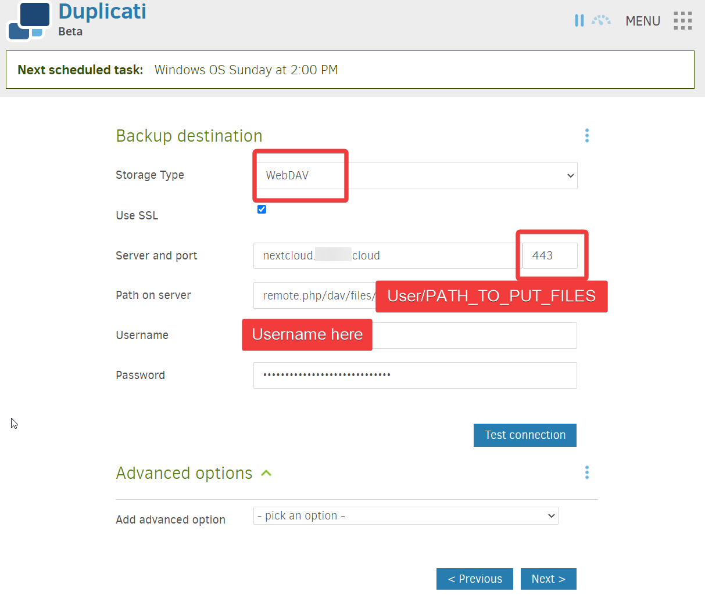

# Windows Backups
## Duplicati to Nextcloud Using WebDAV Protocol
- Links
	- [Sending backups to NextCloud - Support - Duplicati](https://forum.duplicati.com/t/sending-backups-to-nextcloud/16703/4) 
	- [How to coonect to Nextcloud via WebDav - Support - Duplicati](https://forum.duplicati.com/t/how-to-coonect-to-nextcloud-via-webdav/11799)
	- [Accessing Nextcloud files using WebDAV — Nextcloud latest User Manual latest documentation](https://docs.nextcloud.com/server/latest/user_manual/en/files/access_webdav.html) 
	- What to use for path of server with WebDAV - https://docs.nextcloud.com/server/latest/user_manual/en/files/access_webdav.html#third-party-webdav-clients 
- Connecting Duplicati to Nextcloud with WebDAV 
	- [Accessing Nextcloud files using WebDAV — Nextcloud latest User Manual latest documentation](https://docs.nextcloud.com/server/latest/user_manual/en/files/access_webdav.html#third-party-webdav-clients)
		- `When using a third-party WebDAV client (including your operating system’s built-in client), you should use an application password for login rather than your regular password. In addition improved security, this increases performance significantly <https://github.com/nextcloud/server/issues/32729#issuecomment-1556667151>_. To configure an application password, log into the Nextcloud Web interface, click on the avatar in the top right and choose _Personal settings_. Then choose _Security_ in the left sidebar and scroll to the very bottom. There you can create an app password (which can also be revoked in the future without changing your main user password).`
	- Configure Nextcloud for WebDAV 
		- Account > Personal Settings > Security > Devices & sessions
		- Add app name like "Duplicati-backups"
		- Make an app password that it will use instead of actual password
		- Copy password and use with Duplicati
	- `remote.php/dav/files/USERNAME_HERE/Ben_Windows_PC_Backups`
	- Enter in details and test the connection
		- I have mine behind Cloudflare tunnels, so I use 443 for HTTPS
		- 
### Duplicati Source Data
- Discussion on Duplicati Source Data selection
	- [Duplicati Source Data](Duplicati%20Source%20Data/Duplicati%20Source%20Data.md)
- Default source data setup
	- 
### Duplicati Backup Schedule
- 
### Choosing Volume Size
- [Choosing Sizes in Duplicati • Duplicati](https://www.duplicati.com/articles/Choosing-Sizes/#remote-volume-size)
- The downside of using larger volumes are seen when restoring files. As Duplicati cannot read data from inside the volumes, it needs to download the entire remote volume before it can extract the desired data. If a file is split across many remote volumes, e.g. due to updates, this will require a large amount of downloads to extract the chunks.
	- Not really an issue
- Use larger volumes with stable connections
- 
### Backing Up to Nextcloud
- Click Run Now
- If you've been using the backup config before, then you will get an error about missing files
	- 
- To start over - [Error while running - Support - Duplicati](https://forum.duplicati.com/t/error-while-running/14111/3)
	- The quickest way to do that is to double check that the destination `W:\work` is still empty, then click on the backup job in the Duplicati Web UI to expand options, then click “Database …”, then click “Delete”. (Don’t click “Repair” or “Recreate”.)
	- With the local database deleted AND the back end empty, the next time you run the backup job it will behave as if it’s the first backup.