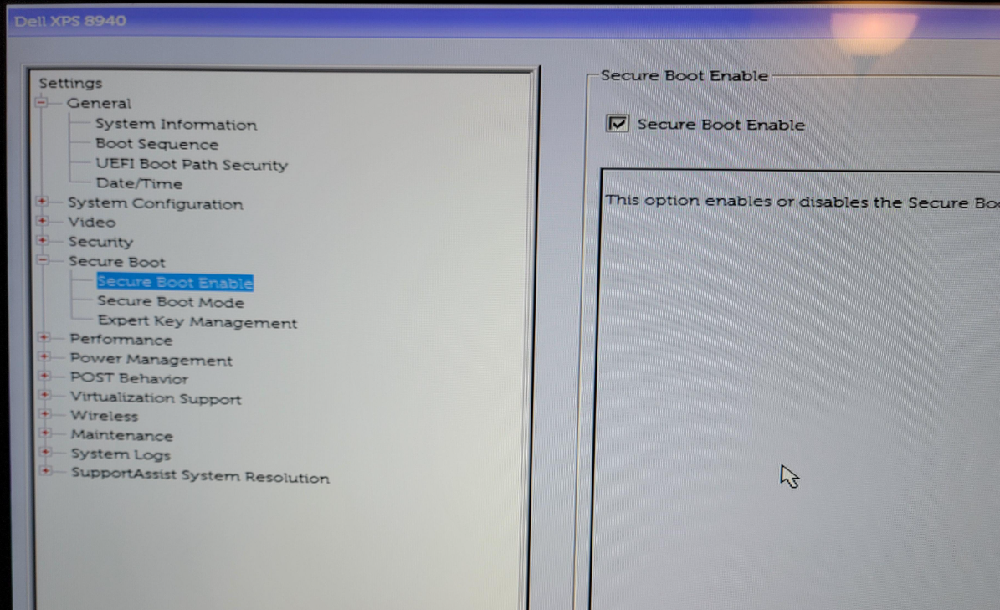
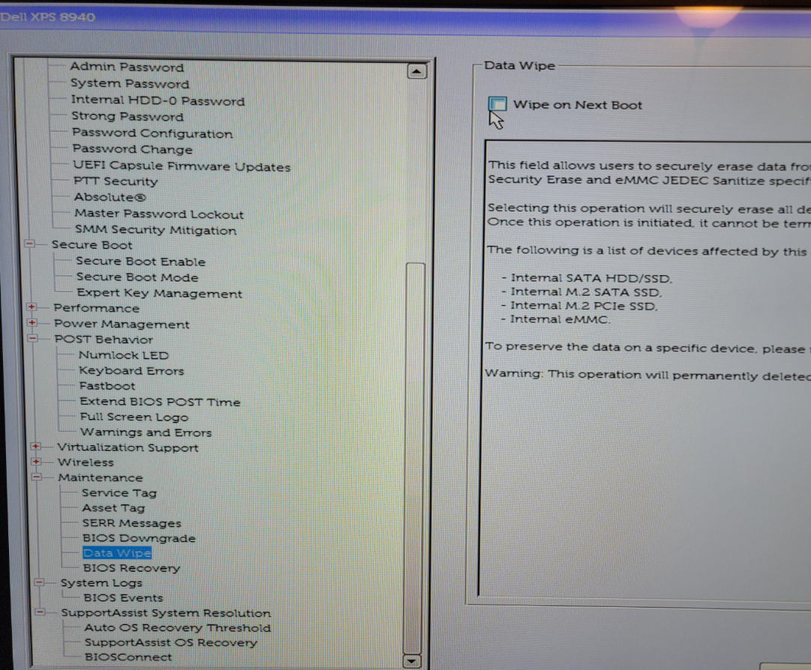
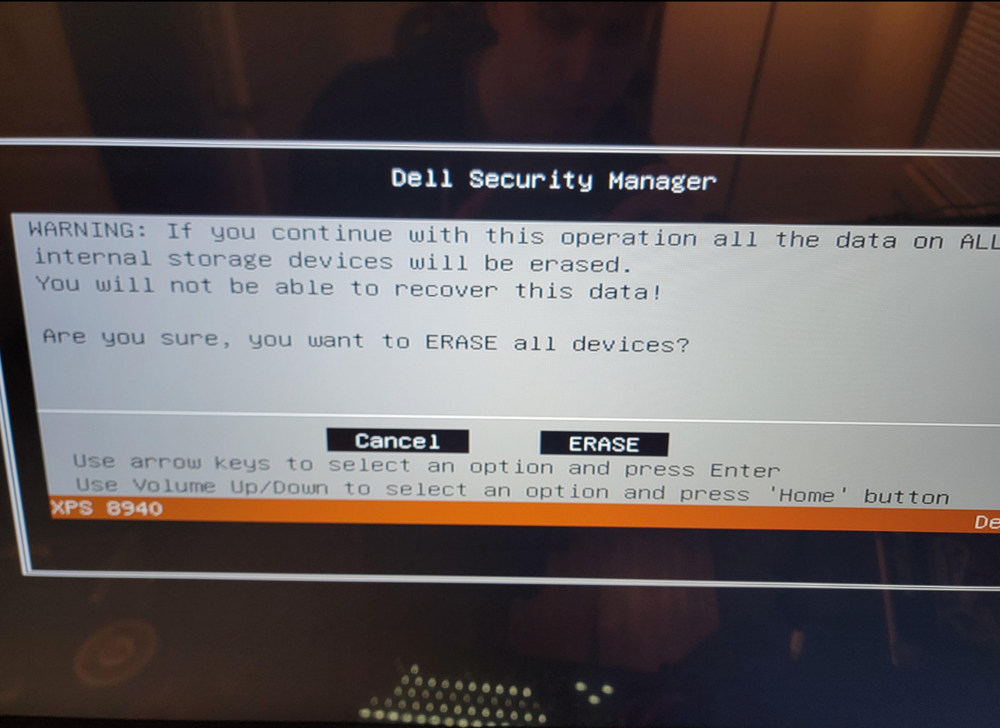

# Misc Links & Videos
- [(40) Building A Budget NAS with TrueNAS Scale - YouTube](https://www.youtube.com/watch?v=iSpL9LnczVQ)
- [(40) Building A DIY NAS On A Budget - TrueNAS Scale - YouTube](https://www.youtube.com/watch?v=jf_5FaVFnrU)
- [balenaEtcher - Flash OS images to SD cards & USB drives](https://etcher.balena.io/)
- [Total Noob Here: trying to install TrueNas on USB pendrive | TrueNAS Community](https://www.truenas.com/community/threads/total-noob-here-trying-to-install-truenas-on-usb-pendrive.102312/)
- [Ventoy](https://www.ventoy.net/en/index.html)
- [Installing SCALE |](https://www.truenas.com/docs/scale/gettingstarted/install/installingscale/)
- [Download TrueNAS SCALE - Data Storage Software](https://www.truenas.com/download-truenas-scale/?submissionGuid=b256dc43-0345-4eee-9ce8-83b058681d6c)
- [Configuring SCALE Using the UI |](https://www.truenas.com/docs/scale/23.10/gettingstarted/configure/uiconfigurationscale/)
- [Preparing for SCALE UI Configuration |](https://www.truenas.com/docs/scale/gettingstarted/install/installprepnonenterprise/)
# Hardware
- Old PC
	- 
## HDDs
- The most expensive part of NAS projects 😅
	- [Amazon.com: Seagate IronWolf 12TB NAS Internal Hard Drive HDD – 3.5 Inch SATA 6Gb/s 7200 RPM 256MB Cache for RAID Network Attached Storage – Frustration Free Packaging (ST12000VNZ008) : Electronics](https://www.amazon.com/Seagate-IronWolf-12TB-Internal-Drive/dp/B084ZTSMWF)
  
Choosing the right hard disk drive (HDD) for your Network Attached Storage (NAS) system depends on your specific needs, including capacity, speed, reliability, and budget. However, there are a few models and brands that consistently receive high marks from both consumers and professionals for NAS setups:
1. **Western Digital Red Plus**: Specifically designed for NAS systems, these drives offer a good balance between performance, reliability, and price. They are optimized for 24/7 operation in multi-bay systems, support NASware technology for improved reliability and system performance, and are available in capacities up to 18TB.
2. **Seagate IronWolf**: Another popular choice for NAS setups, Seagate IronWolf drives are built for always-on, always-accessible 24×7 performance. They offer AgileArray technology for optimal reliability and system agility, and are available in capacities up to 18TB. IronWolf Pro models offer higher performance and are designed for commercial and enterprise NAS systems.
3. **Synology HAT5300**: If you are using a Synology NAS, their HAT5300 series drives are optimized for Synology devices, offering high performance and reliability. These drives are engineered to handle high workloads and data-intense environments, making them suitable for business and professional use.
4. **Toshiba N300**: Designed for personal, home office, and small business NAS systems, the N300 series offers high reliability and performance with up to 18TB of capacity. These drives are built to handle high data workloads in a multi-RAID NAS environment.

When selecting a drive, consider the following factors:
- **Capacity**: Ensure the drive meets your storage needs both now and in the foreseeable future.
- **Reliability**: Look for drives designed for 24/7 operation with features like vibration protection and built for NAS systems.
- **Warranty and Support**: Longer warranties and good customer support can be invaluable, especially in a NAS setup where data availability is crucial.
- **Price**: While important, the cheapest option may not always offer the best value in terms of reliability and longevity.

Always check for compatibility with your specific NAS model and consider buying drives from multiple batches to avoid the risk of simultaneous failures from the same production batch.
# Initial Install TrueNAS onto PC
- Steps:
	- Check for necessary hardware on old PC
	- Flash .iso file to a USB drive
	- Plug in a initial install TrueNAS
	- .
## Prepare Old PC - Hardware
- In my case, I didn't have an SSD (NVMe in this case), so I added one from another old laptop
	- 
- Make sure you have SATA cords for data and power to the HDD
	- 
## Flashing TrueNAS to a USB Drive
- Download TrueNAS Scale .iso file
	- [Download TrueNAS SCALE - Data Storage Software](https://www.truenas.com/download-truenas-scale/?submissionGuid=b256dc43-0345-4eee-9ce8-83b058681d6c) 
- "Flash" the .iso file to the USB drive with [balenaEtcher](https://etcher.balena.io/) or [Rufus](https://rufus.ie/en/)
	- balenaEtcher 
		- 
		- 
		- 
		- 
		- 
		- 
		- 
- 
## Installing TrueNAS onto Old PC (w/sidequests)
- Turn it on
- You should get a blue screen that allows TrueNAS install
	- Hit `Enter`
	- 
- Errors:
	- `bad shim signatures` and `you need to load the kernel first`
	- [I can install and boot Truenas Scale on one pc and not another. | TrueNAS Community](https://www.truenas.com/community/threads/i-can-install-and-boot-truenas-scale-on-one-pc-and-not-another.106601/)
		- `Try disabling secure boot from the BIOS.`
	- Restart or Power off your PC, then turn it back on and hit `Delete` or `F2` a bunch of times till you get to BIOS setup
		- Find and disable Secure Boot
		- 
- Issue: Old OS on SSD, so it's not showing up in TrueNAS destination list
	- I don't have any sort of access to OS.  Locked down.
	- Solution:
		- Restart to BIOS setup
		- Look for something like "Data Wipe" or "Secure Erase"
			- 
			- Are you sure? 🤔
				- 
			- YESSSSS....ERASE IT ALLL 👿
				- 
- PC not detecting NVMe hard drive
	- [M.2 Interface, Key and Socket explained](https://www.atpinc.com/blog/what-is-m.2-M-B-BM-key-socket-3)
	- 
	- [‎Dell SSD Classification | DELL Technologies](https://www.dell.com/community/en/conversations/inspiron/dell-ssd-classification/647f8d18f4ccf8a8ded8bf24)
		- 
	- 
	- 
	- Ahhhhh it's a SATA SSD 😖
	- Looks like I'll have to buy an actual **NVMe SSD** rather than an **M.2 SATA SSD** unless my XPS 8940 supports it
		- SATA just refers to the connection type
	- M.2 Form Factors
		- 
	- [XPS 8940 Setup and Specifications | Dell US](https://www.dell.com/support/manuals/en-us/xps-8940-desktop/xps-8940-setup-and-specifications/specifications-of-xps-8940?guid=guid-7c9f07ce-626e-44ca-be3a-a1fb036413f9&lang=en-us) 
		- 
	- Ordered one overnight 🥴
		- 
		- 
	- Still not detecting in TrueNAS installer, but is detecting in BIOS
		- [Truenas Scale not seeing SSD to install on | TrueNAS Community](https://www.truenas.com/community/threads/truenas-scale-not-seeing-ssd-to-install-on.104153/)
			- Please ignore my previous post. I have fixed the problem.  
			- I reformatted the boot disc to ExFAT, put it back in the NAS system and the installation USB recognised it.
		- I would put it onto my other computer, but it doesn't support Gen 3 PCIE....yayyyyy 😑
		- There's one option only.  USB/live boot Linux onto the machine and reformat everything with GParted.  I swear I run into every issue under the sun with these projects 😆.
			- Since Kali Linux has GParted, I'll just boot with that
			- [Get Kali | Kali Linux](https://www.kali.org/get-kali/#kali-live) 
				- [gparted | Kali Linux Tools](https://www.kali.org/tools/gparted/)
		- Used balenaEtcher to flash to a USB, plugged it in, and got a GNU Grub screen.  I'm pretty sure the CPU supports graphics, so not sure what the issue is
		- 
## Initial Install 

# TrueNAS Configuration and Setup
## Networking and Admin UI 
- .
- 