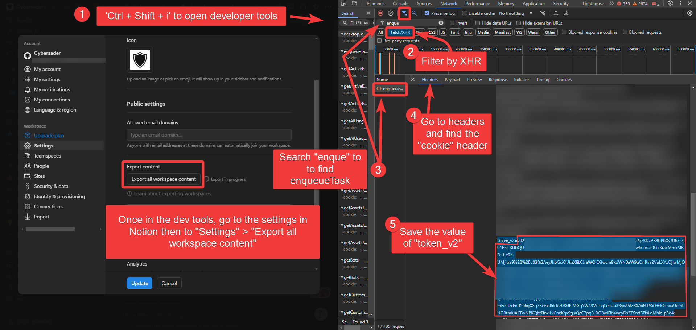

[Contributable Obsidian Wiki](../../📁%2009%20-%20My%20Obsidian%20Stack/Contributable%20Obsidian%20Wiki/Contributable%20Obsidian%20Wiki.md)

# Desktop Vs Mobile Configs

- [awesome-cybersader/.obsidian/community-plugins.json at main · cybersader/awesome-cybersader](https://github.com/cybersader/awesome-cybersader/blob/main/.obsidian/community-plugins.json) - list of enabled plugins 
- [Save settings for which plugins are enabled for mobile and desktop separately - Feature archive - Obsidian Forum](https://forum.obsidian.md/t/save-settings-for-which-plugins-are-enabled-for-mobile-and-desktop-separately/36740) 
- 

# Notion GitHub Sync

## Setting Up 'notion-to-obsidian-github-sync'

Link to repo - https://github.com/cybersader/notion-to-obsidian-github-sync

- For the NOTION_TOKEN and NOTION_USER_ID, make sure to use the non-desktop version of Notion.so and use Ctrl-Shift-I to get to developer options

1. Create a separate private repository for your backups to live in (e.g. "my-notion-backup"). Make sure you create a `main` branch — for example by clicking "Add a README file" when creating the repo.
2. Use this repository ("notion-guardian") as a template in order to create a copy (Click the green "Use this template" button).
3. Create a Personal Access Token ([docs](https://docs.github.com/en/free-pro-team@latest/github/authenticating-to-github/creating-a-personal-access-token)) with the "repo" scope and store it as `REPO_PERSONAL_ACCESS_TOKEN` in the secrets of the copied repo.
4. Store your GitHub username in the `REPO_USERNAME` secret.
5. Store the name of your newly created private repo in the `REPO_NAME` secret (in this case "my-notion-backup").
6. Store the email that should be used to commit changes (usually your GitHub account email) in the `REPO_EMAIL` secret.
7. Obtain your Notion space-id and token as described [in this Medium post](https://medium.com/@arturburtsev/automated-notion-backups-f6af4edc298d). Store it in the `NOTION_SPACE_ID` and `NOTION_TOKEN` secret.
	1. I will explain how to do it in Google Chrome:
	- Open [http://notion.so/](http://notion.so/), go to “Settings & Members” → “Settings”
	- Open [Chrome DevTools](https://developers.google.com/web/tools/chrome-devtools) by pressing Command+Option+J (Mac) or Control+Shift+i (Windows, Linux, Chrome OS)
	- Go to the Network tab, as shown on a screenshot below
	- Enable “XHR” filter (1), clear console (2), start the export (3), select “enqueueTask” (4)
	- 
	- In the opened “Headers” tab you would need to scroll down until you see “cookie:” and a lot of text, in this text you need to identify a part, which looks like(5):
	- `token_v2=xxx;`
	- Where xxx is a very long sequence of letters and digits and can span multiple lines. Copy everything between “token\_v2=” and “;” and save it somewhere. Label it NOTION\_TOKEN\_V2, we will need it later.
	- Now scroll to the very bottom and under the “Request Payload” section you will see something like (6):
	- `spaceId: “4489c211-09d6-4069-ae3b-1665e25d6c03”`
Save the value inside quotes, label it NOTION\_SPACE\_ID.
8. You will also need to obtain your `notion_user_id` the same way and store it in a `NOTION_USER_ID` secret.
9. Wait until the action runs for the first time or push a commit to the repo to trigger the first backup.
10. Check your private repo to see that an automatic commit with your Notion workspace data has been made. Done 🙌

## Notion API Problems as of V3

- [Notion API](https://developers.notion.com/reference/intro)
- [Request limits](https://developers.notion.com/reference/request-limits)
- 2024 Issue with API V3

## Fixing the Code

- 