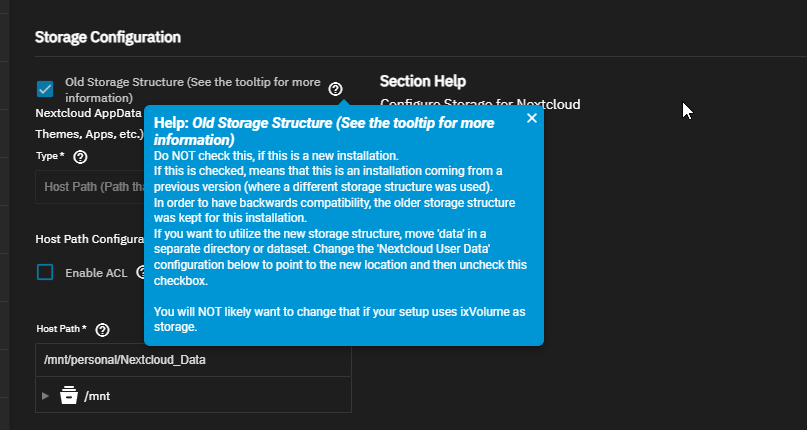

# Links

- [Updating SCALE | TrueNAS Documentation Hub](https://www.truenas.com/docs/scale/scaletutorials/systemsettings/updatescale/)

# App Issues

## Fixing Nextcloud

Nextcloud Data didn't come over quite right.  Had to move some data in the Nextcloud datasets around and change settings

- The errors from looking at container logs in Truenas:
	- Your data directory is invalid.
	- Ensure there is a file called ".ncdata" in the root of the data directory. It should have the content: "# Nextcloud data directory"

- Nextcloud configuration notice about related "data" folder:
	- 

- We have to move "data", point "Nextcloud User Data" to use the newly moved data, then uncheck the box
	- 

# Big Features for New Version

- Will actually work with Storj...this is huge.  
	- Storj caused me $700 in losses with a backup issue because iX-Systems' Cloud Sync function was bad
	- [iX-Storj Overcharging or Overusing Storage](../iX-Storj%20Overcharging%20or%20Overusing%20Storage/iX-Storj%20Overcharging%20or%20Overusing%20Storage.md)
- Docker container support
	- Can pretty much use any open source tool out there now in my TrueNAS server

# Going From Bluefin All the Way to Electric Eel - 22.12 -> 24.10

How to update:

- Go to System Settings > Update
- Select the next version for the [Upgrade path](https://www.truenas.com/docs/softwarereleases/#upgrade-paths) you intend on going down (based on your end goal version)
- "Download Updates" should pop up as an option
- Download and keep your config backed up somewhere just in case
- Apply Pending Update