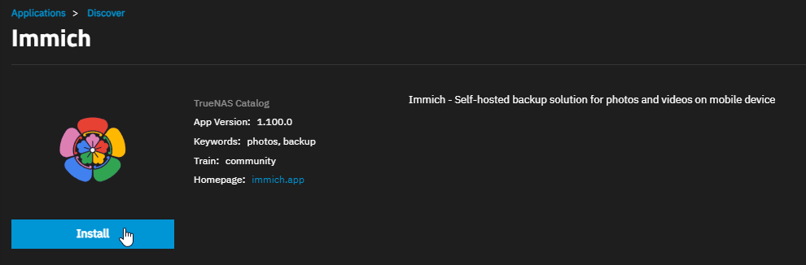
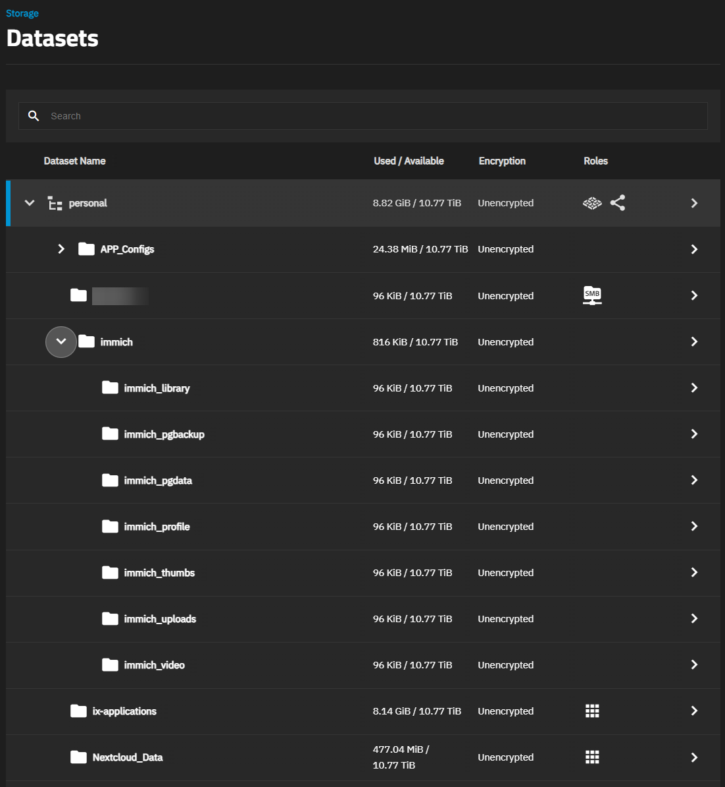
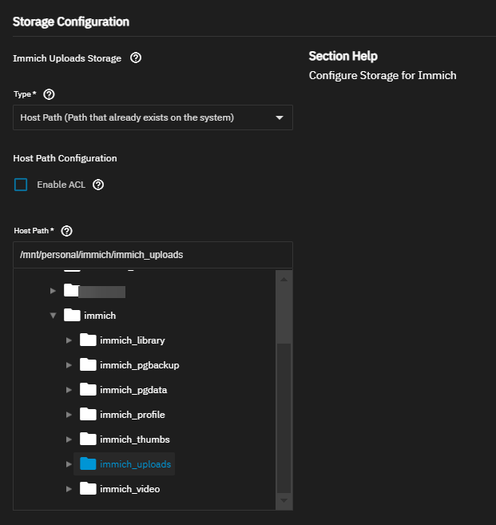
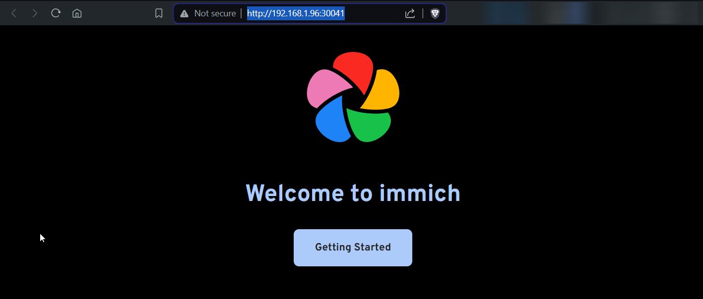
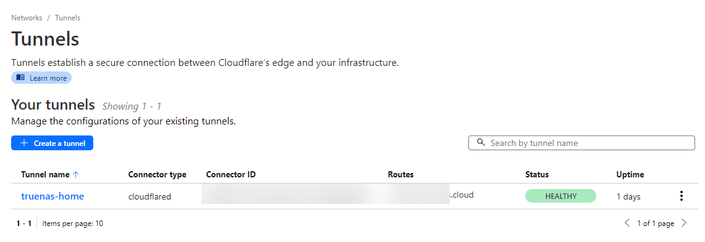
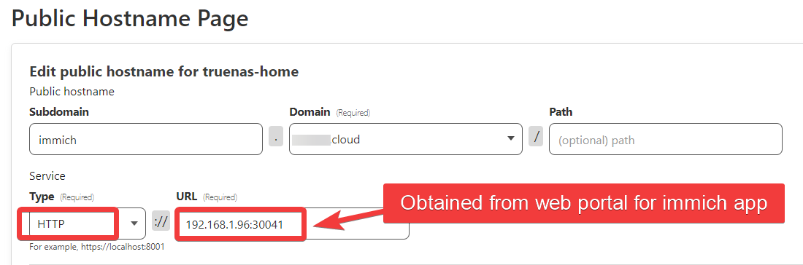
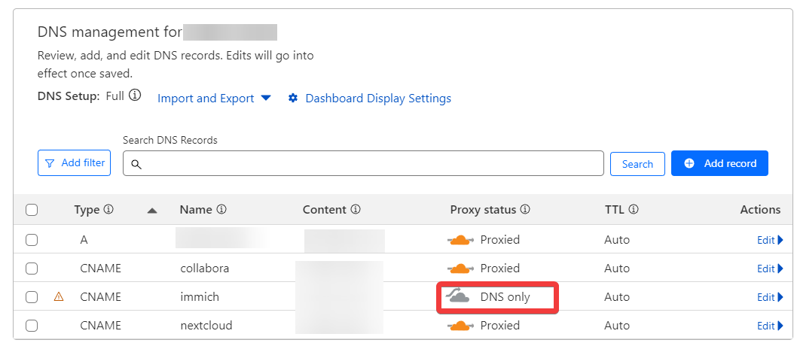

# Links

- [Immich | TrueNAS Docs](https://www.truenas.com/docs/scale/scaletutorials/apps/communityapps/immich/)
- [TrueNAS SCALE [Community] | Immich](https://immich.app/docs/install/truenas) - docs from Immich

# Immich

> Immich integrates photo and video storage with a web portal and mobile app. It includes features such as libraries, automatic backup, bulk upload, partner sharing, Typesense search, facial recognition, and reverse geocoding.

>TrueNAS SCALE makes installing Immich easy, but you must use the Immich web portal and mobile app to configure accounts and access libraries.

# TrueNAS Immich App Setup

- 

## Dataset Configuration

> You can allow SCALE to create the datasets Immich requires automatically during app installation. Or before beginning app installation, [create the datasets](https://www.truenas.com/docs/scale/scaletutorials/datasets/datasetsscale/) to use in the **Storage Configuration** section during installation. Immich requires seven datasets: **library**, **pgBackup**, **pgData**, **profile**, **thumbs**, **uploads**, and **video**. You can organize these as one parent with seven child datasets, for example mnt/tank/immich/library, mnt/tank/immich/pgBackup, and so on.

In this case, I'm making an Immich dataset, then 7 child datasets for each of the storage components mentioned in the Immich configuration.

- Add parent dataset under app folders
	- In this case, I have an `immich` folder as the parent
- Created child datasets
	- 

### Dataset Permissions and User Ownership

The installation process of the immich app should handle the below configuration for you, but it's there if need be.

- The **pgData** dataset must be owned by the user `netdata` (UID 999) for postgres to start. The other datasets must be owned by the user `root` (UID 0) or a group that includes the user `root` (UID 0) for immich to have the necessary permissions.

## Immich App Settings

- Add the datasets or use the auto-generated ixVolume setting
	- 
- Allocate GPU resources to Immich if you want
- Deploy

## Note on Updates

- When updates become available, SCALE alerts and provides easy updates.

## Immich Environment Variables

> Before installing the Immich app in SCALE, review their [Environment Variables](https://documentation.immich.app/docs/install/environment-variables) documentation and to see if you want to configure any during installation. You can configure environment variables at any time after deploying the application.

- Docs - [editing-environment-variables - TrueNAS SCALE Community | Immich](https://immich.app/docs/install/truenas#editing-environment-variables)
- Environment variables [Environment Variables | Immich](https://immich.app/docs/install/environment-variables)

## Immich Web Portal

- Go to the app and click `web portal` or just type in the TrueNAS ip with the port into a browser
- 
- Create first admin account
- Login

# Setup Public Domain & Remote Access - Cloudflare Tunnels

- Cloudflare Account is already set up
- Zero Trust dashboard
- Already have domain for my home lab and self-hosting stuff
- Tunnel already set up for TrueNAS stuff
	- 
- Configure the tunnel > Public Hostname > Add a public hostname
	- 

# Client Setup

- Simply download the Android (Google Play) or iOS (App Store) clients, put the server URL in, and log in

## Client Approach and Bugs

- I want to divide things up at the remote/immich by putting them into albums
- Had trouble creating albums on clients even though I hit create.  Did it no computer instead

## The Issue with Immich + Cloudflare Tunnels - Limited Upload Size

[Immich & Cloudflare Tunnels](../Immich%20&%20Cloudflare%20Tunnels/Immich%20&%20Cloudflare%20Tunnels.md)

# Using Nginx Proxy Manager

- Setup Nginx in TrueNAS - [TrueNAS Scale - Nginx Proxy Setup](../TrueNAS%20Scale%20-%20Nginx%20Proxy%20Setup/TrueNAS%20Scale%20-%20Nginx%20Proxy%20Setup.md)
- Immich config to handle large file uploads - [Reverse Proxy | Immich](https://immich.app/docs/administration/reverse-proxy/) 

My current Nginx Proxy Manager config (lots commented out - don't seem to work):

```json
#server_name $server;

# allow large file uploads
client_max_body_size 50000M;

# Set headers
#proxy_set_header Host            $server;
#proxy_set_header X-Real-IP         $remote_addr;
proxy_set_header X-Forwarded-Proto $forward_scheme;

# enable websockets: http://nginx.org/en/docs/http/websocket.html
#proxy_http_version 1.1;
#proxy_set_header   Upgrade    $http_upgrade;
#proxy_set_header   Connection "upgrade";
#proxy_redirect     off;

# set timeouts
proxy_read_timeout 600s;
proxy_send_timeout 600s;
send_timeout 600s;
```

# Cloudflare DNS 100MB Limit | Requires "DNS only" Setting

- I thought changing to NPM (Nginx Proxy Manager) would fix all my issues with videos above 100MB uploading since I wasn't using Cloudflare Tunnels.  It turns out this is still an issue if you use proxied Cloudflare DNS.
	- [Can't upload videos longer then 1min or larger then 100+MB · immich-app/immich · Discussion #13573](https://github.com/immich-app/immich/discussions/13573)
	- https://github.com/immich-app/immich/discussions/13573#discussioncomment-10980736

- This exposes your home IP - no way around it till Immich fixes it to use chunking
	- 

## The Privacy Issue | "DNS only" exposes public IP

- Use `nslookup <subdomain.domain.com>` to test