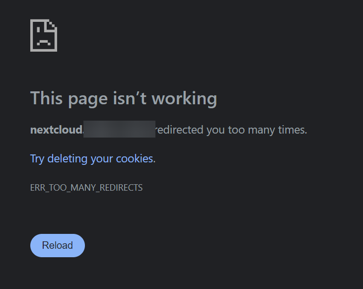
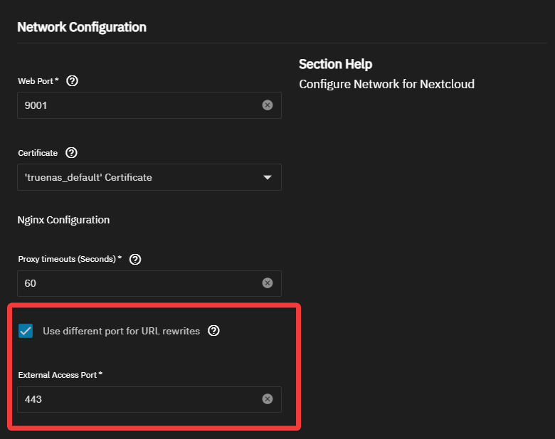

[TrueNAS Scale - Nginx Proxy Setup](../TrueNAS%20Scale%20-%20Nginx%20Proxy%20Setup/TrueNAS%20Scale%20-%20Nginx%20Proxy%20Setup.md)
[Turning Old PC into NAS in 2024](../Turning%20Old%20PC%20into%20NAS%20in%202024/Turning%20Old%20PC%20into%20NAS%20in%202024.md)

I managed to get Nginx Proxy Manager [working in TrueNAS](../TrueNAS%20Scale%20-%20Nginx%20Proxy%20Setup/TrueNAS%20Scale%20-%20Nginx%20Proxy%20Setup.md).

For some reason, I'm getting errors with "too many redirects."  Nextcloud ironically works on my local network, so let's solve it.

# Problem Solving

- Found related articles
	- [Too many redirects error when using nginx reverse proxy - ℹ️ Support - Nextcloud community](https://help.nextcloud.com/t/too-many-redirects-error-when-using-nginx-reverse-proxy/148863)
	- [all-in-one/reverse-proxy.md at main · nextcloud/all-in-one](https://github.com/nextcloud/all-in-one/blob/main/reverse-proxy.md)
	- [nextcloud/all-in-one: 📦 The official Nextcloud installation method. Provides easy deployment and maintenance with most features included in this one Nextcloud instance.](https://github.com/nextcloud/all-in-one/tree/main) 
	- [Reverse proxy keeps redirecting to Nextcloud server URL - ℹ️ Support - Nextcloud community](https://help.nextcloud.com/t/reverse-proxy-keeps-redirecting-to-nextcloud-server-url/110928) 
		- Turns out it just required setting the `overwritehost` parameter in `config.php`. That’s fun.
	- [Truenas Scale overwriting Config.php file (CLI overwrite and HOST overwrite) - ℹ️ Support - Nextcloud community](https://help.nextcloud.com/t/truenas-scale-overwriting-config-php-file-cli-overwrite-and-host-overwrite/173008) 
	- [A full guide for installing Nextcloud on TrueNAS Scale with Collabora integration and outside access through Nginx Proxy Manager - Resources - TrueNAS Community Forums](https://forums.truenas.com/t/a-full-guide-for-installing-nextcloud-on-truenas-scale-with-collabora-integration-and-outside-access-through-nginx-proxy-manager/5874) 

# Solution

Turns out I mentioned this awhile back  too - [Turning Old PC into NAS in 2024](../Turning%20Old%20PC%20into%20NAS%20in%202024/Turning%20Old%20PC%20into%20NAS%20in%202024.md)

Solution explained in depth - [Setting the Nextcloud host](https://forums.truenas.com/t/a-full-guide-for-installing-nextcloud-on-truenas-scale-with-collabora-integration-and-outside-access-through-nginx-proxy-manager/5874#p-21918-setting-the-nextcloud-host-7) 

You have to set the host to your `subdomain.domain.com` and check the "Use different port for URL rewrites" box.

AND set OVERWRITECLIURL 

