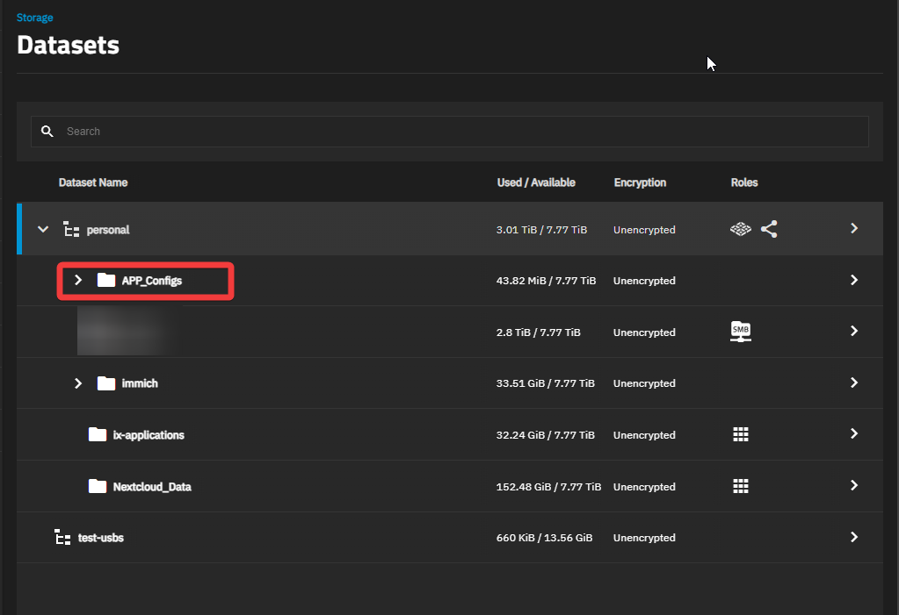
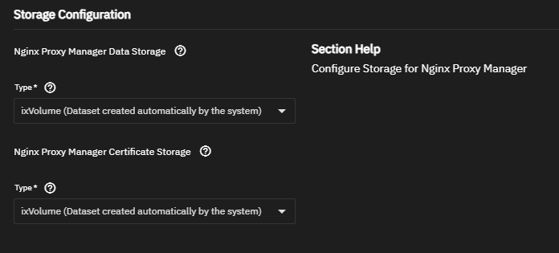
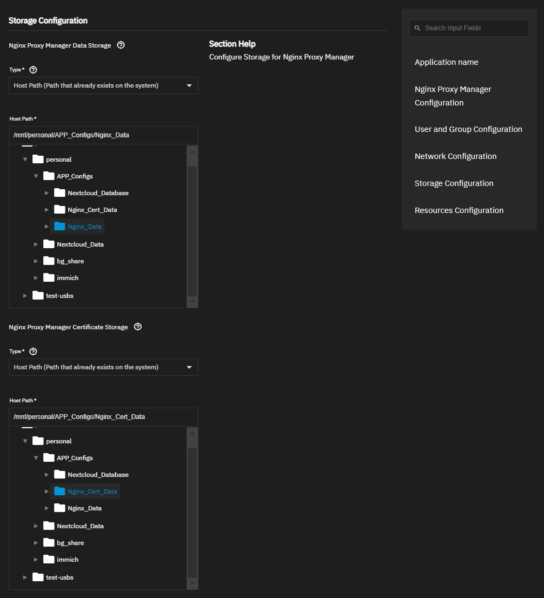

- [ ] Implement Nginx reverse proxy ➕ 2024-08-18

# Links

- [(10) Self Hosting on your Home Server - Cloudflare + Nginx Proxy Manager - Easy SSL Setup - YouTube](https://www.youtube.com/watch?v=GarMdDTAZJo)
- [Nginx Proxy Manager Setup | TrueNAS Community](https://www.truenas.com/community/threads/nginx-proxy-manager-setup.116682/)
- [Guide | Nginx Proxy Manager](https://nginxproxymanager.com/guide/)

## Learning

- [What is a reverse proxy? | Proxy servers explained | Cloudflare](https://www.cloudflare.com/learning/cdn/glossary/reverse-proxy/)
- 

# Setting Up Nginx Reverse Proxy on TrueNAS

[Turning Old PC into NAS in 2024](../Turning%20Old%20PC%20into%20NAS%20in%202024/Turning%20Old%20PC%20into%20NAS%20in%202024.md)

## Prepare TrueNAS Datasets for Nginx App

- If we want to save the data for Nginx app so that we can move the data to another TrueNAS or recover, then we just need to use host path

First, make the datasets.

- 

- 
- We have to add 2 datasets for each storage components of the Nginx Proxy Manager app
	- 
- Dataset configs 
	- Set the appropriate names for each like "Nginx_Data" and "Nginx_Cert_Data" or whatever you want

## Add Nginx App to TrueNAS

- Apps > Discover Apps > Networking > Nginx Proxy Manager
- "Install"
- Storage configuration
	- 

### Environment Variables - Required for Apps like Immich

- 