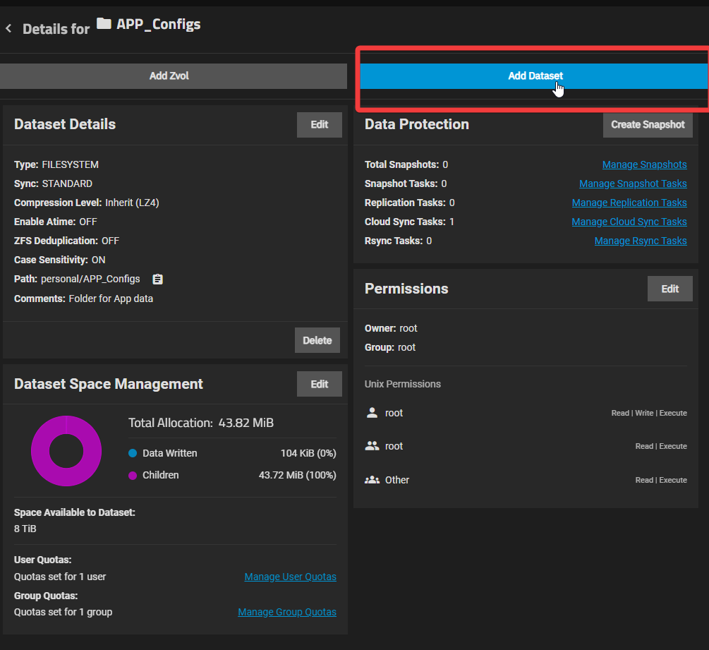
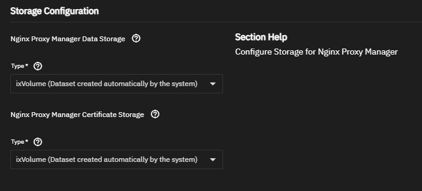
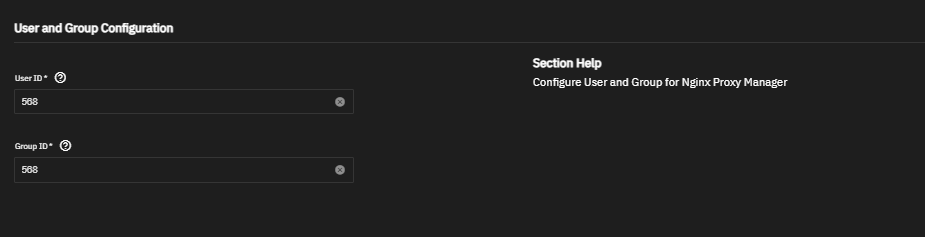
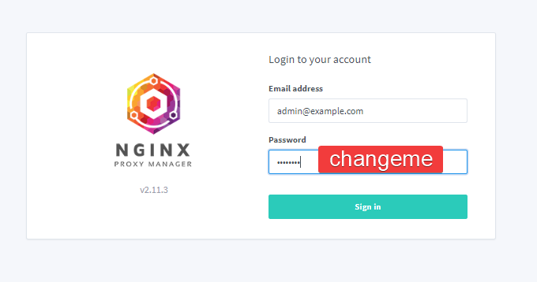

- [ ] Implement Nginx reverse proxy ➕ 2024-08-18

# Links

- [(10) Self Hosting on your Home Server - Cloudflare + Nginx Proxy Manager - Easy SSL Setup - YouTube](https://www.youtube.com/watch?v=GarMdDTAZJo)
- [Nginx Proxy Manager Setup | TrueNAS Community](https://www.truenas.com/community/threads/nginx-proxy-manager-setup.116682/)
- [Guide | Nginx Proxy Manager](https://nginxproxymanager.com/guide/)

## Learning

- [What is a reverse proxy? | Proxy servers explained | Cloudflare](https://www.cloudflare.com/learning/cdn/glossary/reverse-proxy/)
- 

# Setting Up Nginx Reverse Proxy on TrueNAS

[Turning Old PC into NAS in 2024](../Turning%20Old%20PC%20into%20NAS%20in%202024/Turning%20Old%20PC%20into%20NAS%20in%202024.md)

## Prerequisites, Requirements, Caveats

- Nginx Proxy Manager app will only install onto an SSD-based dataset?
	- [Note: Ngnix will only sucessfully install on a SSD - not HDD](https://www.truenas.com/community/threads/step-by-step-instructions-to-set-up-nextcloud-and-nginx-official-apps-for-newbies.115072/)
	- [Nginx proxy Manager - Container Startup Probe Failed: NOT OK | TrueNAS Community](https://www.truenas.com/community/threads/nginx-proxy-manager-container-startup-probe-failed-not-ok.114767/)
	- [Can't install Nginx Proxy Manager | TrueNAS Community](https://www.truenas.com/community/threads/cant-install-nginx-proxy-manager.111184/)
	- [There is a dirty hack to fix this issue is using s6 hook](https://www.truenas.com/community/threads/nginx-proxy-manager-wont-deploy.113904/)
	- [Nginx Proxy Manager won't deploy - Apps and Virtualization - TrueNAS Community Forums](https://forums.truenas.com/t/nginx-proxy-manager-wont-deploy/8076)
		- the issue is that the startup probes are misconfigured, simply kubernetes waits for the app to start up and restarting it if it fails to start within a given amount of time combined with the startup scripts that take ownership of a directory very slowly… it leads to an endless restart during first run on most systems. the environment variable just skips the take-ownership script, blindly hoping that this reduces the time enough that it actually might start this time… the real solution is to just disable startup probes but the ix “official” apps don’t give you the option to do so, this is also a problem with Plex/Jellyfin or any app that does lengthy migrations too, they usually just get corrupted badly by a restart loop. the custom app button does give you most of the required options though… and can be used to side-step fundamentally broken charts like this one (which has had this issue for at least a year but since a lot in the past simply used truecharts, no one has cared till now)

## Prepare TrueNAS Datasets for Nginx App

- If we want to save the data for Nginx app so that we can move the data to another TrueNAS or recover, then we just need to use host path

First, make the datasets.

- 

- 
- We have to add 2 datasets for each storage components of the Nginx Proxy Manager app
	- 
- Dataset configs 
	- Set the appropriate names for each like "Nginx_Data" and "Nginx_Cert_Data" or whatever you want

## Setting Nginx App ACL/Permissions

- Still unsure of how this should look in TrueNAS
- Nginx user and group config
	- 
- Make sure the datasets are configured to the same User ID (likely "apps")

## Add Nginx App to TrueNAS

- Apps > Discover Apps > Networking > Nginx Proxy Manager
- "Install"
- Storage configuration
	- 

### Environment Variables

These are also required for Apps like Immich

- [Nginx Proxy Manager won't deploy | TrueNAS Community](https://www.truenas.com/community/threads/nginx-proxy-manager-wont-deploy.113904/) 
	- NGINX won't deploy if you don't put your datasets on an SSD...usually.  You can use a weird environment variables for now.
	- You have to put in the below environment variables for things to work:
		- `S6_STAGE2_HOOK=sed -i $d /etc/s6-overlay/s6-rc.d/prepare/30-ownership.sh`

## Set Up Nginx DNS + SSL, Router Firewall Rules

- [Full Setup Instructions | Nginx Proxy Manager](https://nginxproxymanager.com/setup/)
	- Use default creds from instructions
	- 

### Cloudflare / DNS Records Setup

- Follow the instructions:
	- [HomeLab: Nginx-Proxy-Manager: Setup SSL Certificate with Domain Name in Cloudflare DNS | by Life-is-short--so--enjoy-it | Medium](https://medium.com/@life-is-short-so-enjoy-it/homelab-nginx-proxy-manager-setup-ssl-certificate-with-domain-name-in-cloudflare-dns-732af64ddc0b)

This gives the self-hosted Nginx Proxy Manager an API token, so that it can dynamically change the DNS for Cloudflare and point to the home server network...at least it seems to be the case.

To add "proxy hosts" that point to local services or TrueNAS Scale Apps - [How to Expose Services with the Nginx Proxy Manager | Linode Docs](https://www.linode.com/docs/guides/using-nginx-proxy-manager/#configuring-the-nginx-proxy-manager)

