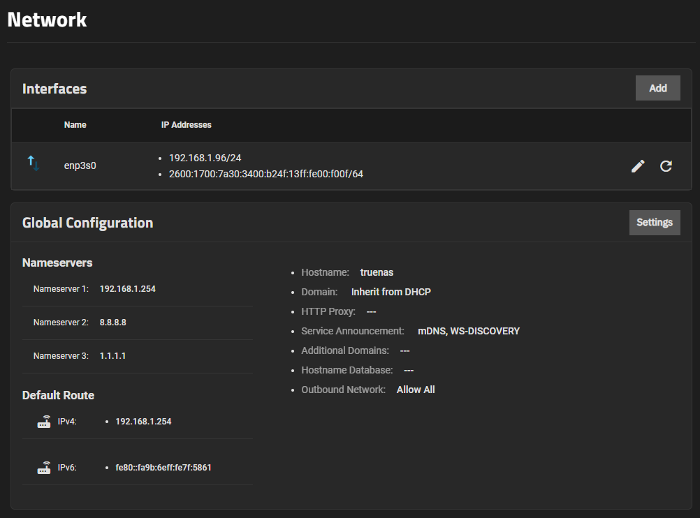
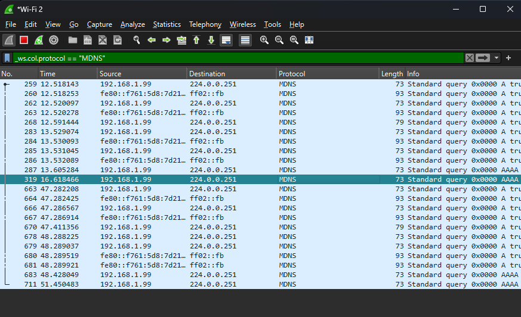

- [ ] Multicast forwarding?? - mDNS issues between wireless vs ethernet segments? ➕ 2024-05-27
# Truenas.local Stopped Working
- My truenas.local domain stopped working all of the sudden, so I'm troubleshooting the issue
- The local IP address still works fine
- To fix this, I got rid of the IPv6 address and it started working for seemingly no reason

More troubleshooting to get to SMB shares - [Cannot Connect to Truenas SMB](../Cannot%20Connect%20to%20Truenas%20SMB/Cannot%20Connect%20to%20Truenas%20SMB.md)

- Weirdly enough, `truenas.local` still works on my phone
- Current Network config:
	- 
- So, I have a truenas.local host on my local network that can resolve to the local IP address. Right now, my phone can resolve the .local domain to the IP address, but my Windows computer couldn't in either the file explorer on the browser. What's going on? I have mDNS and WS-DISCOVERY also turned on for the Networking in the TrueNAS Scale settings

# Solution
This is a client-side issue for Windows since it works on the phone.  Here's some solutions.

1. Add a manual entry to the `hosts` file located @ `C:\Windows\System32\drivers\etc`
2. Set up a local DNS server on the home router
3. Fix Windows mDNS issue
	- Links:
		- [ping not resolving mdns .local domain - Microsoft Q&A](https://learn.microsoft.com/en-us/answers/questions/864012/ping-not-resolving-mdns-local-domain) 

## Fixing Windows mDNS
- When typing in the `.local` address as configured in my TrueNAS (`truenas.local`), I see the requests going out in Wireshark
	- 
- To see multicast traffic, we can use `(_ws.col.protocol == "MDNS" || _ws.col.protocol == "LLMNR" || _ws.col.protocol == "NBNS" )`
	- The issue is that I'm not getting any replies
# Solution: Wireless and Ethernet Using Different Networks
- I plugged into ethernet instead of Wi-Fi and it worked.

# Wireless and Ethernet Home Network Topology & mDNS
- mDNS doesn't work between devices that are using different connection types - ethernet vs Wi-Fi 
- `My server that I'm trying to resolve is plugged into ethernet on the home ATT router, but my Windows PC was on Wi-Fi. Once I plugged it into ethernet, it worked flawlessly. The thing I'm really confused about is why it's worked with the private IP address for accessing the NAS server, but the mDNS doesn't work between Wi-Fi to ethernet attached devices.`
	- The router handles mDNS traffic between wireless and ethernet segments in an unexpected way I'm guessing

- mDNS Basics
	- mDNS (Multicast DNS) is used for local network name resolution without the need for a dedicated DNS server.
	- It uses multicast IP address `224.0.0.251` on UDP port 5353 to broadcast queries to all devices on the local network segment.
- ATT Router Segmentation
	- Many home routers, including some ATT routers, treat Wi-Fi and Ethernet networks as separate segments.
	- Devices on Wi-Fi might be on a different subnet or VLAN compared to devices on Ethernet.
	- Multicast traffic, including mDNS, may not be forwarded between these segments due to the router's configuration.
- Why IP Address Access Works
	- **IP Routing vs. Multicast Forwarding**:
	    - When you access your NAS server using its IP address, your router simply routes the IP packets between the Wi-Fi and Ethernet segments, which is straightforward for the router to handle.
	    - Multicast traffic, however, requires special handling to be forwarded between segments. Many consumer routers do not support or have multicast forwarding disabled between Wi-Fi and Ethernet.
- Solutions to Consider
	1. **Enable Multicast Forwarding**:
	    - Check your router’s settings to see if there’s an option to enable multicast or IGMP snooping/forwarding between Wi-Fi and Ethernet.
	    - This setting may be labeled differently depending on the router model.
	2. **Single Network Segment**:
	    - If possible, ensure all devices are on the same network segment. This might involve configuring your router to treat Wi-Fi and Ethernet as part of the same subnet.
	3. **Advanced Networking Equipment**:
	    - For more control, consider using advanced networking equipment such as a managed switch or a third-party router that supports better multicast handling.
	4. **Wi-Fi Configuration**:
	    - Sometimes, simply rebooting the router or updating its firmware can resolve multicast issues.
	5. **Use a Bridging Device**:
	    - Use a network bridge to connect your Wi-Fi and Ethernet segments, ensuring that multicast traffic can flow between them.