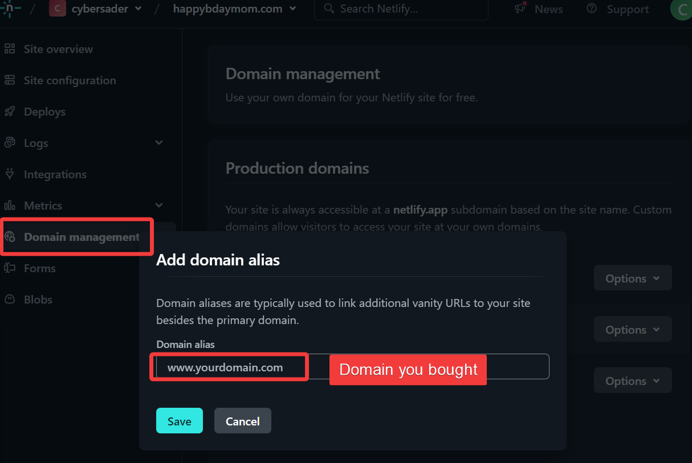

Links:
- [Register a new domain · Cloudflare Registrar docs](https://developers.cloudflare.com/registrar/get-started/register-domain/)
- [Custom domains | Netlify Docs](https://docs.netlify.com/domains-https/custom-domains/) 
- [Best Made In Webflow Websites | Free Examples & Designs - Webflow](https://webflow.com/made-in-webflow/made-in-webflow)
- [Netlify](https://www.netlify.com/)
- [kenwheeler/slick: the last carousel you'll ever need](https://github.com/kenwheeler/slick) 

Today I made a website to celebrate my mom for Mother's Day.  It took me less than an hour.

Here's how you can build a quick website for random things using Webflow and deploying it with Cloudflare for DNS and Netlify for hosting.

First I found a template @ [Best Made In Webflow Websites | Free Examples & Designs - Webflow](https://webflow.com/made-in-webflow/made-in-webflow) 

I copied it, edited it, then added some Javascript in the page settings in Webflow 

- 
- I used the slick JS library to make a carousel
	- [kenwheeler/slick: the last carousel you'll ever need](https://github.com/kenwheeler/slick)
	- 

I got an account on [Netlify](https://www.netlify.com/), then added a site by exporting the code from Webflow and importing it as a "deploy" in Netlify

- 
- 
- 

To attach the website I bought in Cloudflare, I had to set DNS records from within Cloudflare after getting IPs or hosts/FQDNs to "point" at.

[Register a new domain · Cloudflare Registrar docs](https://developers.cloudflare.com/registrar/get-started/register-domain/)
[Custom domains | Netlify Docs](https://docs.netlify.com/domains-https/custom-domains/) 

- 
- 
- 
- 
- 