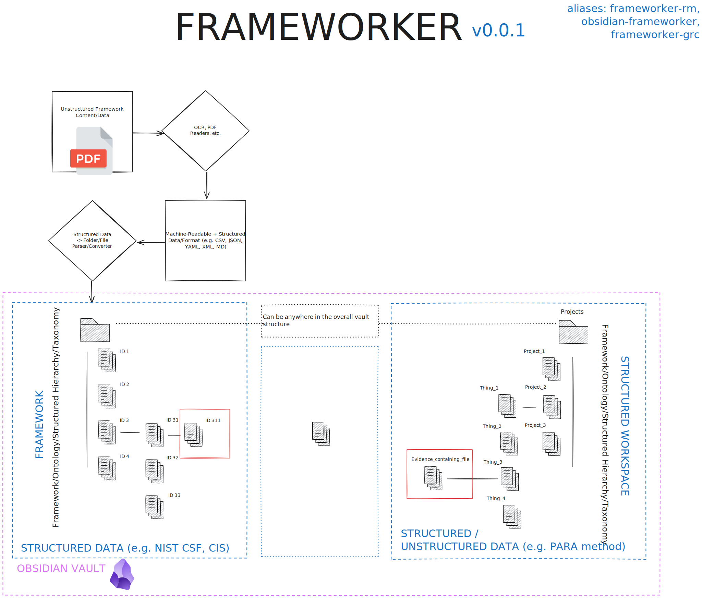

I'm trying to build a tool that can be used to map plaintext files in markdown to taxonomical frameworks with a variety of built-in features such as using YAML frontmatter on note pages, import process for CSV file mapping or tabular versions, 2 way sync with those files, workflows, and more.

[Frameworks & Standards](../../📁%2005%20-%20Organizational%20Cyber/Frameworks,%20Standards/Frameworks,%20Standards.md)
[Framework Mapping](../../📁%2005%20-%20Organizational%20Cyber/Frameworks,%20Standards/Framework%20Mapping/Framework%20Mapping.md)
[My Obsidian Stack](../../📁%2010%20-%20My%20Obsidian%20Stack/📁%2010%20-%20My%20Obsidian%20Stack.md)

# System Design

 

# Data Structures, Taxonomies, Approach

- CRI Community Profile -  Bridge/Crosswalk/Intersection/Merge/Mapping Framework
    - https://cyberriskinstitute.org/the-profile/

# Useful Obsidian Plugins

- Terms
    - Inline
    - Semantic
    - Graph
    - Edge
    - Typed Links
    - Labeled Links
    - Properties

## Core

(WIP)

- Breadcrumbs V4
    - https://publish.obsidian.md/breadcrumbs-docs/Home
    - Use edge fields and fields groups for drawing links to framework-related or separate structure notes
        - https://publish.obsidian.md/breadcrumbs-docs/Field+Groups
    - Would the framework structure be represented as a "field group?" I'm assuming not.
    - Field groups are nothing special. Just to help in the "View" to select multiple fields at once.
    - No way to have structured information attached to edges.  You have to define individual key:value pairs for each edge.
- Juggl
    - The only thing I now need is a decent export/import of the juggling graph or a powerful query/reasoning tool to query over the juggl graph. https://forum.obsidian.md/t/add-support-for-link-types/6994/154
    - 
- Excalibrain
    - A lot like Juggle or Breadcrumbs - visually mostly
- Graph link types
    - Merely turns dataview inline tags with links into edges on graph view
- Semantic Canvas
- Supercharged Links
	- Add CSS to links based on the YAML of the target note of the link
- Dataview
	- Query incoming links and show (link, tag) combinations of them?

## Misc

- Metadata Frame
- https://github.com/tth05/obsidian-completr
- Omnisearch
- Templater
- Waypoint
- Various complements
- Univer
- Timestamper
- Tasks
- Reminder
- Projects
- Metadata Menu
- Make-md
- Metaedit
- Multi-properties
- Folder Notes
- Dataview
- Commentator
- Commander?
- Custom-Save?
- Dataview publisher or serializer
- Frontmatter links
- Consistent attachments and links
- Custom attachment location
- Tag-Wrangler
- Linter
- Workspaces plus
- Pane Relief
- Hover editor
- Supercharged links
- https://github.com/dsarman/better-inline-fields
- Meta Bind
- Supercharged Links
- Custom File Order
- 

# Linking, Graph Edges

> [!important] The purpose?
> Encode metadata about an edge/relationship/link to another note in the vault.  This could be structured or unstructured data even.

The issue is that I essentially want to store data about a relationship between two files and there's no advanced link syntax to store something like JSON in a link/edge.

- Options:
	1. **Intermediate edge metadata file** - use intermediate file that's indexed to store structured data about the edge
	2. **Structured data for graph link syntax** - develop syntax to store structured data at link instantiation
	3. **Take advantage of inline Dataview tag name** - structure data in inline tags with link to framework/structured data component as the value.  Find all of the files, use regex to find all cases of incoming files with regex match

## 1) Intermediate Edge Metadata Files

- We could define connection/mappings files under a folder like `.edges_framework_here` or `.mappings_framework_here` that show the schema for metadata with the connections
- When a link is made, then it could generate an `edge/graph_link/linking` file prefilled with the structure via a Template or something else.  
- A hashmapped file should then be stored under the related framework or a `.edges` folder or whatever the user defines to store unstructured metadata for connection to other files.
- Querying these would be difficult because we would have to be able to query "2nd-degree" connections in which files are two hops from each other (2 hops because, now, there's an intermediate metadata file in the middle.

## 2) Structured Data in Link Syntax

- .

## 3) Dataview Inline Tag Key Workaround

- I could make links that store the nested data with some format to point to a particular kind of general relationship between files like `framework_here.evidence.review`.  Then there could be something like `framework_here.link.sufficient_for :: (file)[relative_path_to_file]`.  Then there could be something like `framework_here.link.sufficient_for :: (file)[relative_path_to_file]
- Then the dataviewjs query could look for all incoming files that include tags with `framework_here` in it and parse the structure of tags to create a flattened table or something similar since it's dataview.

## Linking Workspace

- My ideal linking format for linking different ontologies/data systems/taxonomies/hierarchies in Obsidian
	- Use the same inline dataview syntax with JSON like below
	- Examples:
		- `(beginning of line)framework:: [link_text](link){key:value,key_array:[],key_object:{}}`
		- `(beginning of line)framework:: [link_text](link){key:value,key_array:[],key_object:{}}`
	- Custom dataview regex processor to process inline structured data?
	- Another syntax idea
	    - [key_name :: {positional_value_1, positional_value_2, key_1:value, key_2:value}]
	    - BUT WHAT DECIDES THE TEMPLATE? WHAT IS KEY_NAME FOR?

- Relationships between MD pages - links and graphs
    - How do graph DBs represent information about relationships between 2 nodes?
    - Links
        - https://forum.obsidian.md/t/add-support-for-link-types/6994/27?page=2
        - https://forum.obsidian.md/t/add-support-for-link-types/6994/186
        - https://volodymyrpavlyshyn.medium.com/how-to-make-personal-knowledge-graph-in-obsidian-a6dcd9cd0502
        - https://forum.obsidian.md/t/graph-link-types/74710
        - https://forum.obsidian.md/t/graph-link-types/74710/29 - with positional and keyword parameters per edge
        - https://forum.obsidian.md/t/graph-query-language-api/1542/5
        - https://forum.obsidian.md/t/juggl-out-now-1-0-1-a-completely-interactive-stylable-and-expandable-graph-view-plugin/9625
        - https://medium.com/@apappascs/aggregation-in-cypher-collect-list-comprehension-and-map-projections-4c011a6a6ce3
        - https://forum.obsidian.md/t/paths-for-notes-connection/6888
        - https://forum.obsidian.md/t/paths-for-notes-connection/6888
        - https://forum.obsidian.md/t/how-to-best-discern-between-different-types-of-links/8906/8
        - https://juggl.io/
        - https://github.com/memgraph/odin
            - https://memgraph.com/blog/addobsidian-note-taking-with-odin
		- [Add support for link types - Feature requests - Obsidian Forum](https://forum.obsidian.md/t/add-support-for-link-types/6994/32)
		- [Consistent attribute syntax - Extensions - CommonMark Discussion](https://talk.commonmark.org/t/consistent-attribute-syntax/272/137)
		- [How are links between notes stored in Obsidian - Basement - Obsidian Forum](https://forum.obsidian.md/t/how-are-links-between-notes-stored-in-obsidian/20078/8)
		- 
    - At nodes --
        - Use queries - for generating editable, versionable tables, require dates for changes or just serialize it on nodes in the form of some table that can be edited.  This might be hard
        - At edges - use templates for the to/from set of available key value pairs.  Templates could be in the YAML frontmatter or stored in some other format inline within the note using code blocks
    - Allow for inline connections to other note pages using some crazy inline format

- Format for RDF from W3C
	- [Serialization formats for linked data | RDF | Wikipedia](https://en.wikipedia.org/wiki/Resource_Description_Framework#Serialization_formats "Resource Description Framework - Wikipedia")
	- 

- Format that works with other markdown (GFM / GitHub Flavored Markdown)
	- https://forum.obsidian.md/t/add-support-for-link-types/6994/32?u=cybersader
		- Aspen is cool but probably not for these use cases
	- 

- Weak vs strong links?
    - No schema vs using a "valid" schema - think JSON schema but something with YAML or something else
    - 

- Related - storing in block metadata?
	- [Block metadata - extension of block-id syntax - Feature requests - Obsidian Forum](https://forum.obsidian.md/t/block-metadata-extension-of-block-id-syntax/8306)
	- 

- Okay I've got an incredibly complex project but the solution by its nature could be simple.  Essentially, I need to emulate, in an Obsidian vault, graph-DB-like connections with structured data for those connections.  Here's an example.  I have a structured workspace wiki that i want to be able to, on the fly, map to a structured framework.  Here's the issue.  There could be a piece of evidence in the workspace wiki that i want to map as a ___ (whatever) to the framework along with structured data for that linkage/connection/edge.  I need a way to do that.  The issue is that I'm attaching structured information for that edge to an unstructured file which makes it harder to search and likely to interact with other complex syntactical things on that Obsidian note page.  The idea could be to have an intermediate hash-mapped or something rather note page between links and the structure or template of that intermediary is defined by some simple structure when the link is instantiated.
- Your essentially mapping a structured workspace (one ontology) to another structured framework (another ontology)

- The nested data for edges/links can be flattened out even if it's a nested data structure - JSON -> tables

- Different link syntaxes (nested/hierarchical vs key:value data in edge/link)
    - Overriding the use of "#" for headers in links (not the best idea) - https://forum.obsidian.md/t/add-support-for-link-types/6994/195
    - https://forum.obsidian.md/t/add-support-for-link-types/6994/32
    - https://forum.obsidian.md/t/add-support-for-link-types/6994/30
    - https://blacksmithgu.github.io/obsidian-dataview/annotation/add-metadata/
    - 

# Ingesting a Framework (Structured Data -> Folders + Files)

- Building from framework, policy, and any structured data
    - Tools for building structured folders to be used with Frameworker

# Querying Connections/Edges/Links

- The nested data for edges/links can be flattened out even if it's a nested data structure - JSON -> tables

# DROPZONE, WORKSPACE

- The file/folder order for the framework data in Obsidian is also an issue that needs to be accounted for

- Utilizing AI and search
    - We can use AI while in our normal knowledge spaces to find the framework/structured data links or even use AI to help us find those links

- the MINIMUM using dataview
    - First we refer to things we the inline or YAML frontmaterr dataview markdown or wikilinks
    - At the framework page, and at the top, we use Templater and some way to put in automatic dataview queries to query for incoming connections from evidence files along with what they are "covered", "accounts", "reduces risk for", etc 

- I might be able to use a minimal combination of Metadata Menu and Supercharged links
    - I would essentially make template for the framework side assuming it's only one way.  If I need to make a connection then it would have to be done in the YAML frontmatter of the evidence-containing file.  Then, I refer to some block ID for the highlighted evidence in that file.  Holy crap this is a janky workaround as I'll get out, but it may be doable with the existing plugins unlike the other workarounds.  

- Activate edge/linkage/link/graph relationship "template"/schema/structure/hierarchy or properties based on one of:
    - Tags
    - Folder structure (strict ontology) of the receiving or sending note
    - Some tag or value in the syntax of the link
    - Results from something else like dataview
- Do ontologies/taxonomies/frameworks have to be separte at the root-level?  Can they be intertwined so long as the connection templates are activated based on tags instead of folder structure or something else?

- https://forum.obsidian.md/t/a-proposal-for-rendering-block-embeds-inline/27093/84

- Many to many
    - We should be able to, from one instantiation, define many links that an edge with data/properties goes to, or one link that many data or properties goes to (might be problematic, but would essentially be akin to multiple JSON objects)

- How to keep links future-proofed if framework changes?

- Tables to edit links in bulk from queried place?
	- Editable dataviewjs queries?

- Workaround by embedding intermediate pages in the links to  a hashmap or "supertags"
    - Use intermediary notes for storing data somehow?
    - https://forum.obsidian.md/t/add-support-for-link-types/6994/172
    - https://forum.obsidian.md/t/add-support-for-link-types/6994/173
    - You could embed a hashmap or ID in each edge/link between notes, then have a massive hashmapped store of the properties or data about that edge/link
        - https://forum.obsidian.md/t/add-support-for-link-types/6994/186
    - Template filename could be a hashmap stored in a file like `.edges_data` or something similar

- System for also linking to the source material for the framework such as a pdf by using some sort of syntax with URLs or something of the like
    - You could even have a process that auto-edits the PDF and marks pages as you link to certain content processed from the page during the source material (framework PDF) to the vault structure for the framework.

- Accounting for how images are handled and aggregated/queried once linked

- Scalability problems
    - Inline graph links with properties can have massive performance issues.  Since notes are unstructured, every note has to be processed in its entirety.  So, indexing of some kind has to take place to store the mappings. This means that this graph-based approach in graph-based in functionality but not so much behind the scenes as it's emulated by a table.  This has caveats when the space scales to a large enough size
    - 

- What's the system fundamentally doing?
    - We are taking strict taxonomies/hierarchies and representing them in a way that can be easily interfaced and machine-readable
    - We are using a many components to represent these taxonomies or nested key:value pair systems:
        - Plaintext files with markdown
        - Inline tagging
        - YAML frontmatter - nested information about a singular node
        - Paths (relative or absolute) to other notes
            - Linking
            - Like a "graph"
        - How to represent an "edge" like in a graph but with particular values?
            - EXAMPLE: this page shows evidence of compensating control for this other reference framework page
    - Using the "graph"
        - We have to tell it how to pull the data out (below)

- Enable schemas like OSCAL to be implemented out-of-the-box
    - OSCAL is a set of formats expressed in XML, JSON, and YAML. These formats provide machine-readable representations of control catalogs, control baselines, system security plans, and assessment plans and results.

- Connection/edge templates for graph system
    - Store them per node (note page).  Templates can be defined globally per type of note page based on a tag in YAML frontmatter, or you can have value choices for key_value pairs in the edges, global templates

- Is there a way to reference a line somewhere else such as a "form" notepage to act as an input for something else in Obsidian?
    - We need a way to implement specific assessments or conditionals that choose how a specific node's connections are affected and so on

- One of the hardest parts of using the frameworker tool with evidence gathering
    - Internal links can be consistently updated, but external file links, OneDrive, and others cannot.  This requires 2-way conflict handling

- Include frameworks out-of-the-box with support from the framework makers

- Merging/searching/exporting a path in the graph/structure?
    - We could flatten with particular key:value choices down to a certain layer
    - Use cypher queries with the notes?
    - Somehow would need to use graph-based connections, potentially index them (SUPER HARD), and allow for building two-way synced tables (or not) 

- How does OSCAL fit in?
    - OSCAL to YAML frontmatter?
    - 

- Storing, importing, and exporting templates for these framework setups?
    - Use some template format or system?
    - Definition files?
    - OSCAL?
