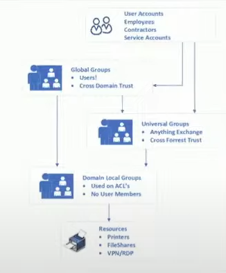
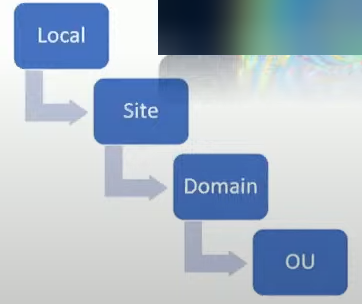
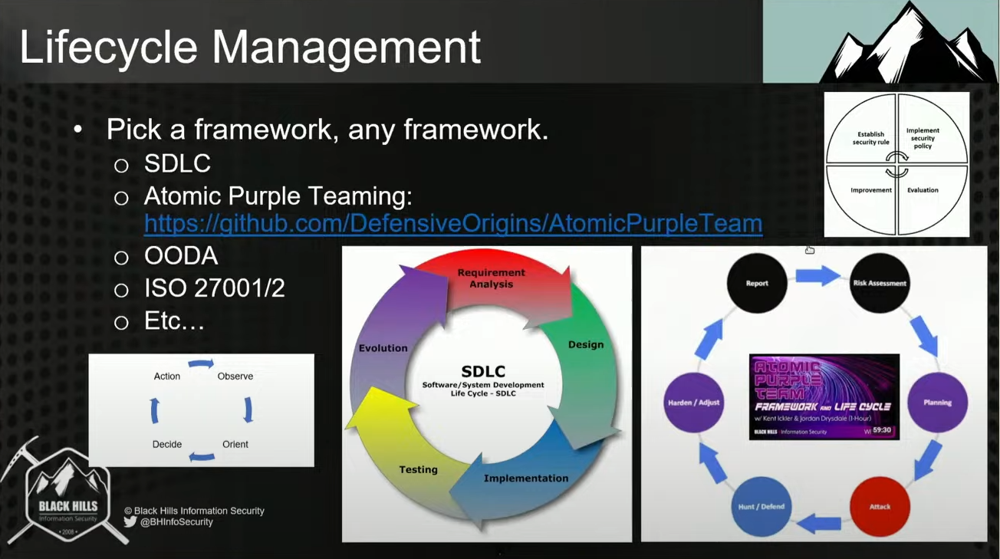

# Good Places to Start

- [(4) Next Gen Strategies for Cleaning Up Previous Gen AD & SMB w/ Kent & Jordan #livestream #infosec - YouTube](https://www.youtube.com/watch?v=lud3T2mHiI4&t=3010s) 

# Tools

- Data Mapping in File Shares
	- Python + Pandas + Plotly Treemaps
	- Data classification (open source and free) - [SnaffCon/Snaffler: a tool for pentesters to help find ... - GitHub GitHub https://github.com › SnaffCon › Snaffler](https://github.com/SnaffCon/Snaffler)
		- Use a paid tool to map and classify data access, permissions, staleness, duplicates, etc. 
	- [Plotly | Treemap charts in Python](https://plotly.com/python/treemaps/)
	- https://plotly.github.io/plotly.py-docs/generated/plotly.graph_objects.Treemap.html
	- https://plotly.com/python-api-reference/generated/plotly.express.treemap.html
	- https://plotly.com/python/reference/treemap/#treemap-name
	- 
	- Use columns like User/Group, File/Folder Path, Sensitivity/Classification to build out the treemap
- AD and Getting to RBAC (Role Based Access Control)
	- [Home - PingCastle](https://www.pingcastle.com/)
	- [BloodHoundAD/BloodHound: Six Degrees of Domain Admin](https://github.com/BloodHoundAD/BloodHound)
	- [Bloodhound Reporting for Blue and Purple Teams - GitHub GitHub https://github.com › PlumHound › PlumHound](https://github.com/PlumHound/PlumHound)
	- [Testimo is a PowerShell module for running health checks ... GitHub https://github.com › EvotecIT › Testimo](https://github.com/EvotecIT/Testimo)
	- [EvotecIT/GPOZaurr: Group Policy Eater is a PowerShell ... GitHub https://github.com › EvotecIT › GPOZaurr](https://github.com/EvotecIT/GPOZaurr)
	
	- [ly4k/Certipy: Tool for Active Directory Certificate Services ... GitHub https://github.com › Certipy](https://github.com/ly4k/Certipy)

# Cleaning Up SMB Shares and AD

The goal of cleaning up AD and SMB shares is to allow for an environment where's it's possible to define the who, what, when, where, why, and how of data.  This is one aspect of that primarily found in legacy and on-prem environments.  

Link - [(4) Next Gen Strategies for Cleaning Up Previous Gen AD & SMB w/ Kent & Jordan #livestream #infosec - YouTube](https://www.youtube.com/watch?v=lud3T2mHiI4&t=3010s)

## Why it matters

- Common findings in pentests
	- Weak NTFS and share permissions
		- File servers are usually a mess in legacy environments
	- Cleartext things like creds lying around
	- Unsupported OS
	- Weak and guessable creds
- Challenge to clean up
- They've cleaned it up many times in the past
	- Sprawling file shares
	- Unknown data types, owners, PoCs
	- Poorly configured AD domains
	- Lack of cultural support for infosec

## Executive Problem Statement

- File shares are a disaster
	- Who is responsible?
	- Why is there personal stuff in them?
- What does cleanup look like?
	- Do we have the staff?
	- Can we buy a tool?
- Why are file shares a mess?
	- AD is a mess
	- Who is responsible?
	- What should we do and where should we start?
- Are we getting good advice?
- Have finance bros ruined everything?

## Legacy

- How Legacy Happens
	- AD environment that has been around a long time with different sys admins at different skill levels
- Cleanup Strategies
- Relationships
- Examples

### Why is AD a Mess?

Active Directory is ... "because it just works"
- a perceptive skill equalizer
- not always obvious
- easy to neglect...
- easy to misuse...
- easy to misconfigure
- easy to open to attack
- easy to forget
- easy to do right

### What AD Is

- Directory Service
	- Store & Provide Data
		- Users
		- Computers
		- Printers
		- Servers
		- Organizations
		- Organizational Units
		- Locations
		- Addresses
		- Phone Numbers
		- Employer Hierarchy
- Authentication / Authorization
	- Centralized Authority
		- Users
		- Computers
		- Authorizes Access
		- Network Resources
		- File Shares
		- Services, Printers
- Policy Management
	- Manaqe & Configure
		- Operating Systems
		- Applications/Software
		- User Settings
		- Security Settings

### What AD is NOT

- Directory Service
	- Store & Provide Data
		- Password Manager
- Authentication / Authorization
	- Centralized Authority
		- A Complete Identify and
		- Access Management Solution
- Policy Management
	- Manaqe & Configure
		- A Complete Identity and Access Management Solution

### Worst Case AD

Misconfigured
- Not Enough Groups
- Too Many Admins
- Excessive Exceptions
- `\\File6\` everyone R/W
- Misplaced PKI SME/PoC
- Stale objects
- Weak network protocols all over
- Bad passwords
- Inappropriate "Descriptions"
- Orphaned objects/ACLs/DNS
- No honey accounts
- Unsupported Operating Systems

### Better Case AD

Well Configured
- Just Enough Groups
- Appropriate Admins
- Minimal and Documented Exceptions
- RBAC group delegations
- PKI audited regularly
- Regular PlumHound I BloodHound audits
- Strong relationships
- Bastion domain
- sMSAs 1 gMSAs
- Fine grained password policies
- Password filter lists

## How to NOT Get There - Messy AD and File Shares

Some companies get hacked and then look for easy buttons:
- Immediately Upgrade EDR, firmware, and software
- Implement full auditing and logging on everything everywhere
- Spend \$\$\$ and allocate resources everywhere
- Contract third-party for their first pentest
- Move to the cloud and pay consultants
- Improve backups and pay consultants
- Draft network maps and pay consultants

## How to Get There - Clean AD and File Shares

Be proactive:
- Upgrade EDR, firmware, and software
- Spend \$\$\$ and allocate resources
- Inventory programs and upgrade network maps
- Regular Pentesting
	- Do it internal if you can't externally
- Data Governance & Compliance
	- Where does data live?
	- Data classification and mapping on file shares?
	- Start looking at reports from tools 
	- Audits Review file share structures
	- Tough to do this
- Implement actual cold storage backups
- Folks, let's introduce HR and IT, blind-date style.

## SecOps + HR + Help Desk

> [!quote] You need support and trust with HR

- HR or Help Desk
	- Human Capital Management
		- Recruitment Process
		- Employee Training
	- Org Design & Policies
		- Enforcement
	- Risk Management
	- Interdepartmental Collaboration Facilitator
- Information Security
	- Access Governance
	- Security Policies
	- Risk Management

- HR or Help Desk
	- Understanding Business Operations
	- Org Charts
	- Department PoCs
	- Job Functions / Descriptions
	- Geographical Map of Organization
	- Employment Notifications
	- Contact information for appropriate executives
- Information Security
	- List of most important Data / Resources / Services
	- Local Network Map / Subnet list / Asset Management
	- Access Control

## Relationships

- InfoSec needs to learn to speak better business language
- Avoid the friction that comes with rapid change
- Work with other teams, schedule regular meetings
- Learn to listen effectively and address concerns

## Organizational Support

Quite a few arguments to garner support:
- Improved security and reduced risk exposure.
- Compliance.
- A cleaner AD == more efficient operations == less \$\$\$.
- Business continuity.
- RBAC is crucial here if you want to survive

## Structuring Groups

- jUGULaR
	- Just because it needed to be clever
	- Users
	- Global Groups
	- Universal Groups (if you have Exchange on prem)
	- Local Access to Resources

"Don't put individual users in DACLs"

- Group Policies Summary
	- 
- LSD-OU
	- User or computer
	- Templates or Policy Preferences
	- Manage local administrators — workstation and server
	- Password Policy
	- Loopback Processing Mode?

## Lifecycle Management

- OODA is well documented
	- What is the infra and environment

## Useful Open Source Tools

- [Home - PingCastle](https://www.pingcastle.com/)
- [BloodHoundAD/BloodHound: Six Degrees of Domain Admin](https://github.com/BloodHoundAD/BloodHound)
- [Bloodhound Reporting for Blue and Purple Teams - GitHub GitHub https://github.com › PlumHound › PlumHound](https://github.com/PlumHound/PlumHound)
- [Testimo is a PowerShell module for running health checks ... GitHub https://github.com › EvotecIT › Testimo](https://github.com/EvotecIT/Testimo)
- [EvotecIT/GPOZaurr: Group Policy Eater is a PowerShell ... GitHub https://github.com › EvotecIT › GPOZaurr](https://github.com/EvotecIT/GPOZaurr)
- [SnaffCon/Snaffler: a tool for pentesters to help find ... - GitHub GitHub https://github.com › SnaffCon › Snaffler](https://github.com/SnaffCon/Snaffler)
- [ly4k/Certipy: Tool for Active Directory Certificate Services ... GitHub https://github.com › Certipy](https://github.com/ly4k/Certipy)

## Migrating File Shares to RBAC (HARD)

- Phase 1
	- Discover Shares
	- Discover Data
	- Analyze Data
- Phase 2
	- Define Roles
	- Implement Access Structure
- Phase 3
	- Migrate
	- Support New Roles & Data

Example:
- New user comes in
- Global groups should have users
- If you have Exchange on-prem then you have to use universal groups
- You shouldn't have resources inside of global groups
- Global group users to be members of domain local groups and domain local groups apply to resources you want to secure

- Accounting with 4 locations:
	- "All_AP"
	- "All_CPA"
	- then...
	- "All_EastRegion_AP"
	- "All_EastRegion_CPA"

- Now you can email all whatever type of group

- Build automation so that when HR sees employment change, then there's a cross-check to make sure the access to that role changes

### Phase 1: Migrating File Shares to RBAC

- File Share Reconstruction Phase 1!
- Inventory existing shares:
	- PowerHuntShares: https://qithub.com/NetSPl/PowerHuntShares
- Analyze existing permissions
- Classify Data
- Snaffler: https://qithub.com/SnaffCon/Snaffler
	- Identify redundant
	- Identify obsolete data
	- Identify trivial data
	- Identify sensitive data
- ROT data!

### Phase 2: Migrating File Shares to RBAC

- File Share Reconstruction Phase 2!
- Use your relationships to identify all the roles (HR!)
	- "We don't really know.  We let the departments handle that."
- Create role based user groups
- Create logical file share structures
- Create share/data based security groups
	- "DEPARTMENT_FILESHARE_FILESERVER_SHARE_FOLDER_RW"
	- Apply those groups to roles at the lowest level/role that we can
	- If everyone needs it then the DACL will only have one group
- Apply role-based permissions structures (User groups -> Resources)

### Phase 3: Migrating File Shares to RBAC

- File Share Reconstruction Phase 3!
	- Plan your migration
	- QA/QC/UAT/Change management your migration
	- Test your migration
	- Make the move
- What happens when roles change?
	- Automation for employment job role changes
	- Automation for terminations and name changes
- What do we do for hybrid roles?
	- If you're an accountant and legal counsel - then you get 2 groups

- Reconstruction and testing
	- You're going to be moving data
	- In a legacy environment, the structure will be deep (like 13 levels) with single owners/users actually using the files
	- People/you will need to find their data and move it into better boxes
	- Then you remove access.  
	- If someone complains, then you say, "what was that data you were needing."

## Decoupling Legacy Systems

- Phase 1
	- Asset inventory
	- Discover Systems
	- Budget Analysis
- Phase 2
	- Analyze, Function, Owners, Users
	- Plan Replacement, End-Of-Life
- Phase 3
	- Migrate
	- Ongoing Support
	- Plan Replacement / Budget

## Example Tech Stack and Process

- Phase 1
	- Vuln a config analysis
		- Nessus
		- PingCastle
		- BloodHound, PlumHound, AD Explorer
		- GPO Zaurr
		- Testimo
		- Certipy
- Phase 2
	- Plan Remediation
	- Change Management
- Phase 3
	- Implement Change / Remediation

- 