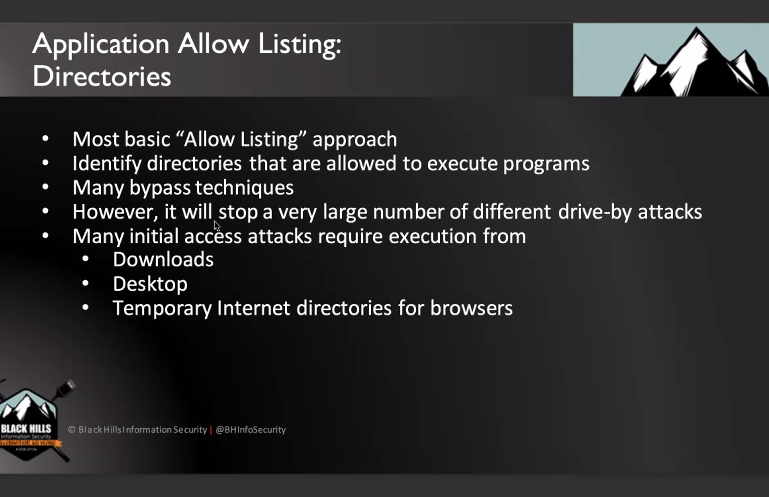
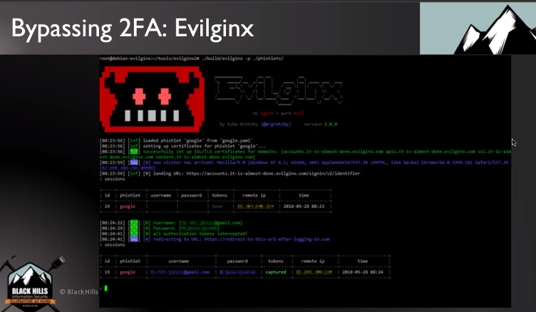
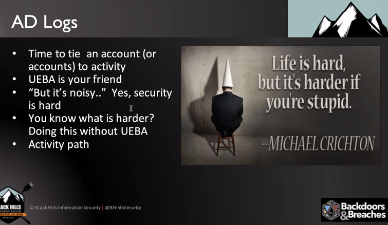
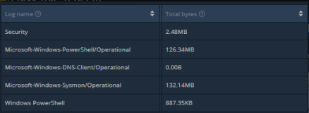
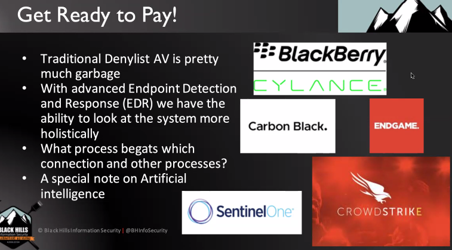
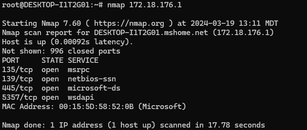
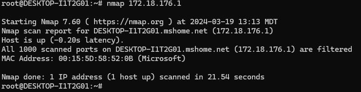
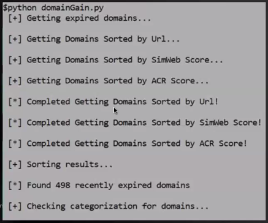

---
tags:
  - BHIS
  - ATTCK
  - Mitre
  - JohnStrand
date created: Monday, March 18th 2024, 11:08 am
date modified: Thursday, March 21st 2024, 8:23 pm
created: Monday, Mar 18, 2024 11:08 AM
updated: Thursday, Mar 21, 2024 08:23 PM
---

# MEMES, Quotes
- Change your title to "managing intern" if you want to avoid marketing as an executive
# RESOURCES and LINKS
- [Free Resources - AuditScripts.com](https://www.auditscripts.com/) 
- [John Strand Training Lab – Download Instructions – Antisyphon Training](https://www.antisyphontraining.com/john-strand-training-lab-download-instructions/) 
- Games:
	- Cubicles and Compromises
	- Pivots and Payloads
	- Backdoors and Breaches
## Misc, Mentioned
- Pingcastle, GPOZaurr, Testimo
- Graphrunner
- Bloodhound + Plumhound
# A Gentle Caring Intro to Security
## Overview of Class - What will be covered
- What works to defend a network
- Cover the things that BHIS loves/hates to see in customer networks
- "Hacker tears make the best wine" - classic quote from John Strand
- **Atomic Controls** - Mapping MITRE to Critical Controls 11 topics:
	- Application Allow listing
	- Password Controls
	- Egress Traffic Analysis
	- UEBA
	- Advanced Endpoint Protection
	- Logging
	- Host Firewalls
	- Internet Allow Listing
	- Vuln mgmt
	- AD Hardening
	- Backup and Recovery
## What WON'T be covered
- Windows
- Linux
- TCP/IP
- Crypto
- Security Models
- The CBK
- NIST 800 series
- DLP
- Exploit of the day!
## Why is this important
- BHIS tracked vulns over the years (650+ per year)
- Mapped these to Mitre

## Compliance Issues
- Far too many frameworks
- Overlapping and conflicting recommendations
- NIST Greenbook
- PCI Min Password length changes a lot
- [Free Resources - AuditScripts.com](https://www.auditscripts.com/) 

## Mitre Defense Coverage Approach
- Don't approach by technique - try to cover large sets of attacks instead
# Application Allow Listing

- How to approach white and blacklisting applications
- We are hardwired to like denylists
	- Don't snuggle with grizzly bears - cavemen evolution
## Six Dumbest Ideas in Security

/## Examples: Ghostwriting, LOLBins
- If we XOR data to itself then it should always be 0
- If we do this in assembly then we can avoid lots of AV
- Living of the land binaries can be used to avoid denylisting AV out there
## Application Allow listing: Directories

- Go by dir
	- Only from Program Files, Program Files x86
	- Avoids from Downloads, Desktop, etc.

## By Hash
- This works too
## By Digital Certs

## AppLocker

- You need pro license to use it
## AppLocker LAB
[IntroLabs/IntroClassFiles/Tools/IntroClass/AppLocker/AppLocker.md at master · strandjs/IntroLabs](https://github.com/strandjs/IntroLabs/blob/master/IntroClassFiles/Tools/IntroClass/AppLocker/AppLocker.md)

## Malicious Executable with Metasploit
- `su` - switch user
- `sudo su` - avoids having to type psw in multiple times

- Made a malicious executable that's hidden
- Ran a C2 in WSL
- Accessed the C2 from another Linux terminal in the VM using `msf5 > use exploit/multi/handler`
- Used my local IP `172.19.78.82`
- Ran TrustMe.exe 

## AppLocker Setup
- Start > Local Security Policy
- Application Control Policies > AppLocker
- Create default rules for each category
	- 
- Enforce the rules
	- 
- Start the Application identity service
	- 
- Run `gpudate /force` to force policy update
## Testing AppLocker
- Signed into allowlist account
- Ran exe from tools folder
	- 
# Password Controls
## Password Sprays

- Using one easy guessable password over tons of different accounts or services instead of focusing on one account with many passwords
- One to many instead of many to one

## Password Spray LAB
[IntroLabs/IntroClassFiles/Tools/IntroClass/PasswordSpray/PasswordSpray.md at master · strandjs/IntroLabs](https://github.com/strandjs/IntroLabs/blob/master/IntroClassFiles/Tools/IntroClass/PasswordSpray/PasswordSpray.md#password-spray)

- Uses `200-user-gen.bat` to generate fake local accounts
- Uses `LocalPasswordSpray.ps1` to spray local accounts

## Password Spray Questions
- Is there a way to give power to decoy accounts if you're a hacker?  What if there's a compromised DA? Seems like they just log, but don't allow actual access.
	- Deny logon to the user on any machine. Please be aware that if another DA gets compromised the DenyLogon setting can be removed.
	- If there is any attempt to use the user credentials (password or hashes) a [4768](https://docs.microsoft.com/en-us/windows/security/threat-protection/auditing/event-4768) is logged. Any enumeration which reads DACL or all properties for the user will result in a [4662](https://docs.microsoft.com/en-us/windows/security/threat-protection/auditing/event-4662) logging.
- How many accounts per number of accounts to cover most password spray type passwords?  I've tried to see if there was a way to allow for an account to accept a password from a list of passwords for the ultimate honey account, but this is impossible to do.  Seems like I would need to create many accounts to cover lots of easy ones depending on what wordlists or guesses I think attackers would use.

# 2FA

- SMS-based 2FA can be bad if your threat profile is against APTs with things like SIM swapping

- Service accounts can't have MFA because they aren't people, so how to secure them?

## Kerberoasting

- user accounts can request these tickets for service accounts, grab hashes, and then crack the hashes offline
# LLMNR, MDNS, NBNS - Name Resolution

- Can still be used to harvest hashes and passwords
- Name resolution:
	- computers have to find servers and IPs when you look up things like blank[.]com
	- "Hey if I can't find the IP address, then how about the computer asks the computers around it for the IP addresses"
		- mDNS and LLMNR
		- No need for security 😆
## Responder LAB
[IntroLabs/IntroClassFiles/Tools/IntroClass/Responder/Responder.md at master · strandjs/IntroLabs](https://github.com/strandjs/IntroLabs/blob/master/IntroClassFiles/Tools/IntroClass/Responder/Responder.md)
- Really simple
- Grabs the hash as someone goes to ask for something that doesn't exist
- Password is cracked
- Then pw could be used with meterpreter

## 2FA Bypassing
- Credking - really good

- Evilginx
	- Really effective at proxying 2FA
	- 

# Identity
## Password Managers
- If these get compromised without 2FA, then you're in trouble
- Just use them
- 

## Privileged Identity Management
- 3rd party identity provision
- Makes post exploitation difficult with reused passwords
- 

# Hashcat LAB
- TODO

# Logs
## MITRE and UEBA
- 
- 
- Speaking of drowning in logs, my task for the day is actually to get a sysmon config and Windows auditing config set up to use across our workstations. The issue being that I need to multiply the throughput by 5000 machines and manage to stay under 2 TB daily. 
- If you don't have a lot of control over the volume of logs being generated, then you will generally need a proxy between log sources and log consumers that filters out the stuff you don't want.
## UEBA - user and entity behavior analytics
- 
- Tools:
	- LogonTracer - lateral movement
- 

## AD Logs
- 

## ActiveWhite CLI
- .

## DeepBlueCLI LAB
- .

# Windows Event Logging 
- 
- 
- 
	- You have to set a bunch of audit policies in Windows 
- Powershell Logging 
	- You need a bunch of PowerShell settings first to get this working
## Sysinternals & Sysmon
- Ntinternals from Mark becames Sysinternals
- Sysmon logs more
	- easy to push out with GPO

## Sysmon Lab
- I didn't really do the lab here, because I already know how
- I'm using the defcon 3 sysmon config from that one BHIS video with Noah and Nick . It looks like this sysmon config with some additional Windows audit policies goes at about 20 KBps which translates to 1.728 GB per day. For 5000 machines (larger org), this equates to ~3-8 TB per day of logs. Notice how a small config for sysmon and audit policies can quickly become expensive. Anyone got recommendations for this? I barely have much turned on for Advanced audit policies and nothing for Basic "Audit Policy". Sysmon config here mentioned by Noah from BHIS - [https://github.com/blackhillsinfosec/EventLogging/blob/master/DEFCON3/sysmon/sysmonconfig.xml](https://github.com/blackhillsinfosec/EventLogging/blob/master/DEFCON3/sysmon/sysmonconfig.xml "https://github.com/blackhillsinfosec/EventLogging/blob/master/DEFCON3/sysmon/sysmonconfig.xml") 
	- 
	- 
# AV to EDR
- Signature AV went to EDR which changed everything
## Cylance AV Tried to Sue John Strand
- Online Consumer Protection Act
	- customers can say negative things about the products and vendors they use
## EDR is Great and Relates to Other Defenses
- 
## Enterprise EDR is Expensive
- 
- 
# DFIR

## Velociraptor LAB
- [IntroLabs/IntroClassFiles/Tools/IntroClass/Velociraptor/Velociraptor.md at master · strandjs/IntroLabs](https://github.com/strandjs/IntroLabs/blob/master/IntroClassFiles/Tools/IntroClass/Velociraptor/Velociraptor.md)
- [Welcome :: Velociraptor - Digging deeper!](https://docs.velociraptor.app/) 
- Velociraptor
	- Agent that can collect in depth endpoint information and allows you to run acquisition, triaging, and hunts for proactive or reactive use cases with endpoints.
- Tampering of evidence?
	- `Still wondering how this would be used in an incident where you're trying to ensure not writing to memory, storage, etc. Assuming you would want Velociraptor already loaded onto your endpoints beforehand?`
	- `I'm talking about keeping storage/memory "sanitary." How do you dump memory without getting your "fingerprints" on things. Is that a weird question? I'm talking from evidence perspective.`
	- From a forensics perspective, just be careful.
	- Use the correct known tools and SANS cheat sheets
	- Daubert rules of evidence:
		- you aren't tampering and you're just doing your job
		- have documented policies and record what you do
	- CYA - cover your assets
		- `Had a legal class that said CYA should stand for "Can You Articulate" - Can you explain why you did what you did to a court of law.`
	- Don't break CoD - chain of custody
	- Do file hashes of drives if you can during chain of custody as long as you documented chain of custody
# Threat Emulation, Simulation, Purple Team
- 
## Caldera
- Does post exploit stuff open source threat emulation 
- .
## Bloodhound
- Post exploitation graph engine to find gaps in accounts
## Bluespawn EDR Testing with Atomic Red Team - LAB
- Ran Bluespawn
- Ran Atomic Red Team
## Commercial Offerings
- Prelude operator
- Caldera
- Brute Ratel
# Mitre ATT&CK Evaluations
- Seems like a good idea, but gets ugly
- Vendors don't want to be evaluated and compared to others
- They've changed since then, but it still can't be trusted as the single source of truth 
- [ATT&CK® Evaluations](https://attackevals.mitre-engenuity.org/) 
# Firewalls and Segmentation
- 
	- It's fine to get compromised but not to have them on your network for months
- Firewalls aren't everything - you need IDS
	- 
	- 
- Firewalls 
	- 
	- You can use your EDR firewall instead of Windows firewall
	- ideally, get a professional firewall that is gateway and/or distributed
	- 
## Defense in Depth - Endpoint Security Architecture
- AV/EDR 
- NSM
- SIEM
- UEBA
## Nmap and Responder - LAB
[IntroLabs/IntroClassFiles/Tools/IntroClass/Nmap/Nmap.md at master · strandjs/IntroLabs](https://github.com/strandjs/IntroLabs/blob/master/IntroClassFiles/Tools/IntroClass/Nmap/Nmap.md)
- Had to turn firewall off - `netsh advfirewall set allprofiles state off`
- Then run nmap from the Linux terminal against the eth0 interface for Windows
	- 
- Turn FW on - `netsh advfirewall set allprofiles state on`
- Run nmap again
	- 
- Exploits
	- What happens when you try to pop exploits with firewall involved
	- 

# DNS
## Domain Allowlisting
- Hackers can quickly get domains that fly under the radar
- The web domain market is a big thing
- 
- 
## Web Surfing Behavior of Company Users
- How many legit sites do users go to?
	- 100s, 1000s
- A pi hole is all you really need shut down a lot of C2
- Remove ads if you can anyway
- Ads "add" a lot of noise to packet captures 
- Adblocking tools
	-  uBlock origin
	- ad tree 
### DNS Filtering
- Deny uncategorized stuff 
- Lots of malware and C2 use DNS 
- For home:
	- OpenDNS
- What to block:
	- Drudge
	- Facebook
	- Movie sites
	- Pornography
## DNS Over HTTPS
- many browsers starting to support it
- Control DNS and you control the world
- Shut down DNS over HTTPS or you will lose a lot of visibility - unless you got sysmon 
- Gives power to the DoHTTPS vendors
- Dnssec validates DNS servers
- DNS over HTTPS is just tunneled DNS traffic
# Vulnerability Management
- Hasn't really changed for 10 years
- Some companies are still moving toward cred scanning
## Vuln Prioritization
- new focus on prioritization
- prioritization can actually be a crutch
- vuln scanning vendors try to develop tools and techniques to prioritize with
	- "hey what's the important ones in our vertical" --> that's not how hackers work bub 😆
- The trap is "let's fix what the attackers go after" ⚠
- prioritization is horrible 💢
- Hackers go after low and informational too.  It really depends on organizational and service contexts
## Addressing Vulns the Wrong and Right Way
### The Wrong Way
- Many go by IP address
- 1000 IPs x 25 vulns per = 25,000 vulns
### The Correct Way
- 
- Break it down by vulns and solves large groups off them at a time
- Use automation 
- Works regardless of the tool
## Nessus - LAB
[IntroLabs/IntroClassFiles/Tools/IntroClass/nessus/Nessus.md at master · strandjs/IntroLabs](https://github.com/strandjs/IntroLabs/blob/master/IntroClassFiles/Tools/IntroClass/nessus/Nessus.md)
- Lows that were Criticals
	- Telnet Server Detection
		- 
	- Office file inventory
		- web server with admin directory and passwords.doc
		- you can find .bak files pretty often too
			- backups of web servers have source code which have password and config files
## More Vuln Tools
- [Google Dorks Cheat Sheet 2024: How to Hack Using Google](https://www.stationx.net/google-dorks-cheat-sheet/) 
# Application Security
- SDLC and shift left is ideal, but a systematic issue
- If you have web apps, you should be running tools at least weekly
- These tools miss:
	- business logic errors
	- permission errors
	- stored XSS
	- CSRF attacks
	- they require manual testing 
- Tools:
	- Burp Pro - cheap and awesome
	- W3AF
	- Zed Attack Proxy - ZAP
	- Nikto
## Burp
- The MOST used web test tool out there
- Modern tool for web app pentesting

# Pentesting
- Getting caught
	- The organization needs to be able to catch you though
- Everybody is purple
	- 
## Burp and ZAP - LAB
- Use DVWA (damn vulnerable web app) with Burp and Zap to learn some web testing

