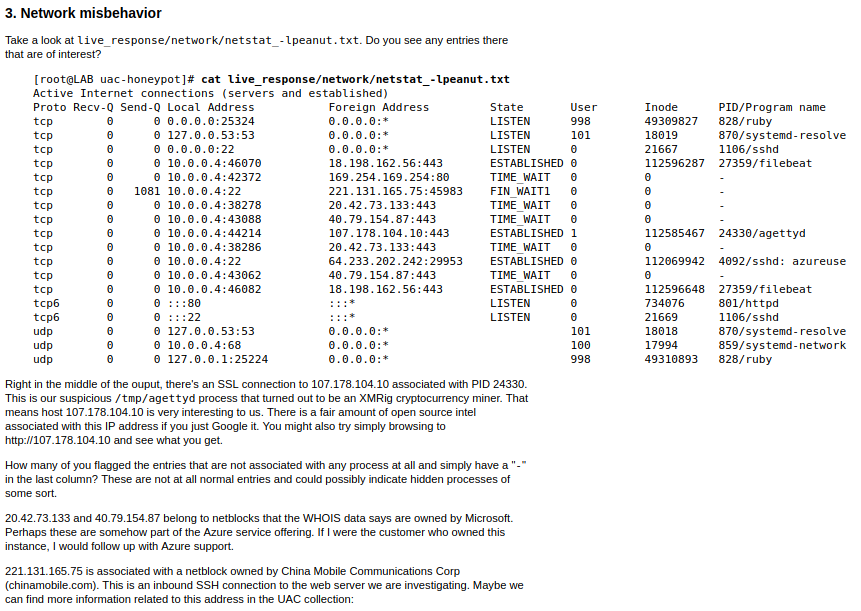
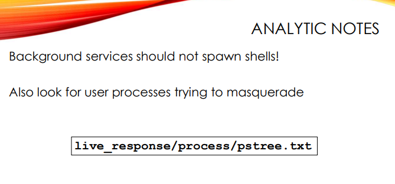
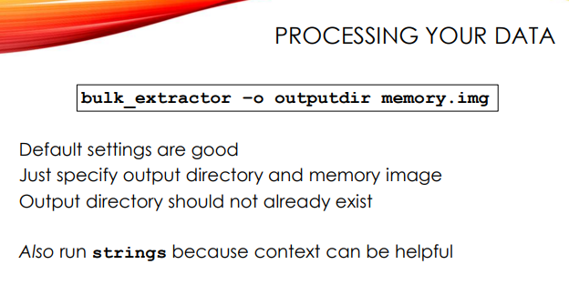
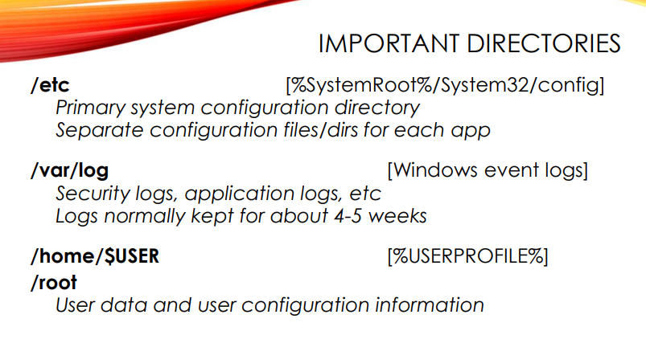
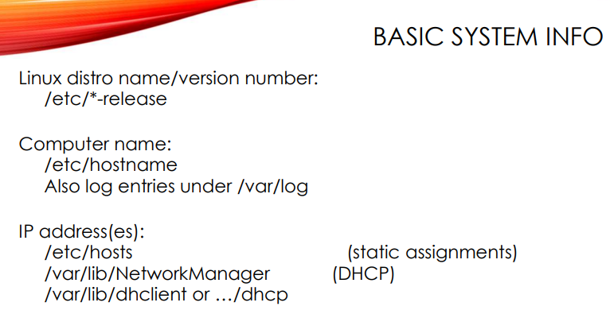
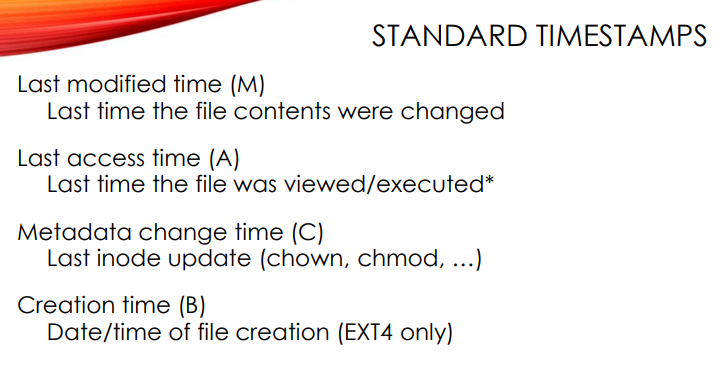
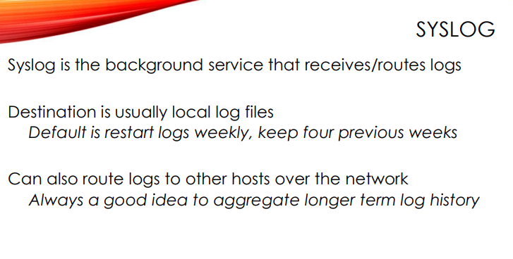
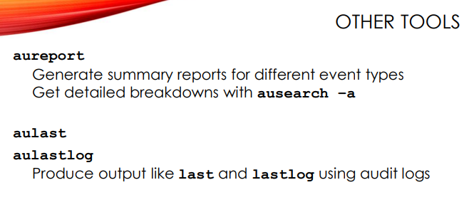

> Linux Forensics by Hal Pomeranz

%% Begin Landmark %%
- **[Exercises](./Exercises/Exercises.md)**
- **[Linux Forensics Cheat Sheet](./Linux%20Forensics%20Cheat%20Sheet/Linux%20Forensics%20Cheat%20Sheet.md)**
- **[Linux Intro](./Linux%20Intro/Linux%20Intro.md)**
- **[Live Linux Triage](./Live%20Linux%20Triage/Live%20Linux%20Triage.md)**
- **[UAC Tool](./UAC%20Tool/UAC%20Tool.md)**

%% End Landmark %%
# Exercises
## Lab 1 - Running UAC
- Simple to run
- Change the yaml to run commands you want
## Lab 2 - Honeypot Part 1
- Goals:
	- Spot suspicious process executable paths
	- Recognize suspicious process working directories
	- Get more detailed information about suspicious processes
	- Understand parent/child process relationships
- Quick Wins
	- `grep -F '> /' live_response/process/running_processes_full_paths.txt | grep -Fv /usr`
	- grep -F doesn't have to set up regex engine, so it's a lot faster with fixed strings (-F)
- Awk
	- reads input one line at a time
	- Programming language that you can use 
## Lab 3 - Honeypot Part 2 
- a good place to look in the UAC output in the `hash_executables/list_of_executable_files.txt` for executables in weird directories
- grep 
	- E - extended regex
	- v - invert
- `grep -Ev '/(usr|lib|etc|bin|sbin|opt|boot|home|var/lib)/' hash_executables/list_of_executable_files.txt`
- Scheduled Tasks:
	- Linux can have lots of systems and ways of doing scheduled tasks
	- `find \[root\] -name \*cron\* -ls`
		- find in the root saved stuff folder anything with cron in the name
	- `ls -lrt \[root\]/etc/cron.* \[root\]/etc/crontab`
		- look in app-related directory for any cron-related folders and folders with the name `crontab`
		- `-t` sorts by last modified date
	- checking through the various configurations for these cron jobs will show benign patterns and the activation of legitimate executables
	- Checking files under `/var/spool/cron`
		- Cron config with "atjob"/one shot job.  
		- 
>>>>>>> Stashed changes
		- Turns out this is the scheduled task that is designed to remove coin miners from the system using a bash script
- Network misbehavior:
	- 
	- All of the foreign/external IPs are super sus
	- The agettyd process is definitely a crypto miner
## Lab 4 - Honeypot Part 3
- Lab goals:
	1. Identify the process owner of our suspicious processes
	2. Find other related suspicious processes
	3. Find potentially suspicious files in the file system
	4. Audit user accounts and authorized_keys files for potential backdoors
	5. Audit the system Sudo configuration and related groups
	6. Check for suspicious set-UID and set-GID files
- Bad, bad users
	- 
	- All of the suspicious processes we noted in the earlier lab are listed here, Plus we can now see the bash processes that are the parent processes for PIDs 15853 and 21785. Also, perhaps unsurprisingly, we see that the web server process ("/usr/bin/httpd") is running as user "daemon". This aligns with our theory that all of the suspicious processes were spawned due to the CVE-2021-41773 web vulnerability.
	- This essentially means that somehow httpd had a web vuln that spawned a listening process "agettyd" that's now a C2 for the the cryptominer 
- Pivoting into the filesystem
	- We can use the 5th column from `bodyfile/bodyfile.txt` and the `etc/passwd` file to find the UID of the daemon user (UID 1) and `awk` to find files in `bodyfile` that are owned by UID 1.
		- UAC does not make a complete forensic image of the file system, but it does capture file metadata in bodyfile/bodyfile.txt. This file is just a pipe-delimited text file
		- The fifth field in each line is the numeric UID of the file owner. We need to figure out the numeric UID of user "daemon". Fortunately, UAC grabs a copy of the /etc/passwd file from the machine
		- User "daemon" is UID 1, and we use a little AWK-fu to find files in the bodyfile that are owned by this UID.
		- Aside from files related to the "atd" system, we see our old friends /var/tmp/dk86 and /run/lock/dk86. This leads us to suspect that these files may have been dropped via the Apache web vulnerability.
- User account audit
- Authorized_keys file
- Sudo config and related groups
- Set-UID and Set-GID 
## Lab 5 - Bulk Extractor
- Goals For This Lab
	1. Run bulk extractor on the memory image of a compromised honeypot
	2. Recognize suspicious URLs
	3. Gather additional context from string data
	4. Explore network data in recovered PCAP
- Not enough time -- laptop missing fan, overheating, and is slowing down
## Lab 9 - Disk Mounting 
- You will deal with this with Synology, QNAP, and RAID-based stuff
- Goals For This Lab
	1. Convert E01 images with ewfmount
	2. Activate RAID sets through loopback mounts
	3. Enable LVM Volume Groups manually
	4. Mount "dirty" (underplayed) file systems
	5. Reverse the process and deactivate mounted images
- .
## Lab 10 - Web Server Mount & Disk Triage
- The attackers changed the passwd file
- You can actually compare the old and new version with the `diff` tool
	- `diff passwd- passwd`
- Sometimes attackers leave behind multiple backdoors to fake you out
	- In this case, they leave the obvious mail user but also the php user
- We can see with the `etc/shadow` file that the mail user has a hashed password now for interactive login (shell)
- Php and mail account were made part of the sudo group.  This is obviously **bad**
- All of these files are only available to edit with root user, so we can know that they had root at least by some timestamp
- With last modified files, we can see files related to the temporary time you get using `sudo` (5 minutes by default). 
- `var/lib/sudo/mail` shows someone interacting with sudo as mail account
- Use `stat` to see when `/update.php` backdoor was created  and by who
- `file apache-xTRhx...`
	- we can use `strings` to look at the binary file still
- The conclusion:
	- They dropped a web vuln at 11:04 and got root with an overlayfs priv esc vuln
	- Start looking at other machines in the organization for similar activity too
- We can figure out if the executable was actually run by looking at the "access" (usually run) time
## Lab 11 - Timeline Analysis
- Goals for the lab:
	- Create body files that are easy for forensic tools to use
	- Generate a timeline, removing distracting information
	- Investigate creation/execution of privilege escalation exploit
	- Examine artifacts of account creation/modification
	- Look at Sudo artifacts 
	- Continue to fill in incident timeline
- Timeline explorer
	- Look around the modify and access time of malware
	- You may see a bunch of header files which may point to compilation
	- You won't see C file which likely means it was deleted, but you can probably still recover it from unallocated space
	- Found `/bin/su` and overlayfs right after. 
	- After the exploit, we see `whoami` then `useradd`
	- We can see `chsh` and that's why we have the `passwd-` backup copy (created if they use `chsh`)
		- Newer generations use `chsh` so it's probably not a Unix dinosaur
	- Is it automated or not?
		- Probably not because of the time gaps
	- A lot of this generates logs, so we can validate the evidence with more log-based evidence
## Lab 12 - Log Analysis
- Goals For This Lab
	1. Investigate successful and failed logins
	2. Track activity for mail user
	3. Include log data in file system timeline
	4. Continue to enhance incident timeline with new information
- You can convert syslog to mactime and use timeline explorer to look through logs
- Tune your logs
# Linux Filesystem
- 
>>>>>>> Stashed changes
- 3rd party software in usr/local , but also sometimes in opt for optional software
- `usr` is rarely changed, so you can check for changes here
- Think of `etc` as the system32 config or registry for Linux
- user stuff under `home/USER`
- root user home is just `/root` and at top of Linux filesystem
- Lots of backdoors usually set up in `root` directory
- Linux has globally shared `tmp` directories (bad idea but oh well)
	- `dev/shm` in memory filesystem - great for putting volatile attacker content and malware - can still be captured during live collection
- FTK and Encase don't account for EXT and other Linux filesystem
- `root` is right up at the top to make it easy with mounting
- executables are typically under `/usr/bin`,`/usr/sbin`,`/user/libexec`, etc
- exception include `/opt` 3rd-party software
- Be sus of programs in user-writable directories `/tmp`, `/var/tmp`, `/dev/shm`
- Directories starting with `.` are uncommon and hidden with `-a` flag for `ls`
- You have to specify `./` when running programs as a pointer to current directory or else attackers could put malicious LoLbins in a commonly used directory that would likely run
# Processes Running from Deleted Binaries
-  A program can start running, delete the executable, and then run from an image in memory so it's volatile
- UAC recognizes this and grabs a copy from memory of the executable
# What to do when compromised?
- Maybe don't pull the plug
- If you pull the plug, then they might find out
- They might be more aggressive or scuttle/destroy the network and evidence
# Way to timeline large-scale investigations
- Look at security tickets and troubleshoot tickets - sometimes little tickets point to larger campaigns
- 
# Dormant malware and sleepers
- can be reactivated by a scheduled task
- list of hashed executables from UAC can be useful for this
- look in UAC `hash_executables` folder for hidden files and dirs
	- look for executables outside of `/usr`
- `[root]` look for hidden dirs
- live_response/process/lsof_-nPl.txt
- bodyfile/bodyfile.txt

# Linux Processes
- Windows malware like to use servicehost under explorer to run malware
- Knowing the Linux process hierarchy helps find bad
- 
- `pstree` command shows process hierarchy in Linux
- ssh is normal
- Nested SSH shell from another process is a bad sign - SSH is bad when you see bash shell coming out of web server
	- 
- Square bracket processes are kernel made processes - some attackers hide their coin miners and malware as these
	- You shouldn't see spontaneous processes ran out of interactive user shells
	- They will still have higher PID values and the start time will be hours, days, or weeks after systemd and first startup
## Orphaned Processes
- 
- When process that started you goes away, then PS can show process ID as systemd as if it started the program.
- What's really happening is some background process was started and the shell was closed
- There is a way to differentiate between orphaned processes and systemd started processes
	- look at proc status file at the `NSsid` value - that's the original parent process
	- You can see the same thing with `stat file` under `proc` folder
	- UAC captures this, but you could call it off with a custom YAML as well
## Scheduled Tasks and Persistence
- 
- Linux has a lot of overlapping task scheduling systems
- cron and spool are common names
- Linux has at least 3 that happen simultaneously
- `ls /etc/*cron*`
- systemd timers is also common - [(13) All About Linux Systemd Timers w/ Hal Pomeranz - YouTube](https://www.youtube.com/watch?v=rAe9Iw08Fn0) 
## Process Network Behavior
- Most malware beacons out to a website - it happens fast though.  Look for process listening in the netstat output
- 
- UAC grabs a lot of this and netstat_-lpeanut is a good place to start
- Is it normal for this process to be listening on this port?
- To understand what's normal, look at the netstat peanut output of all machines on the network and stack the outputs 
# User Context & Identity
- 
- groups in Linux merely allow sharing of projects
- users have UIDs and belong to one or more groups (with at least the group GID that corresponds to their user) -- creation of user also creates a group associated specifically with that user
- only root files can change ownership on files
## Analytics Notes
- What user is that process running as?
	- Can backtrack where they broke in
- Who owns the malicious executable?
	- Can also backtrack to compromise

- What other processes are running as the bad user?
- What other files/dirs do they own?

- We can use UAC
	 - 

## UID Notes
- UID 0 is admin rights
- Normally only "root" has UID 0
- Accounts with UID < 1000 are service accounts
	- Should be locked
	- No interactive logins like user accounts have
- Use `sort -t: -k3,3 -n /etc/passwd` to find UID 0 accounts with a file/directories 
	- 
	- www-data is an account dropped by web application - these should have UIDs under 1000
- The service accounts should have `sbin/nologin` and `/bin/false` to use them as backdoors
- Attackers have to set a password in the `etc/shadow` file to have a usable password instead of `*`.  Service accounts have `*` which means no password, so it's obvious when an attacker adds one
## Sudo

- Job of attacker in Linux is to get admin access on box unless you just want a coin miner
- They need root to have guaranteed persistence 
- Sadly, priv esc Linux vulns come out monthly
- The `/etc/sudoers` file gives UIDs/users root access
- Looking in the sudo config file isn't enough.  
- There's a `sudo` group that allows you to run ANY command on ANY user.  Check the `etc/group` file for evidence of this.
## Set-Id Bits
- The password program to change password is set-id
- It's a special permissions flag `-rwsr` - program runs as owner of the binary rather than the account - can run as root instead of the user running it
- Allowing set-id permission on a program can introduce a priv esc vulnerability
- Adding set-id to shell can also allow anyone to use root user when running commands

- Stack and compare a program on multiple machines for set-id permission to know if it's normal

## Authorized Keys
- You don't need a user and password to login.  For example, you can use SSH instead
- 
- Attackers will drop their own keys into root's authorized keys file for persistence
- Check the `$HOME/.ssh/authorized_keys` file 
- If you see the same key over multiple machines, then that points to an automated attack
# Post-Exploitation Checklist
- 
- authorized_keys entries are popular lately

# The Bad Old Days - Memory, Bulk Extractor, Before Volatility
- Memory analysis before Volatility was HARD
- Needles in lots of haystacks
- Bulk extractor - agnostic memory data extractor
	- agnostic data extractor
	- understands compressed file formats
	- Can extract PCAPs from memory
	- histograms of output
	- Finds important data types/fields - URLs, hostnames, IPs, emails, etc.
	- Forensics like this is an artform and more akin to gambling in the streets than something flashy
	- Bulk extractor can work better for those 4 TB images than Volatility 
	- 
	- You can use `b e viewer` the Java GUI to look at memory with the BE image 
	- `strings -a -t d victoria-v8.memdump.img | gzip >hc07/strings.asc.gz`
		- string indexes the common strings
	- The command-line "tshark" program is excellent for quickly extracting a few fields from each packet and letting me create a quick histogram with some command line kung fu:
		- `tshark -n -r packets.pcap -Tfields -e ip.src -e tcp.srcport -e ip.dst -e tcp.dstport | sort | uniq -c`
	- Tcpflow
		- You could manually go in with Wireshark and "Follow TCP stream", but I prefer to use "tcpflow" to extract all of the TCP streams at once
		- `tcpflow -r packets.pcap -o flows -e http`
		- `ls –lh flows/`
		- The 25/tcp traffic is nothing but long strings of 'A' characters. This makes me wonder if it is somebody trying some sort of buffer overflow against the email server on 192.168.56.102.
# Disk Acquisition & Access
- Memory capture and analysis is hard on Linux, so you should also know disk-based analysis
- 3 situations where disk acq is good:
	- Public Cloud
		- follow vendor procedures
		- Cloud providers have guidelines for acquisition 
			- for Amazon and Cloud Providers, you usually dump into object storage
	- Private cloud
		- snapshot and copy (qemu-img to translate)
	- Local Cloud
		- `ewfacquire`
		- `dc3dd`
		- Esxi cluster - snapshot it -> extract it from the backend storage
		- Sometimes they lack the storage overhead to take the snapshot #IncidentResponse #management 
		- You want a flat `.vmdk` format usually - raw disk image with everything you need
		- Depending on virtualization environment, you may not be able to use analysis tool natively
			- Use `qemu-img` to convert from various disk formats with VMware, HyperV, VBox, etc.
		- Sometimes Bare Metal Linux
			- Can you get a root shell? - yes?..awesome! -- use `dc3dd` 
			- Most forensics tools use EWF and other compressed formats (also eliminates long runs of nulls)
			- `ewfacquire`- runs in CLI to get compressed image
			- Maybe pull out disk and use write blocker last resort -- good luck
- Default Disk Geometries
	- 
>>>>>>> Stashed changes
	- Linux does weird stuff with disk boxes
		- Example: Software RAID interface -> LVM (logical volume mgmt) layer -> then maybe ZFS
		- Commercial forensics suite can't do this, so you need open source tools to do it
	- File systems can be dirty or corrupted if unplugged
- Layers
	- 
	- Lots are in expert witness EWF or E01 format
	- You have to assemble them, then they might be encrypted or have software RAID
	- You have to get all the way to unencrypted disk volumes to use this data with your forensics tools
## Example 
- 
- you can use `ewfmount` with the E01 (first piece) and it will find and use E02, E03, etc.
- `ewfmount` quickly runs by lying to the Linux OS
	- It's a file system and userspace driver
	- Accessing the fake file talks to the ewfmount program and pulls data out of the EWF files
	- It's a software layer to go through the data.  It's better than unpacking huge TB files
- Now we can examine the raw disk image with tools like `mmls` from Sleuthkit
- `mmls` dumps partition table from the front of the disk
- Standard geometry with MBR (master boot record)
	- 
- Time to figure out how to boot
	- 
	- Ext2 filesystem 
	- It mounted last on the `/boot` directory which has everything we need to boot into the Linux OS
	- We need to replicate what the OS does during boot with our own tools manually since we're working with an image
	- Trick the OS to think it's talking to a boot device
- Making a readonly view of the data for Linux OS to use
	- 
	- `file -s /dev/loop0` to look at it
- Now we need to activate the soft partitions in the volume
	- 
	- The device nodes you see on the slide are the actual Linux file systems. If you wanted to acquire an image of the raw file system, then use ewfacquire or dc3ddon /dev/VulnOSv2-vg/root. But I’m more interested in mounting this file system so that I can find and extract artifacts with standard Linux command-line tools.
	- swap space in linux is messy.  No tools that get much from it, but you can use bulk extractor and strings
- To run some tools over the file system, we need to mount
	- 
	- mount read only, no execution
	- The file system is dirty - usually the filesystem driver looks at the filesystem journal on disk so it knows what happened
		- This doesn't keep your data safe, but only your filesystem
	- If we can get the filesystem driver to ignore the journal, then we can get it to work
		- use `noload`
		- We still also have the `/boot` filesystem
			- mount command has an option to not have to make loopback without "losetup"
			- 
			- TURNS OUT THIS DOESN'T WORK EITHER, because it will overlap with the other existing loopback device
			- We can also mount the /boot partition directly. We need to set up a loopback device for this, but the mount command will accept “loop” and “offset” options and set up the loopback device for us. If you recall, /boot is an EXT2 file system, and EXT2 does not have a file system journal. So the “noload” option is not necessary here.
- Tearing all this down manually
	- 
>>>>>>> Stashed changes
	- unmount backwards
	- turn off the volume groups with "n"
	- losetup -d to get rid of loopback devices
	- unmount ewf mount 
## Linux Disk Acquisition Cheatsheet
- 
- Also look here - [Microsoft PowerPoint - dm-crypt LVM2.pptx](https://deer-run.com/users/hal/CEIC-dm-crypt-LVM2.pdf) 
## Running Through It Again
- We want into the LVM partition because it's got the root file system
- We need a loopback device to emulate for mounting to
- We run losetup to get loopback device set up
- We run vgscan, then vgchange and lvscan to get the LVM activated
- Run fsstat to check the file system
- We run mount with ro and noexec 
- After we are done running our various Linux and UAC forensics tools, we can teardown backwards with umount, vgchange, losetup, and then umount again
# "Quick Hit" Disk Artifacts
- In an investigation, make sure you move through devices rapidly before going deep so you don't waste time
### Important Directories to Triage in Linux
- 
- User profile directories are popular for malware
- Temporary directories are also important to look through because that's typically the only place to plant malware
### Basic System Info to Gather Right Away
- 
- From the customer:
	- Get a "runbook" of what's expected to be running on most machines and the purpose of each application
- Distros have different package managers and file setups (including permissions)
- Finding release
	- `cat os-release` under `/etc`
	- `ls *-release`
	- LTS is good because it's usually supported for at least 5 years.  Management should change these out that often.
- IP address
	- `cat /etc/hosts` 
	- If it's dynamic look at `var/lib/NetworkManager`
		- files can end in `.lease` from local DHCP lease
		- `.lease` will have IP, subnet masks, maybe domain names
	- You can use `.lease` files in an investigation to know where they visited because these never get deleted #attribution 
# Post-Exploitation Goals & Forensic Framing
- Usually persistence because it's annoying for attackers to have to rely on a vuln/exploit that can quickly get patched.
## Common Back Doors
- 
- web shell - RCE through web vulns
	- easy to spot -- small apps -- timestamp will differ from other apps 
	- names like "eval", "exec"
	- they are usually obfuscated which makes string searching annoying, but it's obvious once you find them
- Another common back door in the Linux universe is a replacement SSH service with a hardcoded username/password for gaining admin access.
## Malware Persistence
- 
- modify system boot process to start up malware
	- systemd config file 
	- A stealthy approach with the boot process is to activate another script.  They will change the 2nd script rather than the boot owner 
## IOCs on Multiple Systems
- The same campaign will match on multiple machines
# Recent Modifications
- 
- Attackers can modify timestamps, but they usually don't
	- Changing timestamps also requires command line
	- Changing timestamps has to be done down to the nanoseconds. Naturally occurring all zero timestamps don't exist ever. This would point to a sophisticated attacker.
- Hackers don't often do antiforensics 
- `ls -lArt` - show me the newest stuff sorted by modified time in this directory
- Example: you see bash_history under `/mail`.  You shouldn't have bash running from mail applications

# Timeline Analysis, Timezones
- Linux distro creation times 
	- There isn't an artifact that directly tells you the install date of a Linux system
	- You can look at the creation time of the root directory
	- You can use timestamps on SSH host keys too because boot scripts usually generate those
		- `etc/ssh` 
		- `stat ssh_host_rsa_key` 
		- It wouldn't be common to have this differ from the image creation time and this because people reuse images from their own catalogs
	- Some distros have Linux install script timestamps 
- How to find timezone?
	- `etc/localtime` stores default time zone data
	- System logs written in default time zone for machine
	- Binary file format:
		- Use "zdump" on Linux
		- `strings -a /etc/localtime` often works
		- Look for matching file under `usr/share/zoneinfo`
- You can change timezone on the fly in Linux shell
	- export `TZ=TIMEZONE_HERE`
## Timeline Analysis
- 
- This is usually the next step
- Commercial tools suck at this
- The analogy is a beach:
	- It's easy in the morning to see your footprints, but coming back later will have other peoples' footprints and the water could have washed it away
- The nearer you can put your timeline to the point of compromise, the easier it will be to find bad
- Timelines are NOT evidence:
	- requires a technically adept person to understand timeline
	- normal activity can trample these 
- Timelines are a map to where the evidence lives
- You are limited by time in an incident
	- Organizations want to get back up and they have limited money
### Timeline Rules
- Files in EXT4 and later:
	- MACNB
		- M - last modified - last time file content was changed
		- A - last accessed time - last time contents were viewed or exe or shell was executed 
			- This used to be straightforward, but now it's a bit more complex. Most file systems don't rigorously update A time.  NTFS doesn't update A time at all by default. 
			- Now they have relative A time updates.
			- A time gets updated when:
				- If accessed and current last M time is later than A time. 
				- If A time is older than 24 hours. This can create useful artifacts.
			- A time now means first time program got executed in a 24 hour time window.
			- A time is important on weird esoteric files being used by attackers
		- C - metadata change time 
			- everything except file content:
				- links to file
				- ownership (chown)
				- permissions (chmod)
		- B - creation time
			- relatively recent addition (EXT4 and recent release of XFS, ZFS, etc.)
- 

### Timeline Caveats
- 
- Timelines are a guide to evidence, not evidence themselves
### How to Timeline - Tools
- Plaso, Super Timelining - Good for Windows - Registry last updates, pre-fetch, link files, and Windows user-tracking artifacts
	- not useful for Linux
- Collect raw data into a body file (UAC)
- Create chronological output (usually as CSV)
- Jump to key pivot points for analysis
- Timeline Explorer - Eric Zimmerman
	- [Eric Zimmerman's tools](https://ericzimmerman.github.io/#!index.md)
	- any csv data
### How to Timeline - Process
- 
	- `fls` from Sleuthkit is a good tool
	- “-r” to recursively read through the entire file system (rather than just dumping information from the top-level directory, which is the default). You want to be sure to collect evidence from all files and directories. 
	- “-m ” to specify the output format of fls should be in mactimeformat (which is simply a pipe-delimited text file). We will be using mactime in the next step to make our timeline. The argument to -m is the path the file system is normally mounted on—see the second example on the slide where we are dumping data from /boot. The mount pathname will be added to the front of the file paths in the flsoutput so that the path names are consistent with the way the file system was used on the live machine. 
	- “-o” lets you specify a sector offset into a full disk image to find the start of the file system
	- You must also specify a raw file system of a type TSK tools can recognize. The EXT4 /bootfile system can be accessed directly from the raw disk image created by ewfmount(and if TSK is compiled with libewf support, it can read the E01 files directly). But TSK doesn’t understand Linux LVM, so we must first associate the logical volumes with disk devices that fls can read. 
	- Note that because mactime format body files are just plain ASCII text, they compress very well. So were are gzip-ing them to save space. 
	- While some analysts will concatenate all of their body file data into a single large file, I prefer to dump each file system as a separate body file. That way, if I mess up one command, I only have to rebuild that one body file. Otherwise the bad data from my one wrong command might pollute the file with all of my other good data.
- Convert bodyfiles in chronological CSVs
- 
	- Once we have all of our body file data collected, we feed it into the mactimetool to produce our timeline. Here I’m using zcat to uncompress the body files I made in the previous step and piping the uncompressed output into mactime. Useful arguments to mactime include: 
		- “-d” to produce delimited (CSV) output 
		- “-y” for ISO 8601 date output in UTC (2019-10-05T11:31:37Z)
		- “-p” and “-g” to specify the location of the passwd and shadow files from the image you are analyzing so you see the right user and group names in the output
			- Timeline Explorer likes them in numeric format, so you just ignore these if that's the case
- 
	- The 2 big questions to answer with intrusion analysis:
		- How did they break in?
		- How did they get admin privileges?
# Core Log Analysis
- Most of forensics is swimming through logs
- 
- Most Linux runs log rotate that retains logs for a week
	- Default is keeping about a month of logs 
- Syslog on Linux makes it easy to send your logs to your SIEM, data lake, or warehouse
- Revisit log retention strategy
- Correlating across all your logs is better than one machine
- Logs are text, so they are easy to change for attackers
- You can diff logs, but not sure how to pragmatically do that at scale
- backdoor SSH demon (daemon) #cyberMeme 
- Trust by verify with logs
## Logs and Format
- 
- With wtmp and last, `:0` refers to a login through the GUI
- `btmp` - this is optional - sysadmin has to create this
	- this logs user name associated with failed login
	- This is risky because you can sometimes accidentally type in your password in the username section
- You could potentially find password sprays or brute forces if you had `lastb`/`btmp` from numerous machines
- `lastlog` - rarely useful - only handy if all the other logs have rolled away.
	- It uses a weird sparse format
	- Lots of analysis tools have issues parsing this
	- last log parser from tigerphoenixdragon
## Syslog
- 
- Traditional used UDP 514, but modern uses TCP
- Talk to lawyers:
	- How much logs should you keep?
	- Keep enough for compliance and incidents
	- Keep them for as long as possible
- 
- Set up config as part of Linux image template with remote hosts so that logs automatically get routed to log management and SIEM nodes on the network
- `etc/rsyslog*`or `/etc/syslog-ng*`, or `/etc/syslog.conf`
- 
- Timestamps jump around with replays attacks 
- 
# Additional Logs - Apps, Web
- There are lots of web-based exploits, so web logs should be a focus for IR
- 
- Linux has `auditd` and the new EBPF (extended Berkley packet filtering)
- Linux systems may have kernel-level auditing enabled. This is similar to Windows Sysmon. The information is incredibly detailed but can be difficult to understand. Plus it needs specialized configuration in order to provide the most useful information. If you are the administrator of a Linux system, you might want to look into enabling this logging.
- Log the user input piece on web apps #detectionEngineering #logManagement
- 
- Apache log format - created from old httpd
- Every web server uses this format because lots of tools are made to parse these
- Don't parse these logs
- Web logs are typically found in directories under /var/log like /var/log/httpdor …/apache* or …/nginx.
- 
- Sometimes attackers base64 encode and web servers might break with it and log as error
## Kernel-level Auditing in Linux, Sysmon for Linux, Auditd
- 
- DoD made rainbow book logging standards which turned into mandatory logging which turned into `auditd` style logging at the kernel-level #logManagement
- Can't monitor everything or you degrade machine performance
- Look at CIS Benchmarks for auditd #logManagement
- [bfuzzy/auditd-attack: A Linux Auditd rule set mapped to MITRE's Attack Framework](https://github.com/bfuzzy/auditd-attack) 
- auditd lets you monitor system calls closely
- auditd can turn into a keystroke monitor at the kernel-level 
	- Easy to drop this into the PAM configuration
- 
- `ausearch` is the best command for going through auditd logs
- `ausearch` converts the epoch timestamps and gather related log entries
- When gathered up the audit ID, you can get a picture of what was going on
- audit ID resets everytime the system is rebooted
- aureport lets you summarize, then you drill down with ausearch by audit ID number
- 
- `aulast` goes through chronological auditd log file
- Good place to corroborate wtmp
- User logins in Linux:  #logManagement #detectionEngineering
	- audit log
	- wtmp file
	- auth logs
# Q&A
- Do you ever have to do hardware-based data recovery?
	- 
- Ever non-malicious interests investigations - operational related?
	- 
- Does syslog-ng queue and cache? 
	- Yes - if it has that feature
	- Some other agent-based tools do it
- Should Linux images be defaulted with some syslog config in devops?
	- Yes, but it will be messy especially with apps and how they decide their facility and priority values
- The syslog config in Linux also assumes apps deciding on facility and priority? How does that differ from daemon?
	- Apps choose their facility locally and over the wire with the 8 bit number format like "<--->"
	- It's a mess and although you have things like syslog-ng trying to fix that, a lot of old systems, Solaris Linux, and apps handle it differently.
- Windows has sysmon when you want to log more.  Does Linux have a popular way of auditing and logging more?
	- 
- Do you bring tuned artifact YAMLs and configs with you to an investigation or just start from scratch each time?
	- 
- When should responders/investigators hide their forensics activities?
	- 
- How can security teams and companies make it easier for forensicators, incident responders, and investigators to do their jobs on sprawling networks and systems? SMBs vs larger companies?
	- 
- Does the usage of containers ever complicate investigations?
	- 
- What are the lower and upper bounds for the time it has taken to do an investigation?
	- 
- Any tips on interacting with DFIR-related firms?
	- 
- Any bad experiences with how cyber insurance interplays with investigations?
	- Definitely have to do the CBA on it.  A lot of the times insurance companies will charge a lot more than you will ever need and not give you enough for an actual incident.  Cyber insurance usually lets you use certain forensics firms and not others
- What does team work look like for forensics
	- Google doc with Sheets of timelines.
	- Sheet of hosts in scope that are being tracked - status, when are they due, compromised, etc.
	- Checksums, IoCs, etc.
	- Typically, there's a non-technical person interfacing with customer and sending signals (don't shut them down), and communicating between peoples
	- Hal usually contracts with a forensics group. Hal usually works for Crowdstrike on a contract.
- Case management tools
	- Sometimes teams that are dedicated and permanent will use tools like TheHive, but dynamic teams with contractors will use simpler collaboration platforms like Google workspace
- Do you sandbox malware or have a malware engineer?
	- They will usually "throw it over the wall" to malware analysts to get some IoCs, compare it to other campaigns, etc.
	- Sometimes a quick thing to do on malware is use `strings` and look at the imports table to quickly see what the capabilities of the malware are
	- It can give them some direction during an investigation when the results come back.
- Are proactive antiforensics measures common as opposed to reactive antiforensics measures? More specifically, does malware ever monitor for forensics activities?
	- anti EDR, process dumps
	- more common on Windows though
	- There are kernel-level ways of hiding forensics activities
# Misc Convos
- Trim sucks - SSDs wipe themselves
- WSL2 is for people managing Linux instances in the cloud from Windows
	- Guess it's getting discontinued
- Deft, Kain, and Paladin are some good forensic distros
- AI is bull crap.  It's a scheme to make money with hype.
	- Me: ehhhhh...but it's efficient for rapid learning and information retrieval (statisically) than Google Search sometimes is
	- Books are good too because it's thoughtful content.  AI-generated content is garbage currently, but it does allow for you to bridge over to new concepts, mental models, and terminologies.
- You can tranship logs or pick your agent to transport logs over the network