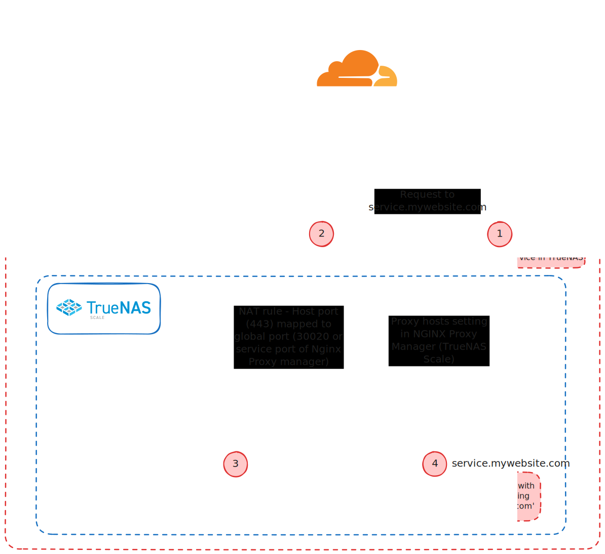

# Home Network Setup

 

# DNS Rebinding Issues

Attempting to access my servers with the FQDN gives me the below error from pfSense

I would think NAT reflection should fix this.  Luckily there are some settings in PfSense to account for this.

The below settings can be found in pfSense at `System > Advanced > Admin Access`

# HTTP Referrer Issues

- 

# More Information

The DNS rebinding error in pfSense typically occurs when trying to resolve local services using a Fully Qualified Domain Name (FQDN) that resolves to a private IP address (RFC 1918) or loopback address. This is a security measure to prevent malicious DNS responses.

Here's why **NAT reflection** might not fully resolve the issue:

## DNS Rebinding Error vs. NAT Reflection

- **DNS rebinding protection** in pfSense blocks DNS responses that resolve to internal IPs when using external DNS servers or public-facing FQDNs.
- **NAT reflection (or NAT hairpinning)** allows devices on the LAN to access an internal service using the external IP or FQDN by reflecting the traffic back into the network.

If DNS rebinding protection is triggered, the request doesn't even reach the NAT reflection stage because pfSense blocks the DNS resolution itself.

* * *

## Steps to Address the Issue

### 1. **Whitelist the FQDN in DNS Rebinding Settings**

- Navigate to **System > Advanced > Admin Access** in the pfSense dashboard.
- Under the **DNS Rebinding** section, add your domain (e.g., `mydomain.local`) to the **Alternate Hostnames** or **Domain Overrides** list.
- This tells pfSense that the FQDN resolving to private IPs is intentional and safe.

### 2. **Use pfSense as Your Local DNS Resolver**

- Ensure that pfSense is configured to act as the primary DNS resolver for your LAN.
- Go to **Services > DNS Resolver** and:
    - Enable **Host Overrides** to manually map the FQDN to the corresponding internal IP address.
    - Alternatively, configure **Domain Overrides** to forward queries for specific domains (e.g., `mydomain.local`) to a local DNS server, such as your NGINX proxy.

### 3. **Configure NAT Reflection (if Required)**

- Navigate to **Firewall > NAT** in pfSense.
- Ensure that the **Reflection for Port Forwards** option is enabled under **System > Advanced > Firewall & NAT**.
- Test to see if NAT reflection allows local clients to access the internal services via FQDN.

### 4. **Use Split DNS**

- Configure a split DNS setup to ensure that internal clients resolve the FQDN directly to the internal IP of the service, bypassing the need for NAT reflection.
- In **Services > DNS Resolver**, set up overrides so that requests for the FQDN resolve to the internal IP when queried from inside the network.

### 5. **Validate DNS Resolution**

- Use tools like `nslookup` or `dig` to confirm that the FQDN resolves correctly to the internal IP.
- Test access to the service using both the FQDN and the internal IP to verify the issue is resolved.

* * *

## Why Split DNS is Preferred

While NAT reflection can work, it's generally more efficient and secure to use a split DNS setup because it avoids unnecessary routing and simplifies local resolution. It also bypasses potential issues with DNS rebinding protections.