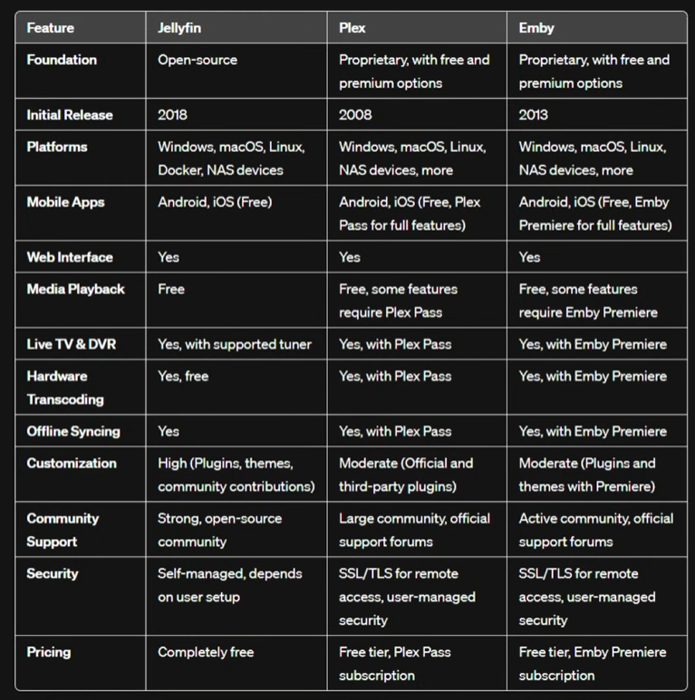

---
permalink:
aliases: []
tags: []
publish: true
date created: Friday, March 29th 2024, 11:03 pm
date modified: Monday, December 23rd 2024, 9:00 pm
---

# Links

- [3 Ways to Start Your Own Plex Server - YouTube](https://www.youtube.com/watch?v=XKDSld-CrHU)
- [Important information for users running Plex Media Server on Nvidia Shield devices - Announcements - Plex Forum](https://forums.plex.tv/t/important-information-for-users-running-plex-media-server-on-nvidia-shield-devices/883484 "Important information for users running Plex Media Server on Nvidia Shield devices - Announcements - Plex Forum")
- [Prowlarr](https://prowlarr.com/ "Prowlarr")
- [Clients | Jellyfin](https://jellyfin.org/downloads/clients/?platform=Roku "Clients | Jellyfin")
- [Jellyfin | Open Source Alternative to Plex, Emby, Netflix](https://www.opensourcealternative.to/project/jellyfin "Jellyfin | Open Source Alternative to Plex, Emby, Netflix")
- [Must have Plex addons : r/PleX](https://www.reddit.com/r/PleX/comments/1bwfffx/must_have_plex_addons/ "Must have Plex addons : r/PleX")
- [Open Source Home Theater Software | Kodi](https://kodi.tv/ "Open Source Home Theater Software | Kodi")
- [Plex Pass | Plex](https://www.plex.tv/plex-pass/ "Plex Pass | Plex")
- [Open source alternatives to Emby](https://www.opensourcealternative.to/alternativesto/emby "Open source alternatives to Emby")
- [2 Open Source Alternatives to Plex](https://www.opensourcealternative.to/alternativesto/plex "2 Open Source Alternatives to Plex")
- [Build your own DVR with Plex Server! #plex #homeserver #antenna - YouTube](https://www.youtube.com/watch?v=0HxtccUFtm8)
- [The Ultimate Guide to Configuring Live TV & DVR with Plex! - YouTube](https://www.youtube.com/watch?v=Q5okoyPewyU) 
- [disable this plex setting RIGHT NOW - YouTube](https://www.youtube.com/watch?v=RENjSPXJUdg)
- [The ULTIMATE Budget Jellyfin Server - YouTube](https://www.youtube.com/watch?v=WCDmHljsinY)
- [Time to UNSUBSCRIBE from Disney+, Netflix, etc! - YouTube](https://www.youtube.com/watch?v=RZ8ijmy3qPo)
- [Better than Disney+: Jellyfin on my NAS - YouTube](https://www.youtube.com/watch?v=4VkY1vTpCJY)
- 

# Plex vs Jellyfin

- [(19) The open source alternative to my sponsor - Jellyfin vs Plex - YouTube](https://www.youtube.com/watch?v=jKF5GtBIxpM&list=WL&index=98&t=25s)
- 

## Jellyfin

> [!tldr] It's open source and has some privacy and advanced benefits, but it lacks the convenience and sharability that I need for the time being

- [Jellyfin Feature Requests](https://features.jellyfin.org/?view=most-wanted)

- Client Options that I care about:
	- [Clients | Jellyfin](https://jellyfin.org/downloads/clients/all)
	- Android TV
	- Roku
	- Android

## Plex

- Client options:
	- [Best Media Streaming Devices | Live streaming apps powered by Plex](https://www.plex.tv/apps-devices/)
	- Apple TV
	- Fire TV
	- Google TV
	- Roku
	- Smart TVs
	- Android 
	- iOS

- Pros
	- Easy system to share with people
- Current issues:
	- Offline download stinks
	- Some technical privacy issues at times
- Cons
	- Costs money for plex pass for people who want to use your library

# Setting Up Plex (TrueNAS Scale)

- Docs
	- [Plex | TrueNAS Documentation Hub](https://www.truenas.com/docs/truenasapps/stableapps/plexapp/)

## 1) Plex Account

- Sign up with a Plex account - [Plex plex.tv › home › sign up Sign Up | Plex](https://www.plex.tv/sign-up/ "") 

## 1.a) First time in TrueNAS?

Set a pool for applications to use if not already assigned.
- You can use either an existing pool or [create a new one](https://www.truenas.com/docs/scale/scaletutorials/storage/createpoolwizard/). TrueNAS creates the **ix-apps** (hidden) dataset in the pool set as the application pool. This dataset is internally managed, so you cannot use this as the parent when you create required application datasets.

## 2) Create Plex-Related "Datasets" in TrueNAS

- Go to **Datasets** and select the pool or dataset where you want to place the dataset(s) for the app. For example, _/tank/apps/appName_.
    
> [!important] 
> Plex uses 2 main storage volumes: 
> 1) **data** to use as the Plex data directory for database and metadata storage, and 
> 2) **config** for Plex application configuration storage.
>    
> - For **log data**, you should just use a temporary directory. 
> - **Transcode data** is also not useful or meant for persistent storage, so using a temporary directory is a better option.

> [!info]- [Creating Datasets for Apps](https://www.truenas.com/docs/truenasapps/stableapps/plexapp/ "Plex | TrueNAS Documentation Hub")
> 
> When creating datasets for apps follow these steps:
> 
> 1. Go to **Datasets**, select the location for the parent dataset if organizing required datasets under a parent dataset, then click **Add Dataset**. For example, select the root dataset of the pool, and click **Add Dataset** to create a new parent called _apps_ or _appName_*, where _appName_ is the name of the app.
>     
>     Do not create the app datasets under the ix-applications or ix-apps dataset.
>     
> 2. Enter the name of the dataset, then select **Apps** as the **Dataset Preset**. Creating the parent dataset with the preset set to **Generic** causes permissions issues when you try to create the datasets the app requires with the preset set to **Apps**.
>     
> 3. Click **Save**. Return to dataset creation when prompted rather than configuring ACL permissions.
>     
>     You can set up permissions (ACLs) for a dataset after adding it by selecting **Go to ACL Manager** to open the **Edit ACL** screen, or wait and use the app Install wizard ACL settings to add permissions. You can also edit permissions after installing the app using either method.
>     
> 4. Select the parent dataset and then click **Create Dataset** to open the **Add Dataset** screen again.
>     
> 5. Enter the name of a dataset required for the app, such as _config_, select **Apps** as the **Dataset Preset**, and then click **Save**. When prompted, return to creating datasets rather than setting up ACL permissions.
>     
> 6. Repeat for remaining datasets required for the app.
>     
> 
> You can set up the permissions (ACLs) for these datasets after adding them using the **Edit ACL** screen, or wait and use the **Install Plex** wizard ACL settings to add permissions. You can also edit permissions after using either method.

## 3) Installing Plex to TrueNAS

> [!note] You can have multiple deployments of the same app (for example, two or more from the **stable** or **enterprise** trains, or a combination of the **stable** and **enterprise** trains).

Go to **Apps**, click on **Discover Apps**, and locate the app widget by either scrolling down to it or begin typing the name into the search field. 

Select the timezone where your TrueNAS system is located. Begin typing the location into the **Timezone** field to filter the list until the location shows, then select it.

While logged into your Plex account, go to the [Plex **Claim Code** web page](https://www.plex.tv/claim/) to copy the **Claim Code** string provided by Plex, and then paste it into the TrueNAS **Install Plex** wizard **Claim Token** field. This authentication token provides TrueNAS access to your Plex account.

### 3.a) Network Settings & Devices

Next, either accept the default values shown or enter the IP addresses for local network connections (Ethernet or WiFi routers) you want in your Plex network. See [Setting Up Local Network](https://www.truenas.com/docs/truenasapps/stableapps/plexapp/#setting-up-local-network) below for more information.

You can add devices and additional environment variables, but this is not required to deploy the app. For more information, see [Adding Devices](https://www.truenas.com/docs/truenasapps/stableapps/plexapp/#adding-devicess) below.

> [!important]
> The app does not require configuring advanced DNS options. Accept the default settings or click **Add** to the right of **DNS Options** to enter the option name and value.

Click Install!

# 4) Access Plex

- Once deployed, go to the app and click the `Web UI` button to get redirect and attach it
- 