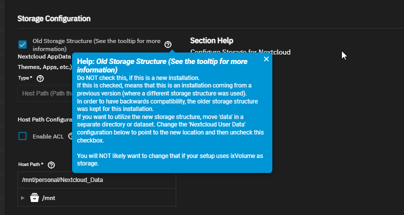
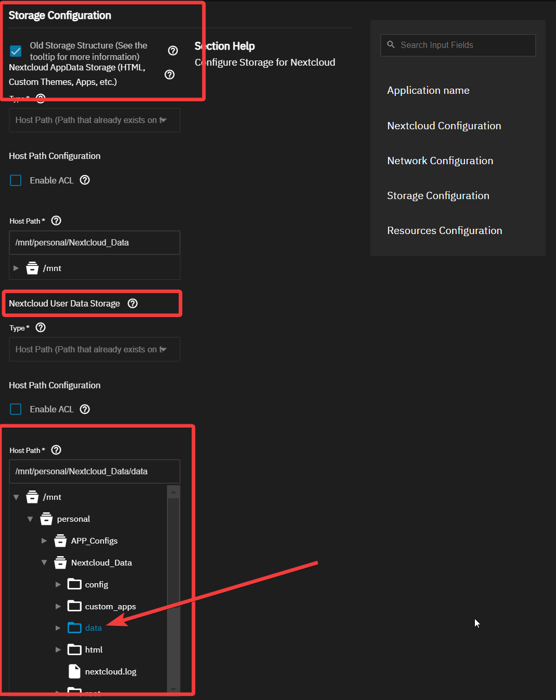

---
aliases:
  - TrueNAS Scale 24.10 Nextcloud Fix
  - Moving Around Data in Datasets - TrueNAS
tags: 
publish: true
date created: Wednesday, October 30th 2024, 7:45 pm
date modified: Sunday, November 10th 2024, 5:32 pm
---

# Links

- [Updating SCALE | TrueNAS Documentation Hub](https://www.truenas.com/docs/scale/scaletutorials/systemsettings/updatescale/)
- [TrueNAS 24.10.0 (Electric Eel) - Now available! : r/truenas](https://www.reddit.com/r/truenas/comments/1gext0r/truenas_24100_electric_eel_now_available/)

# App Issues

## Fixing Nextcloud

- Related Links:
	- [TrueNas Scale NextCloud wont deploy : r/truenas](https://www.reddit.com/r/truenas/comments/1g3k06o/truenas_scale_nextcloud_wont_deploy/) 
	- [Nextcloud | TrueNAS Documentation Hub](https://www.truenas.com/docs/truenasapps/stableapps/installnextcloudmedia/) 
	- [PATH to ZFS utilities broken in TrueNAS SCALE? | TrueNAS Community](https://www.truenas.com/community/threads/path-to-zfs-utilities-broken-in-truenas-scale.110898/) - using zfs in the Shell for TrueNAS is annoying
	- [Same issue found by user in TrueNAS Forums](https://forums.truenas.com/t/nextcloud-does-not-start-and-cannot-reinstall-after-electric-eel-update/22186/8?u=cybersader)
	- [Nextcloud Docs - Earlier Nextcloud Deployment Datasets](https://www.truenas.com/docs/truenasapps/stableapps/installnextcloudmedia/#expand-12)
	- 

Nextcloud Data didn't come over quite right.  Had to move some data in the Nextcloud datasets around and change settings

- The errors from looking at container logs in Truenas:
	- Your data directory is invalid.
	- Ensure there is a file called ".ncdata" in the root of the data directory. It should have the content: "# Nextcloud data directory"

- Nextcloud configuration notice about related "data" folder:
	- 
	- Help: _Old Storage Structure (See the tooltip for more information)_
		Do NOT check this, if this is a new installation.  
		If this is checked, means that this is an installation coming from a previous version (where a different storage structure was used).  
		In order to have backwards compatibility, the older storage structure was kept for this installation.  
		If you want to utilize the new storage structure, move 'data' in a separate directory or dataset. Change the 'Nextcloud User Data' configuration below to point to the new location and then uncheck this checkbox.  
		  
		You will NOT likely want to change that if your setup uses ixVolume as storage.

- We have to move "data", and point "Nextcloud User Data" to use the newly moved data, then uncheck the box
	- Why we can't just "point" at the "data" folder like below?
		- You can, but you won't be able to use the new storage structure which is probably a better idea.  So, we need to create a new dataset and move the data folder into it.
		- 
	- **Via Web Interface:**
		- Log in to your TrueNAS SCALE web interface.
		- Click on **"System Settings"** (or **"System"** depending on your version).
		- Select **"Shell"** to open the shell in your browser.
	- Using ZFS commands to look at things:
		- `/usr/sbin/zfs` - you have to use this since the commands aren't defined in "PATH"
			- [PATH to ZFS utilities broken in TrueNAS SCALE? | TrueNAS Community](https://www.truenas.com/community/threads/path-to-zfs-utilities-broken-in-truenas-scale.110898/)

- Starting from square one - 12/7/2024
	- [Nextcloud | TrueNAS Documentation Hub](https://www.truenas.com/docs/truenasapps/stableapps/installnextcloudmedia/#application-name-settings)
	- Used cp to copy files
	- Made one big nextcloud dataset with generic and www-data and netdata full permissions, then made html, data, and postgres_data child datasets with the Apps preset
	- 

# Big Features for New Version

- Will actually work with Storj...this is huge.  
	- Storj caused me $700 in losses with a backup issue because iX-Systems' Cloud Sync function was bad
	- [iX-Storj Overcharging or Overusing Storage](../iX-Storj%20Overcharging%20or%20Overusing%20Storage/iX-Storj%20Overcharging%20or%20Overusing%20Storage.md)
- Docker container support
	- Can pretty much use any open source tool out there now in my TrueNAS server

# Going From Bluefin All the Way to Electric Eel - 22.12 -> 24.10

How to update:

- Go to System Settings > Update
- Select the next version for the [Upgrade path](https://www.truenas.com/docs/softwarereleases/#upgrade-paths) you intend on going down (based on your end goal version)
- "Download Updates" should pop up as an option
- Download and keep your config backed up somewhere just in case
- Apply Pending Update