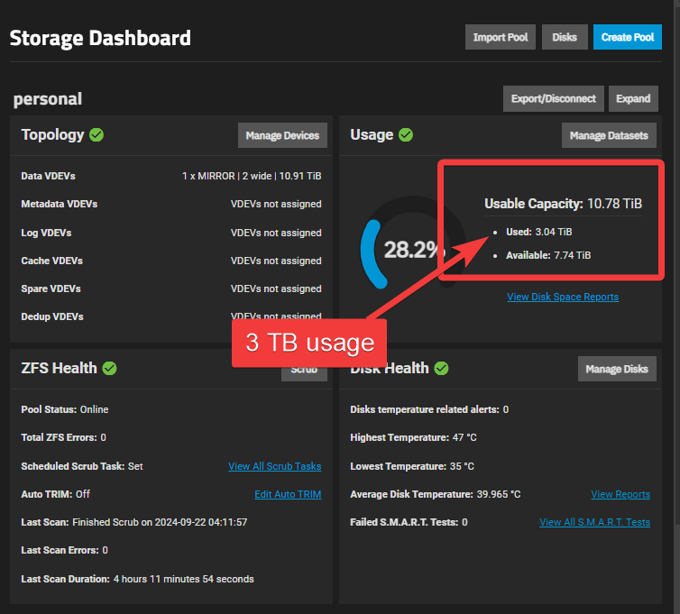
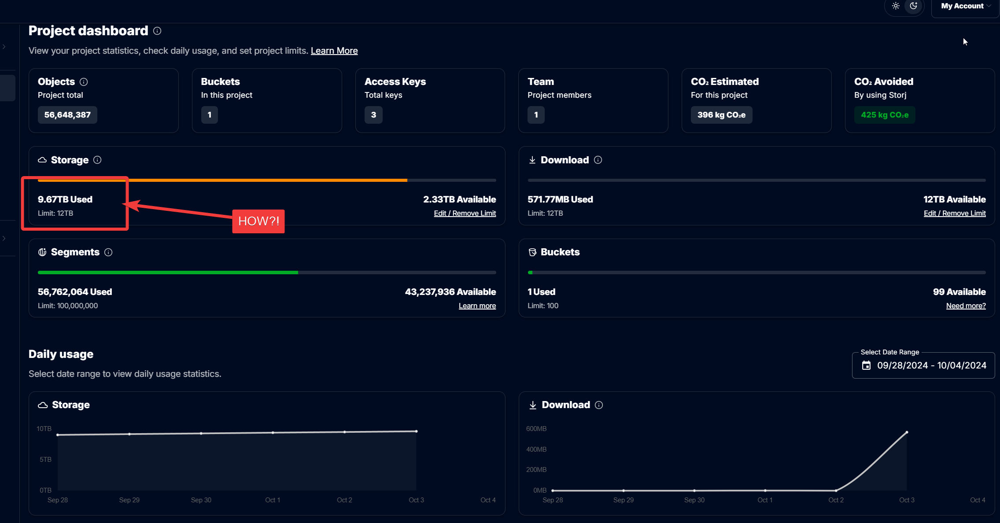
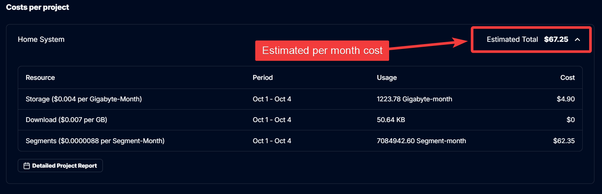
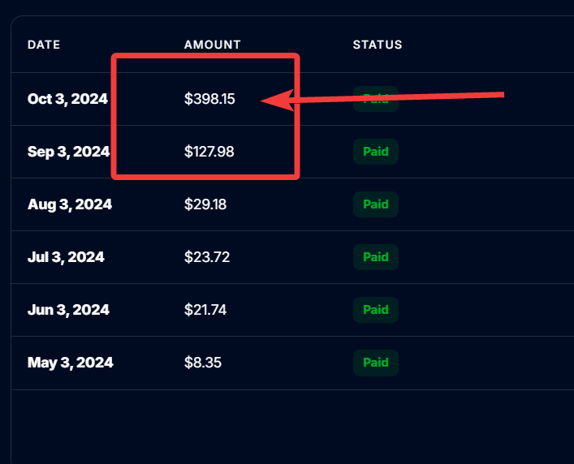

---
aliases:
  - TrueNAS Cloud Sync - Duplicate Files Issue
tags:
  - 
  - "#truenas"
  - "#backups"
  - "#storage"
publish: true
date created: Friday, October 4th 2024, 7:34 pm
date modified: Saturday, October 26th 2024, 2:17 pm
---

[Scheduled Backups, Scheduled Downtime](../Scheduled%20Backups,%20Scheduled%20Downtime/Scheduled%20Backups,%20Scheduled%20Downtime.md)
[TrueNAS Scale Home Server](../TrueNAS%20Scale%20Home%20Server.md)
[Cheapest Archive Storage](../TrueNAS%20Cloud%20Backups/Cheapest%20Archive%20Storage/Cheapest%20Archive%20Storage.md)

# Solution? 

> [!tldr] The true issue here is that TrueNAS Scale and their, at the time, "Cloud Sync" has issues with Storj.  Using "Sync" Transfer mode doesn't fix this.  Either you use "restic" or you upgrade to TrueNAS Scale 24.10+ (Eletric Eel).  

## Storj Support

Here's how the conversation went.  I was frustrated to say the least since I could barely afford what was happening, and I had done my due diligence.  We live and learn though I guess.

<u>Lessons learned:</u>
1) iX Systems should have mentioned the bugs with "Cloud Sync" in versions before 24.10 (Electric Eel).  They should have done this from the "Cloud Sync" UI screen with a modal.  
2) If you're a consumer, then set spending limits and not just storage limits in your provider platform, because you can't anticipate the nuance with the costs...in this case, it was the "segments" cost caveat that skyrocketed the price from $60 to $400
3) Sometimes, your use of a privacy browser could hurt you.  I didn't get a warning/error on the timeout of deleting my Storj buckets.  This amounted to spending $350 dollars more
4) I shouldn't have to buy cryptocurrency to keep myself from going bankrupt on a platform
5) If there's a Web UI that consumers may use, then it needs to be very "safe" and resilient to misunderstandings or accidental explosions in spending

### How the Support Conversation Went

Me:

My 3TB backup somehow turned to almost 9TB - it's some bug likely with RSync or whatever is used in the background from TrueNAS.  I got charged $400 at the beginning of the month and can barely afford that.  I've been trying to delete the bucket now for weeks and to no avail.  It feels like I'm practically getting robbed at the moment with this.  If you must deactivate my account to do it, then so be it.  Please delete my account and if possible reimburse me for this.  You should be able to tell from the logs that I've been trying to delete my bucket several times now.  I anticipated a 100 or so dollars for my almost 3 TB of backups, but this has gotten out of hand. Please fix this issue promptly.

---
Support:

Thank you for contacting Storj.   
   
If your bucket has more than thousand objects, it will take a lot of time to delete a bucket via Web UI, in that case it's recommended to use Uplink CLI instead:  
   

1.  [Create an access grant using your current encryption phrase](https://docs.storj.io/dcs/getting-started/quickstart-uplink-cli/uploading-your-first-object/create-first-access-grant)
2.  [Setup an uplink with that access grant](https://docs.storj.io/dcs/getting-started/quickstart-uplink-cli/uploading-your-first-object/set-up-uplink-cli)

   
To list buckets:  

```
uplink ls
```

   
To remove a bucket:  

```
uplink rb --force sj://my-bucket
```

   
If you have a lot of objects inside the bucket, it could timeout. In this case you need to remove the encrypted content first:  

```
uplink rm --recursive --encrypted --parallelism 30 sj://my-bucket
```

   
Then remove the bucket:  

```
uplink rb --force sj://my-bucket
```

   
You may also use [Cyberduck](https://storj.dev/dcs/third-party-tools/cyberduck), if you do not like CLI, but it could be much slower than Uplink CLI.

---
Me:

I'll try that, but I should be able to delete my bucket from the web UI.  This is something that should be improved.  I used this on personal backups which I expected to pay $60 for, it bumped up to $400 overnight, and I tried deleting the bucket multiple times.  I should be able to do something to stop the charges from racking up and I wasn't able to in the case.  I shouldn't have to download a CLI to essentially break myself off from the platform.  If there's a way to cut myself off completely such as deleting my account let me know.  I need a backup plan if the CLI method fails to work.  Thanks for your help thus far.

I plan on coming back after figuring out my issue with TrueNAS.  I was using a "COPY" setting, but maybe "SYNC" is better to stop from getting duplicate files or whatever.

- FUTURE ME:  this did not help
___
Support:

> I'll try that, but I should be able to delete my bucket from the web UI.

At the moment the web UI is not supposed to be used as a primary interface to the network, it's only for a quick start and to manage not more than a few dozens objects with size not greater than a few GB.   

We develop a distributed end-to-end encrypted s3 compatible storage, not the consumers applications. It is designed for developers and Enterprises, who can implement a consumer applications using our platform as a backend (like the integration for TrueNAS). Consumers may use it too of course, but they would missing a lot of consumer features, including fast deletion via web UI.  
Thus we recommend to use a [third-party tools](https://storj.dev/dcs/third-party-tools) like Cyberduck or [rclone](https://storj.dev/dcs/third-party-tools/rclone) or use our Uplink CLI instead of web UI. By the way, rclone [has GUI too](https://rclone.org/gui/), it also can [mount a bucket](https://rclone.org/commands/rclone_mount/) as a disk or as a folder on your PC/Mac and then you can use your OS functions to work with objects. 

> I shouldn't have to download a CLI to essentially break myself off from the
> platform.

Unfortunately the current version of TrueNAS doesn't have an interface to delete objects. Our web UI is not designed to manipulate with millions of objects, so you need to use other tools. If you do not like CLI - you may install [Cyberduck](https://storj.dev/dcs/third-party-tools/cyberduck) or [FileZilla](https://storj.dev/dcs/third-party-tools/filezilla) and use them to delete the bucket, you need to use the same encryption phrase used during upload to configure these tools. 

> I plan on coming back after figuring out my issue with TrueNAS. I was using a "COPY" setting, but maybe "SYNC" is better to stop from getting duplicate files or whatever.

You may to upgrade TrueNAS to the 24.10 version to get a new feature - [TrueCloud Backup Tasks](https://www.truenas.com/docs/scale/24.10/scaletutorials/dataprotection/truecloudtasks/), which will allow you to make a backup copy faster, it also uses incremental snapshots and more big chunks, so your backup would have much less objects, than Cloud Sync.  
With Cloud Sync it would always copy/sync millions of small objects, which would affect your costs, because each object creates at least one segment.  
   
If you do not want to upgrade, then you may use [backup tools](https://storj.dev/dcs/third-party-tools#backups) to make a backup copies, many of them have an incremental snapshots, automatic backups and so on. I would recommend to use [restic](https://storj.dev/dcs/third-party-tools/restic) (you likely would be able to import them later to 24.10, because it uses restic under the hood), it also included to Dragonfish out of the box, including needed rclone. They can be used from System Settings -> Shell or via ssh.

---
Me:

I appreciate the solutions going forward.  I was just freaking out since I am indeed a consumer and my finances are quite tight as I'm young and trying to learn IT.  I went to you guys since, on paper, it looked much much cheaper in the short and long term for archival.  I didn't expect my costs to go up to $400.  I guess my only request would be to maybe add some sort of information to stress this in the web UI and how it's better to use those solutions for deleting.  I didn't get any error messages when it looked like nothing got deleted.  If I'd gotten such a message the first go-around, then I would've arrived at these solutions without probably spending what will likely amount to $300 which is not easy for me to afford (as a consumer).  

Is there a chance to refund a percentage of that cost?    
  
It looks like the data is being successfully deleted so far.

---
Support:

It's is still cheaper than any other cloud platform, however, it's designed to store big files, because small files are stored [inline](https://storj.dev/learn/concepts/definitions) unlike a big ones (64MB or more), unfortunately this has a cost, thus it's included to bills as a [segment fee](https://storj.dev/dcs/pricing#per-segment-fee) to incentive users to use bigger segments, packing small objects to archives for example. Our platform supports zip archives out of the box, so you may pack millions of small files to a one big archive and be able to access any of object inside the archive via linksharing service or download it back when it's needed.

However, for the backup purposes it's much more efficient to use a specialized backup tools. IX Systems understand that and thus implemented support of restic in their UI in 24.10 version, but they also included restic to a previous releases as a CLI tool.

> I didn't get any error messages when it looked like nothing got deleted.

It actually showed a timeout. It deletes some amount of objects every time. Usually it's able to delete up to  a few thousands objects for the one attempt. So you could probably delete it eventually via the web interface, but it would take a long time if the number of objects is large enough. There is a warning though, but you could missed it - it popped up and disappeared.

> [!note] It 100% never showed a timeout.  Just clarifying here.  I stared at the UI for a long time till it would stop going "around and around."

> Is there a chance to refund a percentage of that cost?

I would ask the team. You may be contacted by someone from the team.  
   
Meanwhile I can help you to configure backup using restic, it should be much better for your use case and likely you would spend much less. When the new version would become stable and you would like to upgrade, you can configure the automatic backup using the new backup option. Right now it's RC, so it's better to wait for a stable version.

By the way, you can always check the Billing section of your dashboard to see your current estimated bill amount so far.

> [!note] Oh..I did, but if I can't trust the platform to delete a bucket, then how can I trust a billing section.

I see that you have successfully deleted all data from the trash. So now the bill will not increase any more.  
You could have contacted us for support much earlier, as soon as you noticed the 5x charge compared to the previous month, and we could have helped you configure your backup better.  
**Unfortunately, your request for a partial refund has not been approved**, your card has been charged for a service already rendered, and a refund is not possible according to our Terms of Service and Terms of Use in this case.  
   
Would you like to set up restic for faster and cheaper cloud backup? Or you can upgrade TrueNAS to 24.10 to have this feature in the UI and set up backup yourself.4

---
Me:

I expected as much, but I honestly never got any error or warning during the process.  However, that may be due to my using Brave browser which may have blocked a cookie or something that wouldn't shown the warning.

The reason I didn't contact support was that I assumed, due to the decentralized nature, that it maybe deleted everything but hadn't shown it in the UI. 

I see that the stable release for 24.10 comes out in a week, so I'll wait till then to upgrade TrueNAS.

Feel free to share any links to useful resources around this subject though.  That would be great.

Also, I contacted iXsystems support immediately thinking they would've known what the issue may have been, but I guess they didn't understand the problem nearly as much as you did.  I was directed to some things that didn't help in the end.  I should've probably used the Storj tokens method too so that I could put a "ceiling" on my costs rather than just a limit on the storage.  I just know for the future to do that with any storage or hardware platform.

Then again, I shouldn't have to get cryptocurrency to keep myself from accidentally going bankrupt as a consumer.

This sucks.  Big sad.  Not gonna lie.

---
Support:

I understand your feelings. It was a pain for several customers with millions tiny objects due to a Cloud Sync nature.  
   
We have been worked with IX systems from start to extend their Cloud Sync to use a proper backup tools, and finally were able to convince them to implement a proper backup feature.   
   
The Cloud Sync Task is not a good backup tool, because you cannot have versions, it would always keep the content from your TrueNAS and nothing else, it's also not efficient even relatively fast.   
Of course you may enable versioning in your bucket, but then you need to manage versions there manually or automatically. We implemented a possibility to generate an access grant with an TTL expiration, so if you would generate an access grant with TTL (see `uplink share --help`) and register it on GatewayMT (`uplink share --register`), you will get S3 credentials which you then may use in Cloud Sync, and if the versioning is enabled, it would start to work like of some kind of a backup system, because now you would be able to restore a previous version if needed and outdated versions would be deleted after their expiration.  
However, it's still would sync millions of tiny segments (because Cloud Sync do not pack them to a bigger chunks), and now you would also have several versions of the same tiny objects and bills will skyrocket.  
So, actually not a solution, if you have millions of small files. It works pretty good for files bigger than 60MB, otherwise you would have the same amount of segments as an amount of small files.  
   
Regarding how to configure restic, which your TrueNAS already have as a CLI tool: [https://storj.dev/dcs/third-party-tools/restic](https://storj.dev/dcs/third-party-tools/restic)  
So, first you need to [configure rclone](https://storj.dev/dcs/third-party-tools/rclone) using your credentials, using either a Storj native or Storj S3 integration (it's recommended to use the same encryption phrase used for Cloud Sync or the same S3 credentials, otherwise you would see these backups only when you would use its encryption phrase, everything else would be hided).   
Please note, since your user likely wouldn't have permissions to backup your datasets, you need to configure rclone under `root`, for that you would need to use `sudo`, e.g.  

```
sudo rclone configure
```

and follow [our guide](https://storj.dev/dcs/third-party-tools/rclone).  
Then you may start to use restic, e.g.:  

```
sudo restic init -r rclone:storj:truenas-restic --pack-size 64
```

It will ask you for a password - it's an additional restic encryption on top of a Storj encryption, they are different (you need also safely store this password, without it you cannot restore or view your backups), after that it will initialize the repository.  
   
After the repository would be initialized, you would be able to create a snapshot:  

```
sudo restic backup -r rclone:storj:truenas-restic /mnt/data --pack-size 64
```

It will ask for a restic password every time. To avoid that you may create a file with the restic password:  

```
sudo mkdir /root/.configsudo nano /root/.config/restic
```

now type your restic password and save the config with `ctrl-o`, and exit from the text editor with `ctrl-x`.  
Now you may provide the password file with an option `--password-file`.  
   
To list snapshots:  

```
sudo restic snapshots -r rclone:storj:truenas-restic --password-file /root/.config/restic
```

To list a directory inside the snapshot, e.g.:  

```
sudo restic ls -r rclone:storj:truenas-restic 99fd924d /mnt/data/storagenode3 --password-file /root/.config/resticrepository 3aa844fb opened (version 2, compression level auto)[0:00] 100.00%  6 / 6 index files loadedsnapshot 99fd924d of [/mnt/data] filtered by [/mnt/data/storagenode3] at 2024-10-21 22:45:10.828347949 -0700 -0700):/mnt/data/storagenode3/mnt/data/storagenode3/config/mnt/data/storagenode3/identity
```

To restore a path from the snapshot, e.g.:  

```
sudo restic restore -r rclone:storj:truenas-restic --target /tmp/ --include /mnt/data/storagenode3 99fd924d --password-file /root/.config/restic
```

if you wouldn't specify `--include`, it would restore the whole snapshot. You may also restore a single file as well: [https://restic.readthedocs.io/en/latest/050_restore.html](https://restic.readthedocs.io/en/latest/050_restore.html)  
   
To configure a schedule you can use the integrated `crontab`, however you need to configure it for `root` too, so you need to use `sudo crontab -e` command.  
Example of the schedule:  

```
sudo crontab -e
```

it will open a config for the `root` in the text editor (you may choose the `nano` text editor, it's more simple) and provide the schedule:  

```
0 0 * * * restic backup -r rclone:storj:truenas-restic /mnt/data --pack-size 64 --password-file /root/.config/restic
```

this example is assuming that you stored your restic password in the file `/root/.config/restic`, the task would be executed every day in `00:00`. You would see an explanation of each value in the crontab config when you open it to edit with `sudo crontab -e` command.  
   
All that TrueNAS 24.10 would do for you under the hood.

## Does Sync Mode Fix It? - don't think so

- Trying Cloud Sync with "Sync" Transfer Mode instead? - nope
	- `114474955 / 114484967, 16.889 TiB / 16.890 TiB, 2.550 GiB/s, ETA 0s, checks: 130429 / 130429`
	- Somehow it's at almost `17TB`.  Not sure what's going on at this point.

# Backing Up 3x My TrueNAS Storage

- 
- 
- 
- 