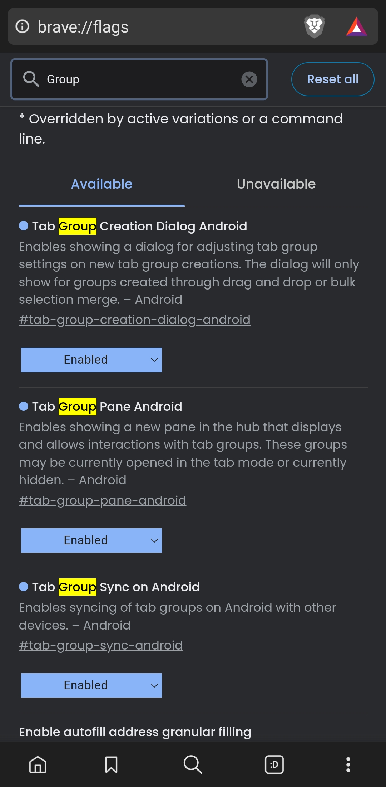
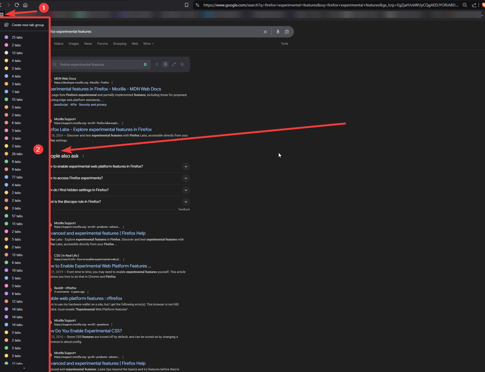

- [Memex](../../📦%20VAULT%20SANDBOX%20TESTING/Memex/Memex.md)
- ChatGPT
- QuickAdd
- Web Clippings
	- [Introduction to Obsidian Web Clipper - Obsidian Help](https://help.obsidian.md/web-clipper)
- Browser Pasting
- Daily Notes
- 

# Sync Between Mobile & Desktop? (Browsers)

- Brave Browser
	- Go to `brave://flags/#tab-groups-save`
	- `brave://flags/` has a bunch of cool settings you can set
	- Seems like you maybe have to set it on both browsers
	- In Android -
		- 
	- Accessing them is easy in desktop
		- 
- In Firefox?
	- 
- Google Chrome does it now too (but Google is spyware)
	- [Google Chrome to make tabs more manageable across devices - The Hindu](https://www.thehindu.com/sci-tech/technology/google-chrome-to-make-tabs-more-manageable-across-devices/article68632998.ece#:~:text=Tab%20Groups%20will%20be%20automatically,user%20interface%20for%20Android%20devices.)
	- [Google Chrome now syncs your tab groups between Android and desktop](https://www.androidpolice.com/google-chrome-tab-groups-sync-android-desktop/)
- 

# DROP

- [Obsidian Vaults and Sub-vaults | by Rafael M. J. Figueiredo | Medium](https://medium.com/@rafaeljost/obsidian-vaults-and-sub-vaults-d4a917f40b2d)
- iOS shortcut setups
- Android shortcut setups?