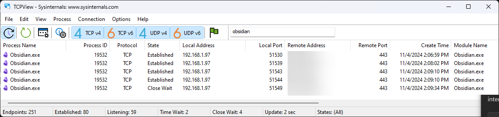
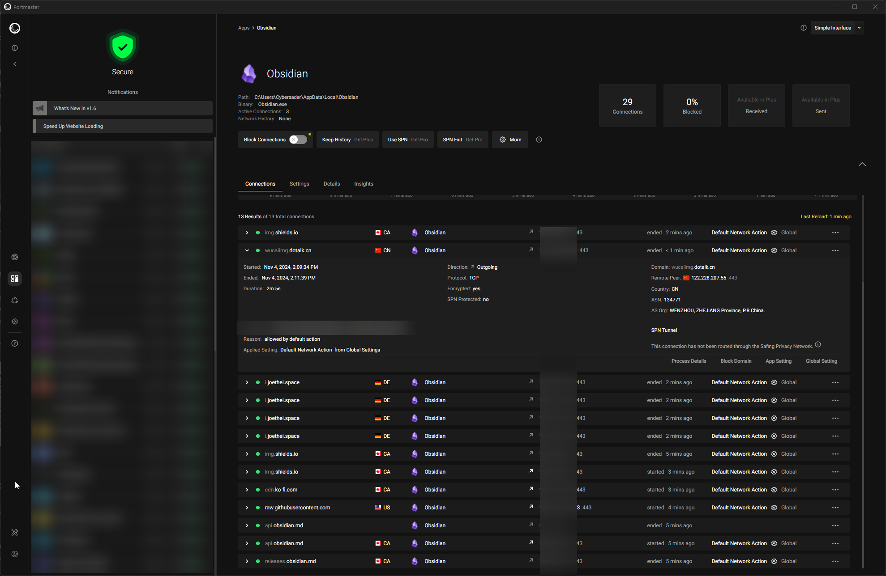
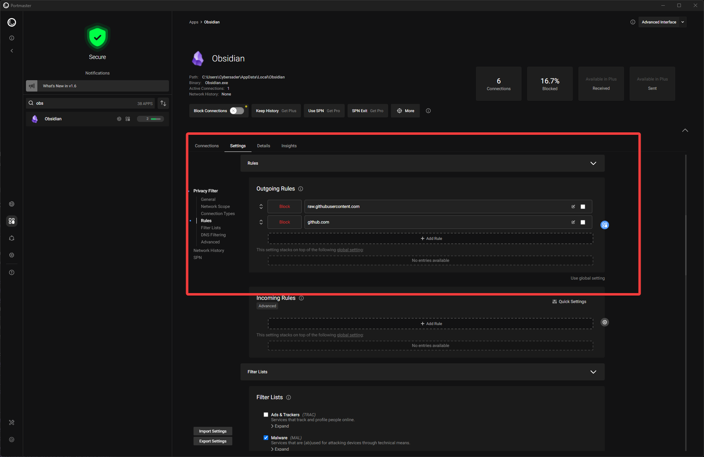

[Organization Documentation & Wikis](../../📁%2005%20-%20Organizational%20Cyber/Organization%20Documentation%20&%20Wikis/Organization%20Documentation%20&%20Wikis.md)
[Obsidian Vault Security](../Obsidian%20Vault%20Security/Obsidian%20Vault%20Security.md)
[Scalable Project Management](../../🕸️%20UNSTRUCTURED/Scalable%20Project%20Management.md)


- [ ] Create guide for Obsidian corporate use 🔺 ➕ 2024-10-30

# Sub-Topics

%% Begin Waypoint %%
- **[[Web or Browser-Based Obsidian]]**

%% End Waypoint %%
# DROP

- Application whitelisting for Kasm and running locally while limiting plugins
- Approach to security and segmentation with processes
- Think about secure dev environments
- How does all this fit together with system calls?
- In-memory vs filesystem malware risks
- VNC and latency issues
- Why Notion has a loading symbol a lot
- The conflict resolution issue

# High-Level Tech Stack & Guide

Here's the high-level questions/steps to implementing Obsidian:

## Tech Stack Options - Corporate Obsidian Use:

> [!info] The goal is to have something that's convenient, resilient, and secure.

### Syncing - options for syncing vaults up across devices and people

- Hosted Vault on a Network Share + Obsidian Sync + Manually Set Obsidian Sync Password + Authenticator App MFA
- Hosted Vault on a Network Share + OneDrive
- Hosted Vault on a Network Share + Google Drive
- (Asynchronous - technical users and developers) Obsidian Git + Corporate Git Repository (likely GitHub)

### Live Collaboration - options for collaborating live if need be

- [Collaboration in Obsidian](../Contributable%20Obsidian%20Wiki/Collaboration%20in%20Obsidian/Collaboration%20in%20Obsidian.md)

### Backups, Version Control - backing up files and versioning vaults

[Backups - The 3,2,1 Rule](../../🕸️%20UNSTRUCTURED/Backups%20-%20The%203,2,1%20Rule.md)

- Obsidian Git + Git Repository (being in the same place as the vault does not make this resilient)
- Obsidian Sync - comes with it's own version control that is stored in their Digital Ocean-based cloud
- Network Share + Other Backup Solution

### Securing and Distributing Obsidian Community Plugins & Vault Template

- Sharing Space (e.g. OneDrive, Network Share) + Least Privilege to Admins + Help Desk or IT Team Workflow

### Network & Endpoint Security

- Firewall + Rules for Obsidian Application + Application Whitelisting (limit only to users that want to use it)

## Corporate Use Components

### 1) Pricing - Obsidian is really cheap

- Example costs:
	- 10 users - $500 per year for corporate license
- Corporate license per user
	- $50 per year
	- $4.20 per month
	- $20k for 400 users once a year
- Obsidian Sync
	- Standard
		- $4 per month per user
		- $48 per year per user
		- Features:
			- 1 synced vault
			- 1 GB total storage
			- 5 MB maximum file size
			- 1 month version history
	- Pro
		- $8 per month per user
		- $96 per year per user
		- Features:
			- 10 synced vaults
			- 10 GB total storage
			- 200 MB maximum file size
			- 12 month version history
			- Upgradable to 100 GB storage
- Obsidian Publish
	- $8 per month per website
	- $48 per year per website
	- not a lot of reasons to use Obsidian Publish [till they add security features](https://forum.obsidian.md/t/obsidian-publish-authentication-for-corporate-use-single-sign-on/19255)

### 2) Sync Method

> [!note] Soon enough, Obsidian will develop or integrate methods for SSO and that should make parts of this a lot easier.

- For a small number of technical users
	- Hosted Vault on a Network Share (or local) + Obsidian Sync + Manually Set Obsidian Sync Password + Authenticator App MFA
	- Hosted Vault on a Network Share (or local) + OneDrive
	- Hosted Vault on a Network Share (or local) + Google Drive
	- (Asynchronous - technical users and developers) Obsidian Git + Corporate Git Repository (likely GitHub)

- For a small number of non-technical users
	- Hosted Vault on a Network Share (or local) + Obsidian Sync + Manually Set Obsidian Sync Password + Authenticator App MFA

- For a large number of technical users
	- Hosted Vault on a Network Share (or local) + OneDrive
	- Hosted Vault on a Network Share (or local) + Google Drive
	- (Asynchronous - technical users and developers) Obsidian Git + Corporate Git Repository (likely GitHub)

- For a large number of non-technical users
	- Hosted Vault on a Network Share (or local) + OneDrive
	- Hosted Vault on a Network Share (or local) + Google Drive

- For an advanced, scalable, super-secure setup
	- Kasm Workspace Server + Clients + Obsidian Sync OR OneDrive OR Google Drive

### 3) Live Collaboration - do you need it?

- Is Obsidian Sync good enough?
	- Obsidian Sync is the best bet for low-overhead implementation and near-live syncing

- Can you use peer-to-peer protocols on your network? (you should threat model this probably)
	- Yes
		- Do you have time to implement something technical?
			- Yes
				- [Collaboration in Obsidian](../Contributable%20Obsidian%20Wiki/Collaboration%20in%20Obsidian/Collaboration%20in%20Obsidian.md) - more solutions here for peer-to-peer
			- No
				- Obsidian Sync might be your only option
				- Look at tools other than Obsidian
	- No
		- Do you have time to test?
			- Yes
				- [Peerdraft – Collaboration for Obsidian – Sync, Share, and Edit anywhere](https://www.peerdraft.app/) 
					- [peerdraft.app/documentation/explanations/what-is-the-difference-between-persistent-and-fleeting](https://www.peerdraft.app/documentation/explanations/what-is-the-difference-between-persistent-and-fleeting)
					- May or may not work - do some testing with their free tier
			- No
				- Maybe stick with Obsidian Sync for near-live syncing

- Do you want this behind a corporate VPN, SSO, or administered MFA?
	- Yes
		- Network Share that requires Corporate VPN + [Collaboration in Obsidian](../Contributable%20Obsidian%20Wiki/Collaboration%20in%20Obsidian/Collaboration%20in%20Obsidian.md)
		- Local vault + OneDrive OR Google Drive + [Collaboration in Obsidian](../Contributable%20Obsidian%20Wiki/Collaboration%20in%20Obsidian/Collaboration%20in%20Obsidian.md)
	- No
		- [Collaboration in Obsidian](../Contributable%20Obsidian%20Wiki/Collaboration%20in%20Obsidian/Collaboration%20in%20Obsidian.md)

### 4) Securing Plugins and Hosting an Example Vault - Distribution

- Securing Plugins and Hosting an Example Vault
    - set up a local repo as an admin
    - put it on a network share or place people can grab it but not modify
    - set up application whitelisting on non admin machines to block any GitHub related DNS calls from the obsidian app
    - let users download the vault, but they can't then download plugins unless being added by you
    - open the admin vault to check for security updates on plugins
    - keep plugins down to what's necessary 
- How to guide for those using the template vault

### 5) Make a Tutorial 

- Make a video guide with sharex OR obs and losslesscut

### 6) Workflow and Hotkeys Guide

- need this

### 7) Initial Community Plugins

- List these out

### 8) Network Security

- Take a whitelist approach to connections but follow below docs and notes

# Misc Links

- [TrustedSec | Obsidian, Taming a Collective Consciousness](https://trustedsec.com/blog/obsidian-taming-a-collective-consciousness)
- [Obsidian Publish: Authentication for corporate use (Single Sign On) - Feature requests - Obsidian Forum](https://forum.obsidian.md/t/obsidian-publish-authentication-for-corporate-use-single-sign-on/19255)
- [GitHub - brush701/obsidian-multiplayer: Real time collaboration for Obsidian](https://github.com/brush701/obsidian-multiplayer)
- [Syncing for teams - Obsidian Help](https://help.obsidian.md/Teams/Syncing+for+teams)
- [Collaborate on a shared vault - Obsidian Help](https://help.obsidian.md/Obsidian+Sync/Collaborate+on+a+shared+vault)
- [Obsidian Publish: Support individual user authentication and management (subscriber-only access) - Feature requests - Obsidian Forum](https://forum.obsidian.md/t/obsidian-publish-support-individual-user-authentication-and-management-subscriber-only-access/27854/2)
- [Access control in Obsidian : r/ObsidianMD](https://www.reddit.com/r/ObsidianMD/comments/15sp8sw/access_control_in_obsidian/)
- [Obsidian at Work - Share & showcase - Obsidian Forum](https://forum.obsidian.md/t/obsidian-at-work/18504)
- [Can't use Obsidian at work. Any suggested workarounds? - Basement - Obsidian Forum](https://forum.obsidian.md/t/cant-use-obsidian-at-work-any-suggested-workarounds/4451/3)

# Syncing & Collaboration

[Collaboration in Obsidian](../Contributable%20Obsidian%20Wiki/Collaboration%20in%20Obsidian/Collaboration%20in%20Obsidian.md)
[Syncing Obsidian](../Syncing%20Obsidian/Syncing%20Obsidian.md)

- This is the hardest part of solving the using Obsidian in corporate problem.  Plugins can at least be controlled and whitelisted.  The goal with using Obsidian is to cheat the system by having a really cheap, valuable, extensible, universal system, all with plaintext on the backend for compatibility and flexibility.
- You may be thinking, why not just use git with "[Obsidian Git](../Obsidian%20Git/Obsidian%20Git.md)"?  Yes...that will work most of the time, unless you have plugins that add data right when you open pages or the vault.  Constantly having conflicts and git errors is a chore.
	- [ ] Solve the constant Obsidian Git error issues 🔺 ➕ 2024-10-30

- Related links:
	- [Syncing for teams - Obsidian Help](https://help.obsidian.md/Teams/Syncing+for+teams)
	- [Sync your notes across devices - Obsidian Help](https://help.obsidian.md/Getting+started/Sync+your+notes+across+devices)
	- 

- Asynchronous Options:
	- Obsidian Git
- Live Sync Options
	- Obsidian Sync
		- 

## Syncing Workspaces Between Devices 

- Links:
	- [Obsidian Git - tips on how to use it for reliable sync? : r/ObsidianMD](https://www.reddit.com/r/ObsidianMD/comments/18dt1ok/obsidian_git_tips_on_how_to_use_it_for_reliable/)
	- [You can also have separate folders synced across devices by using GIT sparse-checkout approach. On each device you can set what folders it will sync with main repository. Thus, you can keep work related notes updated in your main vault and on your work compputer without sharing personal notes on your work machine. Same approach can be used on smartphones, if you can get GIT working on that device. I sync my phone in my selfhosted cloud solution with Obsidian app.](https://forum.obsidian.md/t/yet-another-obsidian-git-tutorial-desktop-pc-ipad-sync/67531)
	- [Creating a Partial Clone of a Git Repo - Tyler Mercer](https://tylermercer.net/posts/software/partial-clone-git-repo/)
	- [Handling Obsidian on multiple devices? : r/ObsidianMD](https://www.reddit.com/r/ObsidianMD/comments/1ca9758/handling_obsidian_on_multiple_devices/)
	- [Different workspaces per device : r/ObsidianMD](https://www.reddit.com/r/ObsidianMD/comments/x4246k/different_workspaces_per_device/)
	- [Obsidian on multiple devices? : r/ObsidianMD](https://www.reddit.com/r/ObsidianMD/comments/v9ccoo/obsidian_on_multiple_devices/)
- Plugins
	- Workspaces Plus
- Files to not sync
	- Generally, don't sync the workspace and other `.obsidian` folders or files.  You'll get conflicts usually as you try sync at the same time while Obsidian updates those files as they change
- 

## Working On Two Devices at the Same Time?

- Obsidian Sync works for it
	- [Not a problem. Sync just works.](https://www.reddit.com/r/ObsidianMD/comments/18inzz8/curious_about_obsidian_sync_two_devices_open_at/)
- 

## Avoiding and Handling Git Conflicts

- [Handling Obsidian Git Conflicts & Issues](../Obsidian%20Git/Handling%20Obsidian%20Git%20Conflicts%20&%20Issues/Handling%20Obsidian%20Git%20Conflicts%20&%20Issues.md)
- [🐛 Known Base Bugs, Issues](../Contributable%20Obsidian%20Wiki/🐛%20Known%20Base%20Bugs,%20Issues/🐛%20Known%20Base%20Bugs,%20Issues.md)
- [Obsidian Git Setup](../Obsidian%20Git/Obsidian%20Git%20Setup/Obsidian%20Git%20Setup.md)
- [Syncthing Incompatible with Git](../Syncing%20Obsidian/Syncthing%20Incompatible%20with%20Git/Syncthing%20Incompatible%20with%20Git.md)

### Obsidian Git Options

- Merge strategy
- Auto Commit
- Disable on this device
- Shouldn't there be a setting to ask if you want to commit/push?

### Solutions to Git Conflict Issues with 'Obsidian Git" plugin

#### 1) Add some folders and files to gitignore

Add a `.gitignore` file with the following lines:

```
.obsidian/workspace-mobile.json
.obsidian/workspace.json
.obsidian/workspace
.obsidian/plugins/home-tab/data.json
```

To ensure that Git ignores certain files or folders without having to manually remove them from tracking, you can set up a pre-commit hook. This hook will automatically check if any files in `.gitignore` are still tracked and will remove them from tracking if they are. Here's how you can set it up:

- [Gitignore Folder Tracking Removal](📁%2021%20-%20Development/Git/Gitignore%20Folder%20Tracking%20Removal/Gitignore%20Folder%20Tracking%20Removal.md#3%20Untrack%20All%20Files%20Listed%20in%20gitignore)

Once you've ran the commands from above to stop tracking the files in `.gitignore`, then it should work smoothly on other devices when pulling and syncing as well.

#### 2) Use Lazy Loading pl?

**For data.json plugin settings files that need to be synced but cause issues**.

You can try the Lazy load plugin to load the setting long after the vault opens so that Obsidian Git can do its job before breaking with the plugin loading.  

# IAM and User Management?

- obsidian sharing collaboration user control active directory

## SSO and MFA

- Related links:
	- [Account security](https://help.obsidian.md/Teams/Security+considerations+for+teams#Account+security)

# Version Control

- Obsidian Git

# AI Risks?

- Related links:
	- [AI and Your Obsidian Vault — Practical Advice to Protect Your Privacy | by TfTHacker | Obsidian Observer | Medium](https://medium.com/obsidian-observer/ai-and-your-obsidian-vault-practical-advice-to-protect-your-privacy-27a75d28965a)
	- 

# Network and Plugin Risk Reduction

## Looking at Obsidian Developer Console for Network Connections?

- Related links:
	- [How to access the console? - Help - Obsidian Forum](https://forum.obsidian.md/t/how-to-access-the-console/16703/9) - Try "Ctrl + Shift + i"

- Make sure other hotkeys aren't taking the place of developer console
- Go to settings, then "Ctrl + Shift + i" should always work
- Doesn't work - they're only internal connections

## Firewall Rules for Obsidian

[Endpoint Firewall](../../🕸️%20UNSTRUCTURED/Endpoint%20Firewall/Endpoint%20Firewall.md)

- [Security considerations for teams - Obsidian Help](https://help.obsidian.md/Teams/Security+considerations+for+teams)
- [Security and privacy - Obsidian Help](https://help.obsidian.md/Obsidian+Sync/Security+and+privacy#Managing+access+to+Obsidian+Sync+on+your+network)
- [What domains does Obsidian use? - Help - Obsidian Forum](https://forum.obsidian.md/t/what-domains-does-obsidian-use/75800)
- [Network and access - Connections and Firewall](https://help.obsidian.md/Teams/Security+considerations+for+teams#Network+and+access)
- [How did Obsidian update when blocked by firewall? - Help - Obsidian Forum](https://forum.obsidian.md/t/how-did-obsidian-update-when-blocked-by-firewall/69320)
- [A setting to entirely restrict internet access by the app - Feature requests - Obsidian Forum](https://forum.obsidian.md/t/a-setting-to-entirely-restrict-internet-access-by-the-app/35117/6)
- [Network Connections (Network Traffic) - Meta - Obsidian Forum](https://forum.obsidian.md/t/network-connections-network-traffic/12294)

### Investigating Obsidian Connections

- Tools:
	- Portmaster
	- TCPView
	- Wireshark
- TCP View
	- While looking through community plugins in Obsidian
		- 
- Portmaster
	- While looking through community plugins in Obsidian
		- 
- Wireshark
	- Showed DNS over HTTPS then TLS traffic...makes sense
	- You would need TLS decryption to be able to see what's going on

## Blocking Individual Plugins? - NOT POSSIBLE (2024)

#### Why You Need a Firewall or Proxy with SSL/TLS Decryption / DPI (Deep Packet Inspection)

- Potential tools to test with at home?:
	- [Squid for Windows](https://squid.diladele.com/)

Obsidian generates network traffic in several ways:

1. **Updates and Plugin Checks**: Periodically checking for updates and fetching plugin deprecations from GitHub.
2. **Account and License Management**: Accessing Obsidian's servers (`api.obsidian.md`).
3. **Obsidian Sync and Publish**: Connecting to various `obsidian.md` subdomains.
4. **Third-Party Plugins and Themes**: Downloading and enabling plugins, which may generate their own network traffic.
5. **DNS Over HTTPS (DoH)**: Potentially using DoH for DNS queries.

Obsidian uses HTTPS (port 443) for its network connections, which encrypts the HTTP payload—including URLs, paths, and parameters—making it challenging for firewalls to inspect and block specific paths. Additionally, if Obsidian uses DNS over HTTPS, traditional DNS filtering becomes ineffective because DNS queries are encrypted and sent over HTTPS.

---

Challenges with Blocking Specific Paths:

1. **Encrypted Traffic**: HTTPS encryption prevents standard firewalls from inspecting HTTP headers and URLs without SSL/TLS decryption.
2. **DNS Over HTTPS**: DoH encrypts DNS queries, bypassing traditional DNS filtering mechanisms.
3. **Dynamic IP Addresses**: Blocking IP addresses is unreliable because services like GitHub and Obsidian use CDNs and dynamic IPs.

---

##### **Possible Solutions**

###### **1. Use a Firewall with SSL/TLS Decryption and DPI**

**Requirements**:

- A firewall capable of SSL/TLS decryption and Deep Packet Inspection (DPI).
- Deployment of a trusted root certificate to all client devices.
- Compliance with legal and organizational policies regarding SSL interception.

**How It Works**:

- The firewall intercepts HTTPS traffic, decrypts it using the trusted certificate, and inspects the contents.
- You can configure rules to block specific domains, URLs, paths, or parameters.
- Example firewalls: **Palo Alto Networks**, **Cisco Firepower**, **Fortinet**, **Check Point**.

**Considerations**:

- **Privacy Concerns**: Intercepting SSL/TLS traffic can raise privacy and legal issues.
- **Complexity**: Setting up SSL decryption is complex and requires careful management of certificates.
- **Performance**: SSL decryption can impact network performance due to the overhead of encryption and decryption processes.

###### **2. Implement a Web Proxy with Filtering Capabilities**

**Options**:

- **Squid Proxy with SSL Bump**: An open-source solution that can intercept and filter HTTPS traffic.
- **Commercial Proxies**: Tools like **Blue Coat ProxySG**, **Zscaler**, or **Forcepoint** offer advanced filtering.

**How It Works**:

- The proxy acts as an intermediary between client devices and the internet.
- SSL Bump allows the proxy to decrypt HTTPS traffic for inspection.
- You can define granular rules to block specific URLs or paths.

**Considerations**:

- **Certificate Management**: Clients must trust the proxy's SSL certificate.
- **Deployment**: Requires configuring network settings to route traffic through the proxy.
- **Maintenance**: Ongoing management to update rules and certificates.

###### **3. Use Endpoint Security Solutions**

**Options**:

- **Endpoint Firewall Software**: Solutions like **Windows Defender Firewall with Advanced Security** or third-party software that supports application-level filtering.
- **Application Control Policies**: Implement policies that restrict network access for specific applications or processes.

**How It Works**:

- Control outbound network connections at the application level.
- Block Obsidian from making network requests to specific domains or IPs.
- May require creating custom rules based on executable files or process names.

**Limitations**:

- **Granularity**: Might not be able to block specific paths or URLs within allowed domains.
- **User Experience**: Overly restrictive rules could impair Obsidian's functionality.

###### **4. Modify Local DNS Resolution**

**Approach**:

- **Hosts File Modification**: Map unwanted domains to `127.0.0.1` in the hosts file.
- **Internal DNS Server**: Use an internal DNS server to control domain resolution.

**Challenges**:

- **Ineffective Against DoH**: If Obsidian uses DNS over HTTPS, it bypasses the local DNS resolution.
- **Maintenance**: Keeping the list of domains up to date can be cumbersome.

###### **5. Configure Obsidian Settings**

**Options**:

- **Disable Automatic Updates**: Turn off updates in Obsidian's settings to prevent update checks.
- **Restrict Plugin Installation**: Avoid installing third-party plugins or disable them.

**How It Helps**:

- Reduces the amount of network traffic generated by Obsidian.
- Limits connections to GitHub and other external services.

**Limitations**:

- **User Compliance**: Requires users to adhere to configuration policies.
- **Partial Solution**: Doesn't prevent all network connections, especially if users can change settings.

###### **6. Use a Local Proxy for Testing and Control**

**Tools**:

- **Burp Suite**
- **Charles Proxy**
- **Fiddler**

**How It Works**:

- Install the proxy on individual devices.
- Configure the device to route traffic through the proxy.
- Decrypt HTTPS traffic by installing the proxy's certificate.
- Set up rules to block or modify specific paths or parameters.

**Best For**:

- **Testing Environments**: Useful for debugging and understanding the application's network behavior.
- **Small Scale**: Not practical for large organizations or multiple devices.

---

##### **Addressing DNS Over HTTPS (DoH) Complications**

**Why DoH Complicates Firewalling**:

- **Bypasses Traditional DNS Filtering**: DoH sends DNS queries over HTTPS to DoH servers, encrypting the queries and responses.
- **Makes Domain Blocking Harder**: Since DNS queries are encrypted, the firewall can't see which domains are being resolved.

**Potential Solutions**:

1. **Block DoH Traffic**:
    
    - Identify and block known DoH servers at the firewall.
    - Configure the firewall to prevent traffic to standard DoH ports (e.g., 443) for specific IPs.
2. **Enforce Internal DNS Policies**:
    
    - Use Group Policy (for Windows environments) to enforce DNS settings on client devices.
    - Disable DoH in browsers and applications if possible.
3. **Implement Network-Wide DoH**:
    
    - Redirect DNS queries to a local DoH server that you control.
    - Allows you to enforce DNS filtering policies even with DoH.

**Limitations**:

- **Application Behavior**: Some applications might hardcode DoH servers or ignore system DNS settings.
- **Encryption Bypass**: Blocking DoH might cause applications to fall back to traditional DNS, but this isn't guaranteed.

--- 

##### **Recommended Approach**

Given the complexities and the potential need for granular control, here's a step-by-step approach:

1. **Assess Organizational Policies and Resources**:
    
    - Determine if SSL/TLS decryption is permissible under your organization's policies.
    - Evaluate the resources available for implementing advanced firewall or proxy solutions.
2. **Pilot a Proxy Solution**:
    
    - Set up a proxy like **Squid** with SSL Bump in a test environment.
    - Configure it to decrypt HTTPS traffic and block specific paths.
    - Test Obsidian's behavior when accessing plugins and updates.
3. **Evaluate Endpoint Solutions**:
    
    - Explore endpoint firewall settings to block or restrict Obsidian's network access.
    - Consider application whitelisting or blacklisting as necessary.
4. **Communicate with Users**:
    
    - Inform users about the network restrictions and how they might affect Obsidian's functionality.
    - Provide guidance on acceptable use and configuration.
5. **Monitor and Iterate**:
    
    - Continuously monitor network traffic to ensure that the restrictions are effective.
    - Adjust rules and policies based on observed behavior and user feedback.

##### **Summary**

Blocking specific paths or URL parameters used by Obsidian, especially over HTTPS and with potential DNS over HTTPS usage, is challenging but achievable with the right tools and configurations:

- **SSL/TLS Decryption with DPI Firewalls**: Allows inspection and blocking of specific paths but requires careful implementation.
- **Advanced Proxy Servers**: Provide granular control over network traffic with SSL decryption.
- **Endpoint Controls**: Offer application-level restrictions but may lack the granularity for path-based blocking.
- **DNS Considerations**: Addressing DoH requires additional steps to ensure DNS filtering is effective.

By combining these approaches and tailoring them to your organization's needs and policies, you can effectively manage and control the network traffic generated by Obsidian.

## Obsidian Plugin and Sync Security

- [Obsidian Vault Security](../Obsidian%20Vault%20Security/Obsidian%20Vault%20Security.md)
- [Plugin security - Obsidian Help](https://help.obsidian.md/Extending+Obsidian/Plugin+security)
- 
- Firewall should already have a whitelist approach and general network security controls
- Endpoints should have application whitelisting implemented
- Whitelist the Obsidian application to run
	- [Scripting vs Development Risks on Endpoints](../../📁%2004%20-%20Organizational%20Cyber/Scripting%20vs%20Development%20Risks%20on%20Endpoints/Scripting%20vs%20Development%20Risks%20on%20Endpoints.md)
	- [Secure Cyber Environment](../../📁%2004%20-%20Organizational%20Cyber/Secure%20Cyber%20Environment/Secure%20Cyber%20Environment.md)
	- [Securing Python on Workstations](../../📁%2004%20-%20Organizational%20Cyber/Secure%20Cyber%20Environment/Securing%20Python%20on%20Workstations/Securing%20Python%20on%20Workstations.md)
- Whitelist certain URLs from the Obsidian plugin repo so that the vault can install the plugin data from that particular whitelisted repo path
- Do this for each whitelisted and approved plugin
- Have a process for this approval through help desk and/or InfoSec teams

- Related links:
	- [Securing Obsidian - Boxes and Walls](https://ohm.one/securing-obsidian-boxes-and-walls/)
	- [Special build excluding sync and community plugins - Feature archive - Obsidian Forum](https://forum.obsidian.md/t/special-build-excluding-sync-and-community-plugins/62963)
	- [Prevent plugins and auto-updates in corporate network - Help - Obsidian Forum](https://forum.obsidian.md/t/prevent-plugins-and-auto-updates-in-corporate-network/73495)
	- [Trying obsidian in a corporate environment - Help - Obsidian Forum](https://forum.obsidian.md/t/trying-obsidian-in-a-corporate-environment/68816)
	- 
	- [Obsidian Sync being blocked by firewall - Help - Obsidian Forum](https://forum.obsidian.md/t/obsidian-sync-being-blocked-by-firewall/69622)
	- [How can I check if the community plugin is safe? - Help - Obsidian Forum](https://forum.obsidian.md/t/how-can-i-check-if-the-community-plugin-is-safe/15258)
	- [Security of the plugins - Meta - Obsidian Forum](https://forum.obsidian.md/t/security-of-the-plugins/7544/51)
	- [Is Obsidian And The Plugins Secure To Use At Work - Help - Obsidian Forum](https://forum.obsidian.md/t/is-obsidian-and-the-plugins-secure-to-use-at-work/52164)
	- [How do I whitelist a dynamically changing application sync server IP? - Developers: Plugin & API - Obsidian Forum](https://forum.obsidian.md/t/how-do-i-whitelist-a-dynamically-changing-application-sync-server-ip/66967)
	- [Per-plugin connections in Obsidian? : r/ObsidianMD](https://www.reddit.com/r/ObsidianMD/comments/11xd1r9/perplugin_connections_in_obsidian/)
	- [Third-party plugins leverage the Obsidian API](https://help.obsidian.md/Teams/Deploy+Obsidian+across+your+team#Plugins)

## Application Firewalls

- [Securing Obsidian - Boxes and Walls](https://ohm.one/securing-obsidian-boxes-and-walls/)
	- [Safing Portmaster - Easy Privacy](https://safing.io/) - firewall they recommended

## Whitelisting Per Community Plugin 

### Plugin Whitelisting Workaround with a Company Plugins Folder

- The only way to manually whitelist plugins is to block plugins with firewall rules, then manually update the folders for users with a company folder to store current plugins.  

- Blocking community plugins with firewall
	- Block both of the related domains from being **outbound** connections for Obsidian
		- `github.com`
		- `raw.githubusercontent.com`
	- Use whatever application firewall
		- At home, I use Portmaster - [Endpoint Firewall](../../🕸️%20UNSTRUCTURED/Endpoint%20Firewall/Endpoint%20Firewall.md)
		- 

- This admittedly brings about other risks (e.g. needing to keep plugins updated somehow, having users manually move plugin folders, etc.) 

### Whitelisting Per-Plugin with Firewall? (NOT POSSIBLE 2024)

- Related links:
	- [Per-plugin connections in Obsidian? : r/ObsidianMD](https://www.reddit.com/r/ObsidianMD/comments/11xd1r9/perplugin_connections_in_obsidian/)
	- [Obsidian Help | GitHub-sourced connections](https://help.obsidian.md/Teams/Security+considerations+for+teams#GitHub-sourced+connections)
	- [What domains does Obsidian use? - Help - Obsidian Forum](https://forum.obsidian.md/t/what-domains-does-obsidian-use/75800)

## The Ideal Plugin Security - Our Own Plugin Repo

- We could audit the code for a plugin then put it in our own repo, whitelist that repo URL in the firewall, and have it internally, then point Obsidian to that URL for updates.

# Plugins

- Plugins from my main cybersader repo are good plugins for the most part

## Useful Plugins for Business

- Plugins for exporting pages in different formats

## Project Management

- Tasks
- Project Management
- Changelog page
- Dataview

## General Vault Layout

- Folder Notes

## Better Vault Functionality

- Omnisearch
- 