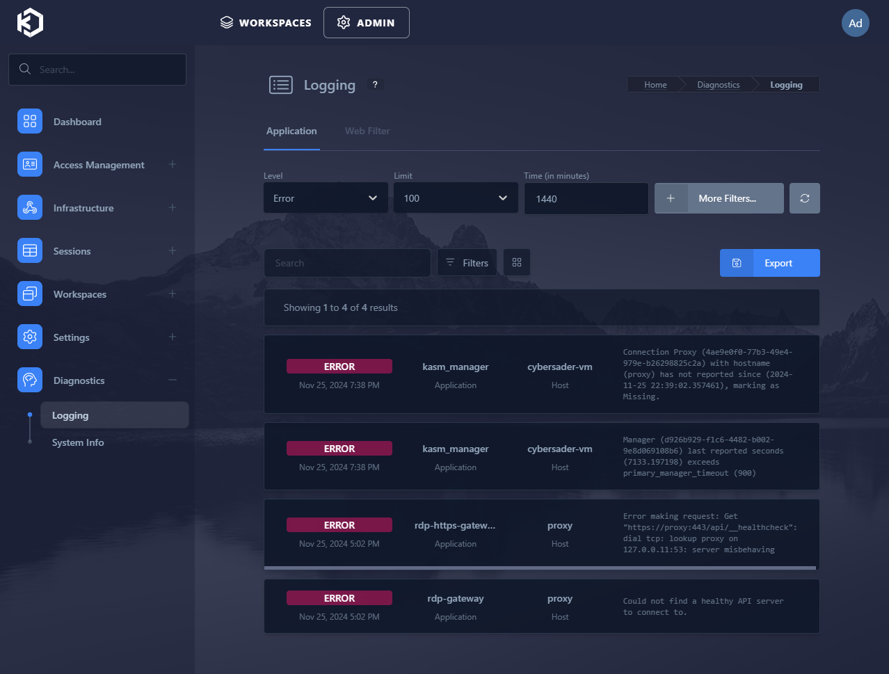
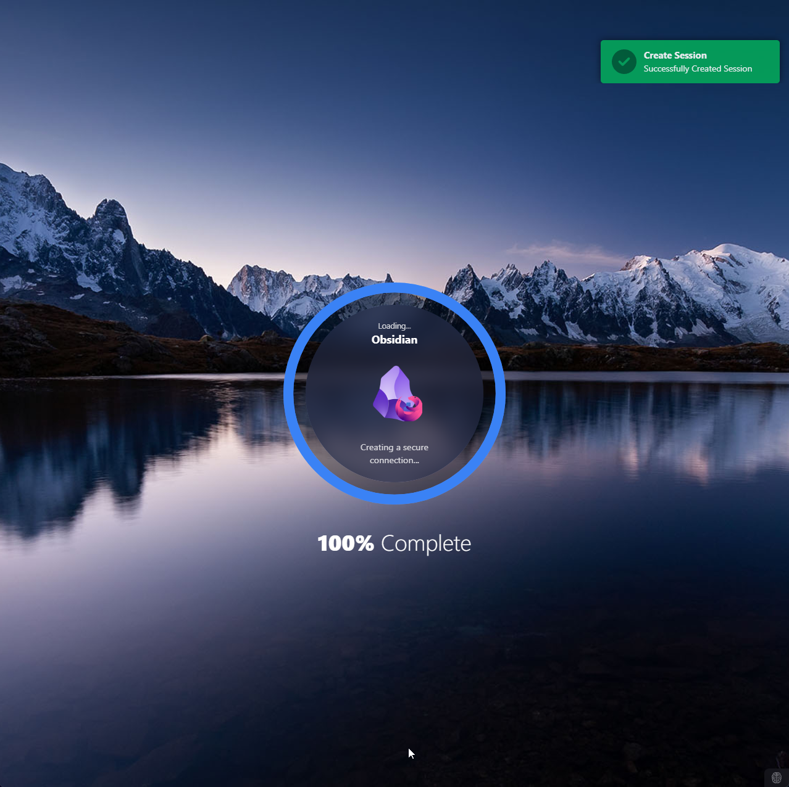
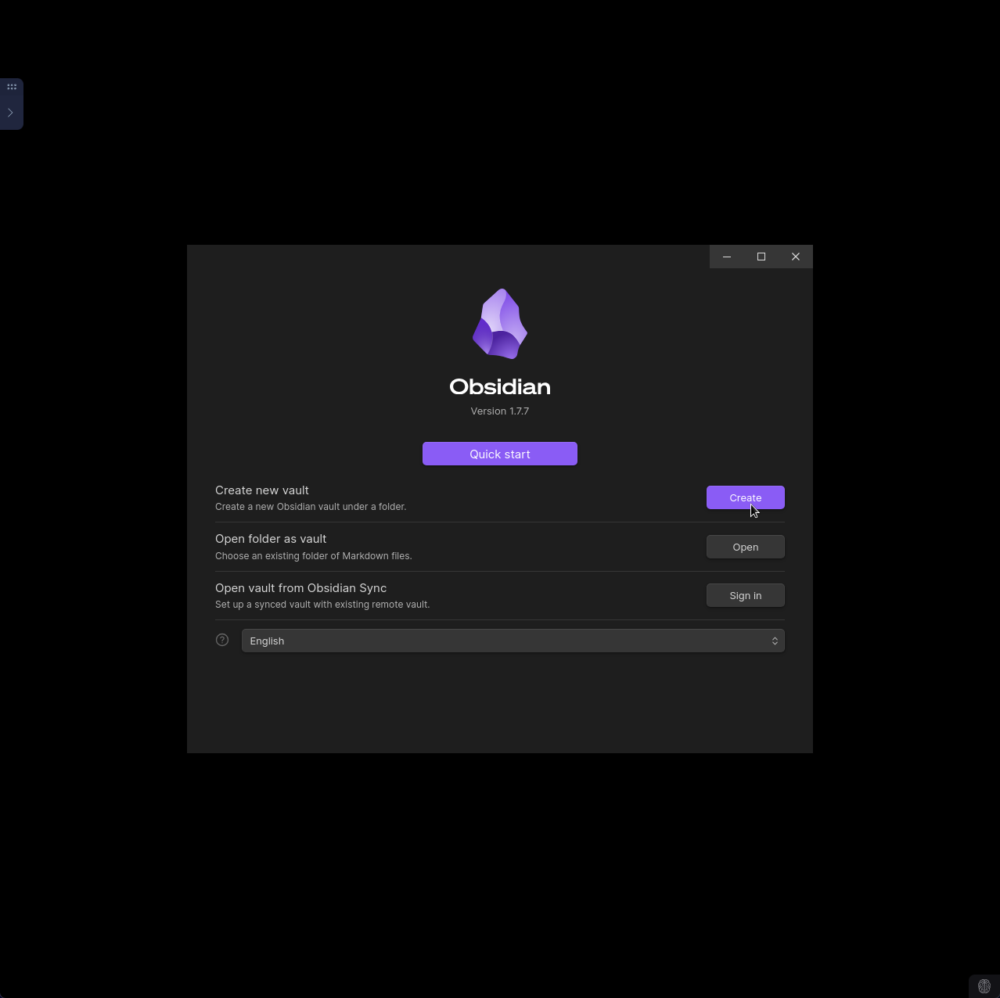
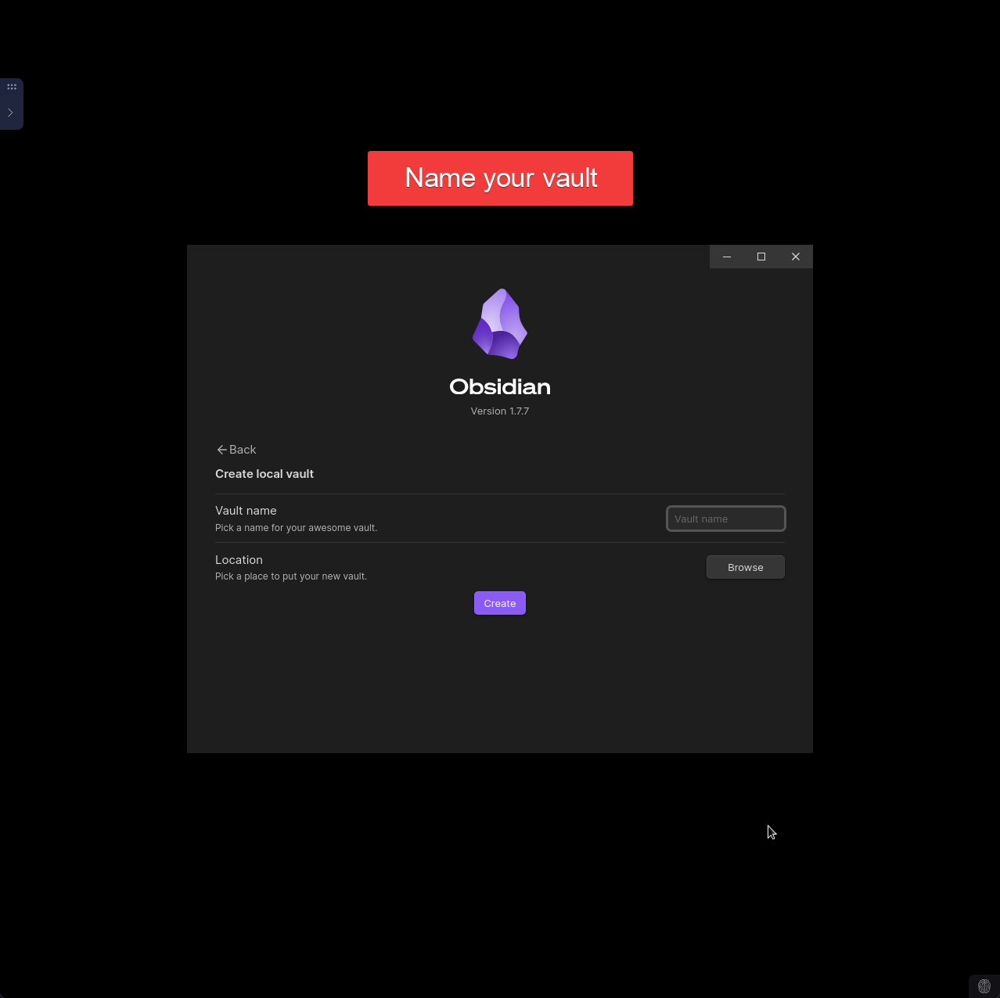
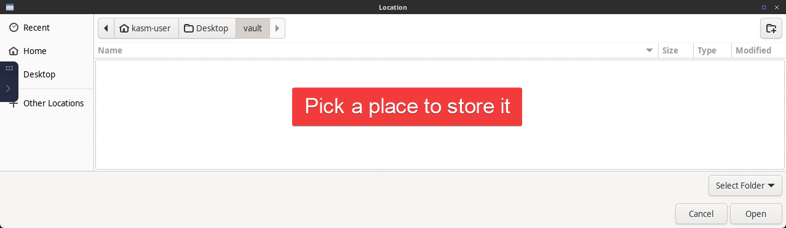
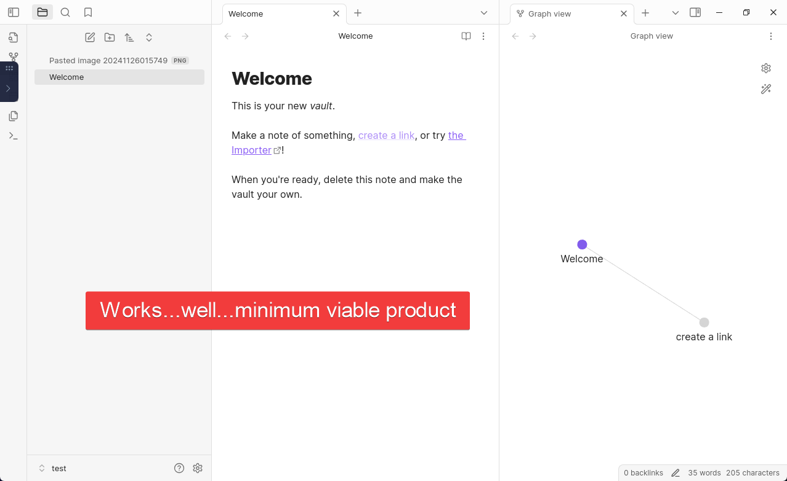

- All of these options will essentially run Obsidian somewhere else with mechanisms in place to make other essentials work:
	- Syncing
	- User Management
	- Community Plugin Management
	- Networking
	- Security

There's only one option that seems like it could scale and that's [Kasm Workspaces](../../📁%2005%20-%20Organizational%20Cyber/Remote%20Desktop%20Gateways/Kasm%20Workspaces/Kasm%20Workspaces.md) but the general solution are [Remote Desktop Gateways](../../📁%2005%20-%20Organizational%20Cyber/Remote%20Desktop%20Gateways/Remote%20Desktop%20Gateways.md)

- [Apache Guacamole](../../../📁%2005%20-%20Organizational%20Cyber/Remote%20Desktop%20Gateways/Apache%20Guacamole/Apache%20Guacamole.md)
- [Kasm Workspaces](../../../📁%2005%20-%20Organizational%20Cyber/Remote%20Desktop%20Gateways/Kasm%20Workspaces/Kasm%20Workspaces.md)

# DROPZONE

- [sytone/obsidian-remote: Run Obsidian.md in a browser via a docker container.](https://github.com/sytone/obsidian-remote)
- [https://code.visualstudio.com/docs/editor/vscode-web#\_extensions](https://code.visualstudio.com/docs/editor/vscode-web#_extensions) - an example of why Obsidian doesn't have a browser version

# Kasm Workspaces for Obsidian | Browser-Based Obsidian

- [ ] Implement Kasm Workspaces in the browser with Obsidian and custom images ➕ 2024-11-20

## Kasm Workspaces - Requires VM | Docker Kasm with Obsidian

### Can you set up Kasm inside a Docker container?

Long story short, you can with DiD (Docker in Docker) but just don't...

- [You might want to take a look at the linuxserver project that bundles Kasm into a single container. It leverages Docker in Docker (DinD). The recommended way to run Kasm is on standalone machines/VMs, but the DinD solution should be close to what you are looking for.](https://www.reddit.com/r/kasmweb/comments/wz3amp/can_you_add_kasm_workspace_to_an_existing_docker/)
- [Kasm Docs - Kasm Workspaces can be installed on a Virtual Machine or directly on bare metal. We do not recommend running Kasm in LXC or WSL/WSL2.](https://kasmweb.com/docs/latest/install/system_requirements.html "System Requirements — Kasm 1.16.1 documentation")

### Kasm in a VM in TrueNAS Scale?

So...obsidian inside of Kasm inside of an Ubuntu Linux VM inside of TrueNAS Scale?

- [Running VMs in TrueNAS Scale - Should you run this instead of Proxmox? - YouTube](https://www.youtube.com/watch?v=hpPXOSC5GmU)

> [!tldr] TL;DR - TrueNAS VMs are not that great and I should just get a small server box and start running Proxmox separately

### Kasm in a VM in VMware Workstation Player

- Install guides
	- [Single Server Installation — Kasm 1.16.1 documentation](https://kasmweb.com/docs/latest/install/single_server_install.html)
	- [(2) Kasm Workspaces - Installation - YouTube](https://www.youtube.com/watch?v=BYJ0M04cD18)
	- [Kasm Workspaces - Ep. 1 - Installing Kasm Workspaces - YouTube](https://www.youtube.com/watch?v=QHdU4HnseDw)

Steps:
- Download VMware Workstation Player
- Download a VM image - [supported VM image operating systems](https://kasmweb.com/docs/latest/install/system_requirements.html "System Requirements — Kasm 1.16.1 documentation")
	- [Get Ubuntu | Download | Ubuntu](https://ubuntu.com/download) 
- Add the VM to VMware Workstation Player by adding a new virtual machine (in workstation player) and selecting the ".iso" file you downloaded
	- Make sure it has enough resources - [Minimum Resource Requirements](https://kasmweb.com/docs/latest/install/system_requirements.html "System Requirements — Kasm 1.16.1 documentation")
- Setup Kasm and Linux
	- Once Linux server is running (just click through all the stuff for Linux till you're at the login
	- Login
	- Copy and Paste aren't enabled in Community edition for VMware Workstation Player 

- How does the networking work in a VM on my desktop?
	- Linux server showed...
		- DHCPv4 - 192.168.159.130/24
	- I accessed it by going to 192.168.159.131 in my browser

- Errors that can show up
	- 

- Opening up Obsidian as a user
	- 
	- 
	- 
	- 
	- 

### Problems with using Kasm for Obsidian

- [ ] Solve problems to make Obsidian work for a corporate setting using Kasm ➕ 2024-11-25

There's some problems that have to get solved in order for this to work for a corporate setting.

**Problems to solve for Kasm-based Obsidian:**
- Employees would have to learn to accept the interface - might be possible if the argument is that it's secure
- Provisioning and user management
- Authentication
	- [LDAP Authentication — Kasm 1.16.1 documentation](https://kasmweb.com/docs/latest/guide/ldap.html)
	- [SAML 2.0 Authentication — Kasm 1.16.1 documentation](https://kasmweb.com/docs/latest/guide/saml_authentication.html)
	- [OpenID Authentication — Kasm 1.16.1 documentation](https://kasmweb.com/docs/latest/guide/oidc.html)
	- [Two Factor Authentication — Kasm 1.16.1 documentation](https://kasmweb.com/docs/latest/guide/two_factor.html)
- Syncing, storage, Kasm workspace session persistence
	- [Persistent Data — Kasm 1.16.1 documentation](https://kasmweb.com/docs/latest/guide/persistent_data.html)
	- [Rclone Common Configurations — Kasm 1.16.1 documentation](https://kasmweb.com/docs/latest/guide/storage_providers/custom.html)
		- Includes SMB
	- [File Mappings — Kasm 1.16.1 documentation](https://kasmweb.com/docs/latest/guide/file_mappings.html)
	- How are community plugins managed?
		- Employees need to be able to upload files, yet, that allows them to change the ".plugins" folder - adds risk of malicious community plugins
		- [Storage Mappings — Kasm 1.16.1 documentation](https://kasmweb.com/docs/latest/guide/storage_mappings.html)
- Implementation in corporate infrastructure
	- [VM Provider Configs — Kasm 1.16.1 documentation](https://kasmweb.com/docs/latest/guide/compute/vm_providers.html)

# Obsidian in a Container

- Forums, discussions
	- [Has anyone here tried to virtualize Obsidian in docker container? : r/ObsidianMD](https://www.reddit.com/r/ObsidianMD/comments/s13lp5/has_anyone_here_tried_to_virtualize_obsidian_in/)
	- [Self hosted Docker instance - Share & showcase - Obsidian Forum](https://forum.obsidian.md/t/self-hosted-docker-instance/3788)
	- [Obsidian - running sync engine via Docker](https://www.blackvoid.club/obsidian-running-sync-engine-via-docker/)
	- [Obsidian for web - Feature requests - Obsidian Forum](https://forum.obsidian.md/t/obsidian-for-web/2049/221)
- [Unraid | Community Apps | Obsidian](https://unraid.net/community/apps?q=obsidian#r)
- [Package obsidian](https://github.com/linuxserver/docker-obsidian/pkgs/container/obsidian) 
- LinuxServer.io
	- [linuxserver/obsidian - Docker Image | Docker Hub](https://hub.docker.com/r/linuxserver/obsidian)
	- [obsidian - LinuxServer.io](https://docs.linuxserver.io/images/docker-obsidian/)
	- 
- Obsidian-Remote
	- [Obsidian Remote: Running Obsidian in docker with browser-based access - Share & showcase - Obsidian Forum](https://forum.obsidian.md/t/obsidian-remote-running-obsidian-in-docker-with-browser-based-access/34312) 
	- [sytone/obsidian-remote: Run Obsidian.md in a browser via a docker container.](https://github.com/sytone/obsidian-remote/tree/main?tab=readme-ov-file#hosting-behind-nginx-proxy-manager-npm)

