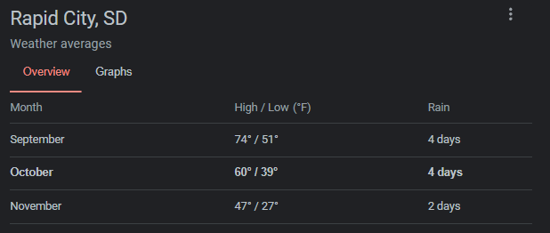
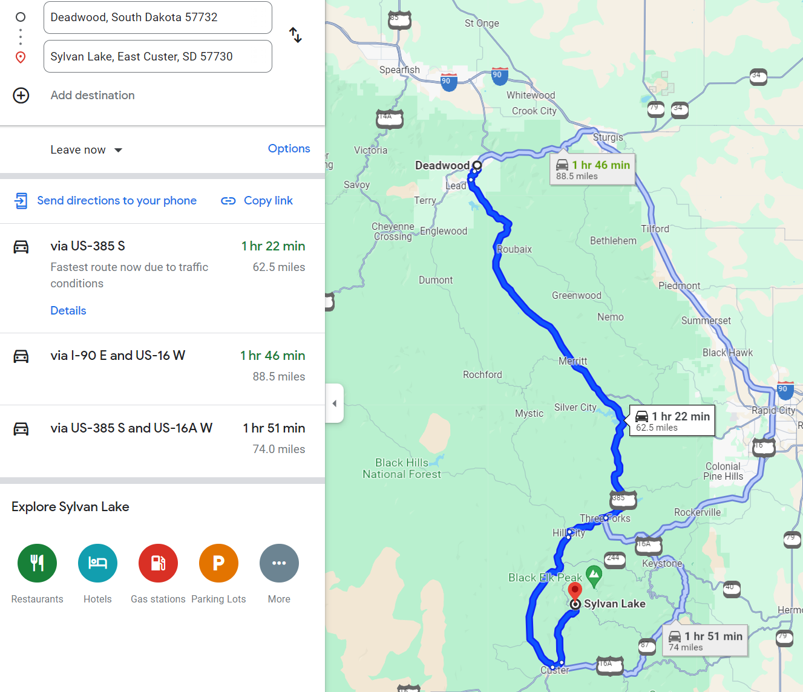
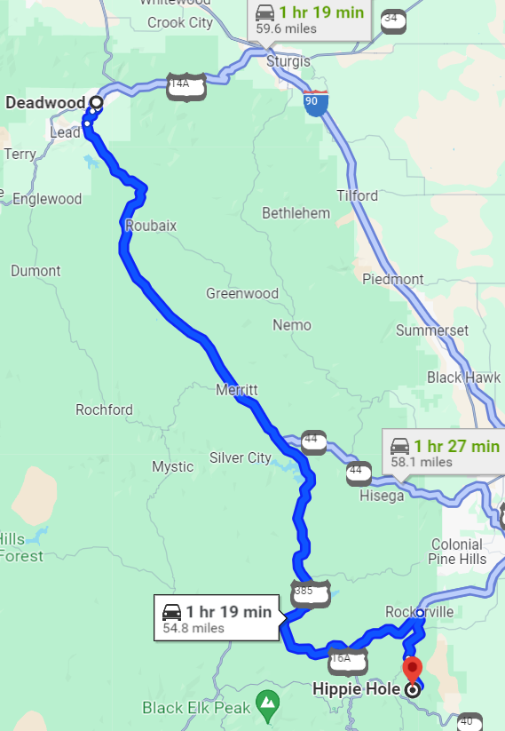

# Rapid City to Deadwood + Transportation

- Rental cars - were all taken when I looked
	- 4 days Kia Forte \$285
	- 
- Links
	- [Travel & Transportation Services – Visitor Services | Deadwood, SD](https://www.deadwood.com/businesses/travel-transportation/)
	- [Transportation ✈️ Rapid City Regional Airport](https://rapairport.com/transportation/#tgvczbtalukskadlygculawtdsyfgkdfrahg)
		- 
- Deadwood bikes
	- [Non-Electric Bike - Roll or Sirrus X Bicycle Rentals | Deadwood Outdoor Rentals](https://deadwoodrentals.com/non-electric-bike-roll-or-sirrus-x-bicycle-rentals/) 
	- 

# 2024 Itinerary

- https://wildwesthackinfest.com/agenda-for-wwhf-2024-deadwood/

| Wednesday, October 9                                                                                                                                                                                                                                                                                                                                                                                                                                      |
| --------------------------------------------------------------------------------------------------------------------------------------------------------------------------------------------------------------------------------------------------------------------------------------------------------------------------------------------------------------------------------------------------------------------------------------------------------- |
| - 2 p.m. MT- Registration opens on the conference level of the Deadwood Mountain Grand Hotel (DMG) - 5:15 p.m. MT - Talkin' Bout [infosec] News - LIVE Broadcast from the Main Stage at DMG - 5:45 p.m. MT – Conference kicks off  - 6:00 - 9:00 p.m. MT – It’s Sponsor Stampede in Downtown Deadwood - 8:30 - 11:00 p.m. MT - Open Mic Night at The Elks Club, 696 1/2 Main Street Deadwood                                                  |
| **Thursday, October 10**                                                                                                                                                                                                                                                                                                                                                                                                                                  |
| - 7:30 a.m. MT - Registration opens on the conference level of the DMG - 8 a.m. to 8:45 a.m. MT - Martial Arts Workout with Cameron Cartier - 8:50 a.m. MT - Welcome to WWHF followed by the keynote talk with Dr. Gerald Auger - 2:00 p.m. MT – SOC meet and greet – Martin Mason, 33 Deadwood St, Deadwood  - 5:30 p.m. to 10 p.m. MT – Chuckwagon Dinner, Calf Roping and Stick Horse Rodeo, Old Time Photos, Who's Slide, Knight of Chess |
| Friday, October 11                                                                                                                                                                                                                                                                                                                                                                                                                                        |
| - 6:30 a.m. MT – Run with BHIS (meet at the entrance of the DMG hotel) - 7:30 a.m. MT – Registration opens - 9:00 a.m. MT – Talks kick off in Track 1 and 2 - 4 p.m. MT – Join Wade Wells for the final keynote of the event! - 5 p.m. MT - Awards and closing remarks with John Strand                                                                                                                                                       |
|                                                                                                                                                                                                                                                                                                                                                                                                                                                           |

# Shuttle Back Schedule

| Saturday, Oct. 12, 2024 – Airport Shuttle: Deadwood to Rapid City Airport                                    |
| ------------------------------------------------------------------------------------------------------------ |
| Pick-up time from Deadwood:                                                                                  |
| - 3:30 a.m. MT - 6:30 a.m. MT - 10 a.m. MT - 1:30 p.m. MT                                           |
| Pick-up locations in order:                                                                                  |
| 1. The Lodge at Deadwood  2. Cadillac Jacks 3. Hampton Inn at Tin Lizzie 4. Deadwood Mountain Grand |
|                                                                                                              |

# Deadwood 2024 Locations 

1906 Deadwood Mountain Drive
Deadwood, SD 57732

# Stuff to Do in Deadwood

## Links

- [Fun Things to Do In and Around Deadwood – Wild West Hackin' Fest](https://wildwesthackinfest.com/conference/fun-things-to-do-in-and-around-deadwood/) 

# Additional Locations

- Links 
	- [Black Hills & South Dakota Maps | Black Hills Vacations](https://www.blackhillsvacations.com/plan-your-visit/black-hills-maps/)
	- [Maps | Black Hills & Badlands - South Dakota](https://www.blackhillsbadlands.com/maps) 
	- [Bridal Veil Falls in Spearfish, SD | Visit Spearfish](https://visitspearfish.com/things-to-do/bridal-veil-falls) 
	- [Roughlock Falls in Spearfish, SD | Visit Spearfish](https://visitspearfish.com/things-to-do/roughlock-falls) 
- Custer State Park
	- [Sylvan Lake | Black Hills & Badlands - South Dakota](https://www.blackhillsbadlands.com/places/sylvan-lake) 
		- Cliff jumping + Wet suit
		- 
		- 
- Hippie Hole
	- Cliff jumping + wet suit
		- [Hippie Hole - Hiking - Black Hills The Hike - South Dakota](https://www.blackhillsthehike.com/hippie-hole/)
		- 
	- 

# Places to Stay

- [Historic Bullock Hotel – Deadwood's First and Finest Hotel](https://www.historicbullock.com/) - historic and cheap