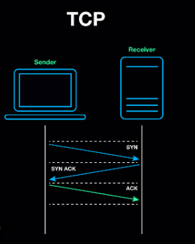
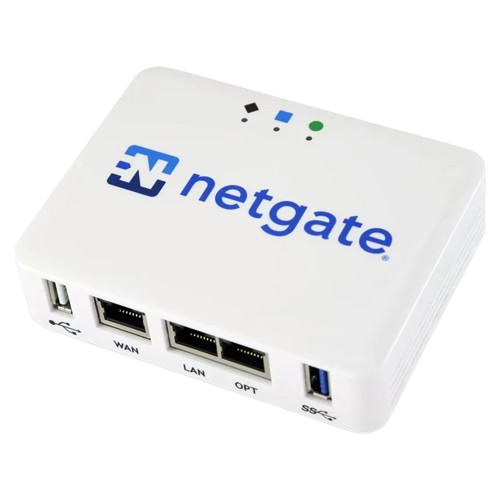

1. Secure DB Exposition
	1. Talking about exposing databases securely...namely for self-hosting or home lab projects
	2. One could call this secure service exposition
2. (DEPRECATED) Security
	1. Peace of mind against entities with conflicting interests that affect CIA of IT systems
3. (DEPRECATED) Initial Direction
	1. Most companies use hybrid architectures which means there has to be some remote access between various networks
	3. I'm not interested in these implementations, but rather how to do it on a small scale
	4. If I ask my coworkers about database security most of them mention application level attacks specific to databases and their implementations.
	5. On the other hand, lots of them mention access control
	6. However, I liked looking at this from the perspective of how attackers find and exploit these databases in the first place
	7. The most lucrative attack is to find publicly exposed databases or servers (databases are gold) then do ransomware to hold the data hostage
	8. I wanted to target the risk model for exposing these databases 
4. Motivation & Purpose
	1. Databases are ultimately just servers with the express purpose of organizing data and creating interfaces for utility with that data
	
	2. They have an application level, interfaces, and logic that can be exploited (SQL injection, XSS, etc.), but usually the only similarities with other databases are the exploitation of these query languages, privilege structures, access control, and IAM type stuff.
	3. Networking problems
		1. Some need remote access or networking for on-prem & cloud hybrid implementations
		2. Lots of administration
			1. Administration for the networking hardware (firewalls, routers, etc.), the access control lists (ACLs), dealing with dynamic IPs, and integrating the remote access systems and processes with other logic can be a true headache
	4. Cyber is hard - "peace of mind from conflicting and malicious interests related to IT systems"
	5. Networking is kind of hard - I've learned it a lot and done numerous projects, but the abstractions and mental models never stick
	6. I want to look at the risk model for exposing services like a database and the easiest one for self hosting and home labs
		1. Self hosting pros and cons:
			1. pros
				1. CHEAPER long term especially with old computer hardware
				2. More control over hardware
				3. Learning IT concepts (S tier)
			2. cons
				1. Have to manage hardware
				2. Manage networking
				3. Privacy...usually
	7. I love curating and exploring
	8. Databases have to be remotely accessible.  Localhost is common, but not in larger setups
5. Unsolicited vs Solicited
	1. Solicited means that the TCP conversation is started with an outbound request (SYN).  Unsolicited means it began with an inbound one with a port number
	2. If you are receiving an unsolicited connection, then you're pretty much a server.  Problem being, if you open up a port and allow unsolicited traffic then you open Pandora's box
	3. 
	4. 
	5. 
	6. 
6. Service Exposition Threat Model
	1. Databases are gold for hackers
	2. Databases are GOLD​
	- Perimeter security – get this done first​
	- Recon – "low hanging fruit"​
	- Exploit Vulns– priv esc, lateral movement, access to OS with RCE, etc.​
	- Actions on Objective:​
	- Ransomware – use PG service or others to execute ransomware and hold data hostage​
	- Botnets – use PG database to execute botnet malware for cryptomining or relaying hacker ops (e.g. PGminer)
7. 

- 
- 
- 
- 