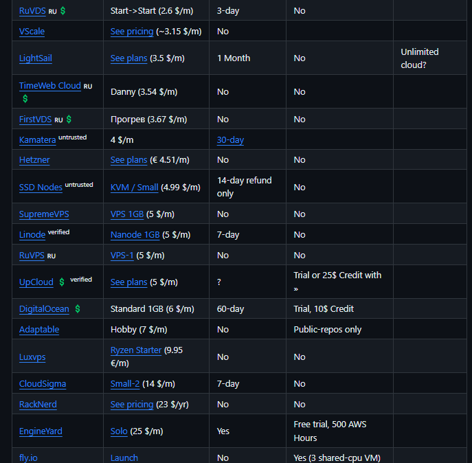

on Postgres, CF Tunnels, Exposition, Detection, etc.
# Misc
* [Traefik vs Nginx for Reverse Proxy with Docker on a Raspberry Pi | Alex Hyett](https://www.alexhyett.com/traefik-vs-nginx-docker-raspberry-pi/)
* [What is a reverse proxy? | Proxy servers explained | Cloudflare](https://www.cloudflare.com/learning/cdn/glossary/reverse-proxy/)
* [Cloudflare Tunnels vs Nginx Reverse Proxy vs Traefik? : r/selfhosted](https://www.reddit.com/r/selfhosted/comments/yxkwg7/cloudflare_tunnels_vs_nginx_reverse_proxy_vs/)
* [Using Cloudflare Tunnel Instead of Traefik/Nginx Proxy Manager : r/homelab](https://www.reddit.com/r/homelab/comments/101hfqu/using_cloudflare_tunnel_instead_of_traefiknginx/)
* [Traefik vs Ngnix Proxy Manager : r/selfhosted](https://www.reddit.com/r/selfhosted/comments/mhv0mx/traefik_vs_ngnix_proxy_manager/)
* [https://github.com/mikeroyal/Self-Hosting-Guide > log-management](https://github.com/mikeroyal/Self-Hosting-Guide#log-management)
* [Pentesting-Guide/port_knocking.md at master · pha5matis/Pentesting-Guide](https://github.com/pha5matis/Pentesting-Guide/blob/master/port_knocking.md)
* [What is Port Forwarding? What is it Used For? | Cybernews](https://cybernews.com/what-is-vpn/port-forwarding/)
* [Port Forwarding 101 — Everything You Want to Know](https://www.privacyaffairs.com/port-forwarding/)
* [https://www.google.com/search?sca_esv=587745529&q=port+forwarding+AND+"unsolicited"&tbm=isch&source=lnms&sa=X&ved=2ahUKEwie-_DMtvaCAxVavokEHVNyAkkQ0pQJegQICRAB&biw=412&bih=686&dpr=2.63 > imgrc=DOsb9ozq0fdLAM](https://www.google.com/search?sca_esv=587745529&q=port+forwarding+AND+"unsolicited"&tbm=isch&source=lnms&sa=X&ved=2ahUKEwie-_DMtvaCAxVavokEHVNyAkkQ0pQJegQICRAB&biw=412&bih=686&dpr=2.63#imgrc=DOsb9ozq0fdLAM)
* [Cloudflare Tunnels vs reverse-proxy VPS? : r/selfhosted](https://www.reddit.com/r/selfhosted/comments/w5qq14/cloudflare_tunnels_vs_reverseproxy_vps/)
* [What is a reverse proxy? | Proxy servers explained | Cloudflare](https://www.cloudflare.com/learning/cdn/glossary/reverse-proxy/)
* [Reverse Proxy with Cloudflare Tunnel · louislam/uptime-kuma Wiki](https://github.com/louislam/uptime-kuma/wiki/Reverse-Proxy-with-Cloudflare-Tunnel)
* [tailscale vs cloudflare tunnel? which is better a homelab - Lemmy.World](https://lemmy.world/post/7802261)
* [Was: Cloudflare Tunnels, now: Tailscale goodness | Ars OpenForum](https://arstechnica.com/civis/threads/was-cloudflare-tunnels-now-tailscale-goodness.1491645/)
* [Cloudflare Access vs. Tailscale · Tailscale](https://tailscale.com/compare/cloudflare-access/)
* [Tailscale Funnel · Tailscale Docs](https://tailscale.com/kb/1223/funnel/)
* [Introducing Tailscale Funnel · Tailscale](https://tailscale.com/blog/introducing-tailscale-funnel/)
* [Cloudflare Tunnels vs Nginx Reverse Proxy vs Traefik? : r/selfhosted](https://www.reddit.com/r/selfhosted/comments/yxkwg7/cloudflare_tunnels_vs_nginx_reverse_proxy_vs/)
* [Ridiculously easy to use Tunnels](https://blog.cloudflare.com/ridiculously-easy-to-use-tunnels/)
* [Do you use cloudflare tunnel? : r/selfhosted](https://www.reddit.com/r/selfhosted/comments/u4qe6b/do_you_use_cloudflare_tunnel/?rdt=42902)
* [Cloudflare Tunnels vs Nginx Reverse Proxy vs Traefik? : r/selfhosted](https://www.reddit.com/r/selfhosted/comments/yxkwg7/cloudflare_tunnels_vs_nginx_reverse_proxy_vs/)
* [Cloudflare Tunnels vs Nginx Proxy Manager - Which will You Use?](https://noted.lol/cloudflare-tunnels-vs-nginx-proxy-manager/)
* [Say Goodbye to Reverse Proxy and Hello to Cloudflare Tunnels](https://noted.lol/say-goodbye-to-reverse-proxy-and-hello-to-cloudflare-tunnels/)
* [Cloudflare Tunnel with Nginx - Developer help / Self-hosting - Ghost Forum](https://forum.ghost.org/t/cloudflare-tunnel-with-nginx/36308)

## Postgres, Remote Connections
- [Configure PostgreSQL to allow remote connections](https://gist.github.com/toraritte/f8c7fe001365c50294adfe8509080201)
	- Not sure how developers actually connect to Postgres remotely
- [HTTP API - PostgreSQL wiki](https://wiki.postgresql.org/wiki/HTTP_API)
	- Setting up HTTP API with Postgres
	- [pramsey/pgsql-http: HTTP client for PostgreSQL, retrieve a web page from inside the database.](https://github.com/pramsey/pgsql-http)
- [Tunnels with postgres database? : r/CloudFlare](https://www.reddit.com/r/CloudFlare/comments/rtlca2/tunnels_with_postgres_database/) 
## Port Scanning Detection
- [CAR-2021-01-001: Identifying Port Scanning Activity | MITRE Cyber Analytics Repository](https://car.mitre.org/analytics/CAR-2021-01-001/) 

## Hosting Providers
I realized looking at hosting that they're expensive compared to long term self hosting
- [dalisoft/awesome-hosting: List of awesome hosting sorted by minimal plan price](https://github.com/dalisoft/awesome-hosting)
	- ****

## Virtualization Layers
- 
### Containers & Layers
- 