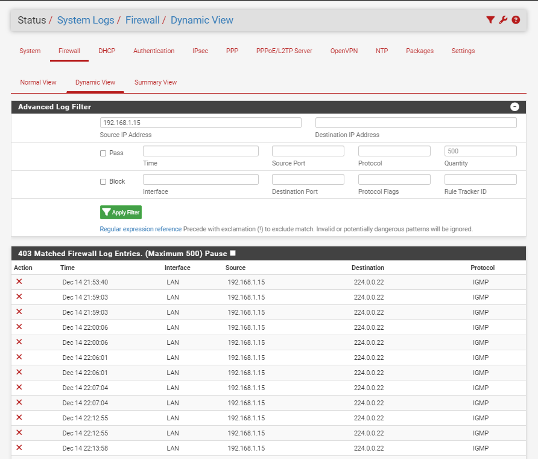
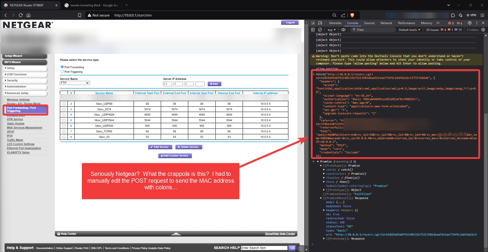

# IPv6 Tunneling and NAT

- Your parts may jump around a lot.  If you're having party issues, go to Network settings > Advanced and look at alternate port selection.  Make sure that port is open (NAT / firewall rules in your router panel).  Getting to this panel requires you be on your home network, then connect to the likely IP address on the back on your router by typing that IP in your browser to get to the admin panel.

# Ports to Open on NAT/Firewall to Xbox

- [Network ports used by the Xbox network on the Xbox console | Xbox Support](https://support.xbox.com/en-US/help/hardware-network/connect-network/network-ports-used-xbox-live)

- 

- Port 88 (UDP)
- Port 3074 (UDP and TCP)
- Port 53 (UDP and TCP)
- Port 80 (TCP)
- Port 500 (UDP)
- Port 3544 (UDP)
- Port 4500 (UDP)

# Using PFSense

- [Tweaking4All.com - pfSense 2.x - How to fix Strict NAT for XBox One](https://www.tweaking4all.com/network-internet/pfsense-strict-nat-xbox-one/)
- [pfSense and Multiple Xbox Ones: Open NAT Guide - Networking & Firewalls - Lawrence Systems Forums](https://forums.lawrencesystems.com/t/pfsense-and-multiple-xbox-ones-open-nat-guide/2409)
- [UPnP Fix for multiple clients/consoles playing the same game | Netgate Forum](https://forum.netgate.com/topic/169837/upnp-fix-for-multiple-clients-consoles-playing-the-same-game/78)
- Using system packages
	- [System Patches Package | pfSense Documentation](https://docs.netgate.com/pfsense/en/latest/development/system-patches.html)
	- [UPnP Fix for multiple clients/consoles playing the same game | Netgate Forum](https://forum.netgate.com/topic/169837/upnp-fix-for-multiple-clients-consoles-playing-the-same-game)
	- 

- IGMP being blocked?
	- 

## Support Ticket

I'm trying to be able to join parties and play games with Xbox Live on my Xbox.  Below are all of the things I've tried.  I've scowered Pfsense docs as well.

- [Tweaking4All.com - pfSense 2.x - How to fix Strict NAT for XBox One](https://www.tweaking4all.com/network-internet/pfsense-strict-nat-xbox-one/)
- [pfSense and Multiple Xbox Ones: Open NAT Guide - Networking & Firewalls - Lawrence Systems Forums](https://forums.lawrencesystems.com/t/pfsense-and-multiple-xbox-ones-open-nat-guide/2409)
- [UPnP Fix for multiple clients/consoles playing the same game | Netgate Forum](https://forum.netgate.com/topic/169837/upnp-fix-for-multiple-clients-consoles-playing-the-same-game/78)
	- Couldn't try this because it seems like an old path - I'm new to Pfsense
- [Network ports used by the Xbox network on the Xbox console | Xbox Support](https://support.xbox.com/en-US/help/hardware-network/connect-network/network-ports-used-xbox-live)
What can get it working:
- Turning on UPnP with "Default Deny" turned off
	- This is really insecure though and I need to figure out how to limit the access

1) Firewall > NAT > Port Forward

- Interface: WAN, Protocol: UDP/TCP (duplicates rule like this), Source Addr: *, Source Ports: *, Dest Addr: WAN address, Dest Ports: Xbox_ports (from included link)
- I enabled Pure NAT for both of the rules

2) Firewall > NAT > Outbound

- Outbound NAT Mode - Hybrid Outbound NAT
- Interface: WAN, Source: Xboxes (alias with Xbox IPs with /32), Source Port: \*, Destination: \*, Destination Port: \*, NAT Port: \*, Static Port: "checked"

3) Services > UPnP (tried this)

- Tried same as below link but without the VLANs
	- [UPnP Fix for multiple clients/consoles playing the same game | Netgate Forum](https://forum.netgate.com/topic/169837/upnp-fix-for-multiple-clients-consoles-playing-the-same-game/78)
- Enabled first 3 checkboxes, then below ACL rules created
	- This forces the xbox to use a port other than 3074 for UPnP
	- deny 3074 192.168.1.0/24 0-65535
	- allow 0-65535 192.168.1.15/32 0-65535

4) Status > System Logs to troubleshoot

- "Dynamic View"
- I filtered with Source IP: 192.168.1.15 (xbox IP)
- I noticed rules like below
- BLOCK | Dec 14 21:59:03 | LAN | 192.168.1.15 | 224.0.0.22 | IGMP |
- Other blocks that were happening:
	- I clicked on the "x" in the log - "@4 block drop in log inet all label "Default deny rule IPv4" ridentifier 1000000103"
	- 

5) Diagnostics pfTop (for more troubleshooting)

- Noticed below igmp related state
- igmp      In  192.168.1.15:0                224.0.0.22:0                   NO_TRAFFIC:SINGLE       00:00:19  00:00:12        0        0

6) Related Xbox settings

- (not a setting) NAT Type: Unavailable - I could get it to be "Open" with UPnP but then it would fail upon joining a party
- Network > Advanced Settings
- Port selection: 3074 - pretty sure this is also related to the Xbox error of "couldn't get a Teredo IP address"

7) Modem/ISP Setup

- I'm using the BGW320 (pretty sure that's the model) from ATT
- I have it set up with IP Passthrough with all the firewall settings turned off.  I haven't had issues with this part.  However, this could be playing into something else that I'm not aware of.

8) Other Ideas

- Would IPv6 ever have anything to do with any of this?  My NAT rules are IPv4

## Setting Up VLANs

```
I'm a bit confused on what to configure in each dashboard. I'm trying to set up...potentially a physically separated type system at layer 2 or at least understand how to do it. The netgate 2100 comes with the marvel switch.

- Interfaces > Switch > VLANs
- Interfaces > VLANs (I have the below ones)
- mvneta0 (wan) 10 DMZ
- mvneta0 (wan) 30 HOME_LAB
- mvneta0 (wan) 20 INTERNAL
- Interfaces > Interface Assignments

WAN - mvneta0 (90:ec:77:91:13:56)
LAN - mvneta1 (90:ec:77:91:13:57)
OPT1 - VLAN 10 on mvneta0 - wan (DMZ)
OPT2 - VLAN 20 on mvneta0 - wan (INTERNAL)
OPT3 - VLAN 30 on mvneta0 - wan (HOME_LAB)

I'm trying to understand how to break up the physical ports on the netgate switch and use that in combination (or not in combination) with VLANs
```

- [(13) Basic Setup and Configuring pfsense Firewall Rules For Home - YouTube](https://www.youtube.com/watch?v=bjr0rm93uVA)

- [VLAN Configuration | pfSense Documentation](https://docs.netgate.com/pfsense/en/latest/vlan/configuration.html#web-interface-vlan-configuration)
- [VLANs with the Netgate 2100 - My experience : r/PFSENSE](https://www.reddit.com/r/PFSENSE/comments/u1qkkf/vlans_with_the_netgate_2100_my_experience/)
	- [Netgate 2100 VLAN Configuration | Linux & Cybersecurity in South Australia with AGIX](https://agix.com.au/netgate-2100-vlan-configuration/)

- What is OPT?
	- [Configuring an OPT interface as an additional WAN | Netgate Documentation](https://docs.netgate.com/pfsense/en/latest/solutions/netgate-2100/opt-wan.html)
	- "Optional" interface

- [Configuring the Switch Ports | Netgate Documentation](https://docs.netgate.com/pfsense/en/latest/solutions/netgate-2100/configuring-the-switch-ports.html)

- Access Ports (untagged) vs Trunk Ports (tagged VLANs)
	- .

Interfaces > Switch > VLANs:

| VLAN group | Port | Members | Description         |
| ---------- | ---- | ------- | ------------------- |
| 1          | 1    | 2,3,4,5 | Default System VLAN |
| 2          | 2    | 1,3,4,5 | Default System VLAN |
| 3          | 3    | 1,2,4,5 | Default System VLAN |
| 4          | 4    | 1,2,3,5 | Default System VLAN |
| 5          | 5    | 1,2,3,4 | Default System VLAN |

- 802.1q VLAN mode - guessing this is what implements the tagging of VLANs
	- 
# Don't Buy a Netgear

- The amount of issues I've had thus far after adding a Netgear to [Router IP Passthrough](../../📁%2007%20-%20Cybersader%20Arsenal/Home%20Network/Bridging%20New%20Home%20Router/Bridging%20New%20Home%20Router.md) with my ATT router is frustrating.  I wish it did Bridged, but here we are.  If I could afford a nice Pfsense or Unifi, then I would do it.

- [Solved: Netgear Address Reservation - Invalid MAC Address [Workaround] - iFixit Repair Guide](https://www.ifixit.com/Guide/Solved:+Netgear+Address+Reservation+-+Invalid+MAC+Address+%5BWorkaround%5D/162994)
- 